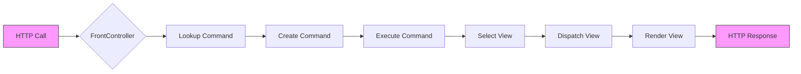

-----

# Front Controller Pattern in MVC Systems

## Front Controller Pattern

The goal of the Front Controller pattern is to centralize calls at a single point of access, acting as a main controller. It can be implemented in Java using a servlet.

It concentrates all incoming calls and handles the business logic, routing, and selection of appropriate Views. The Front Controller coordinates the application flow, processing calls and separating them from business rules.

In this pattern, it receives all calls to a system and acts as a coordinator. It manages the calls through servlets, using only a base class to manage the calls and dispatch the execution to the appropriate View.

***(Video content omitted)***

We will create a **Java Enterprise Application** project, named `ExemploFC`. It will be configured to use the Struts Framework.

### Struts Configuration (`struts-config.xml` file)

```xml
<?xml version="1.0" encoding="UTF-8"?>
<!DOCTYPE struts-config PUBLIC "-//Apache Software Foundation//DTD Struts Configuration 1.2//EN" "http://jakarta.apache.org/struts/dtds/struts-config_1_2.dtd">
<struts-config>
  <form-beans>
  </form-beans>
  <global-exceptions>
  </global-exceptions>
  <global-forwards>
  </global-forwards>
  <action-mappings>
    <action path="/incluirEmpresa" type="br.empresa.web.IncluirEmpresaAction" name="empresaForm" scope="request" input="/incluiEmpresa.jsp">
      <forward name="ok" path="/listaEmpresa.jsp" />
    </action>
    <action path="/listarEmpresas" type="br.empresa.web.ListaEmpresaAction" scope="request">
      <forward name="ok" path="/listaEmpresa.jsp" />
    </action>
    <action path="/excluirEmpresa" type="br.empresa.web.ExcluirEmpresaAction" scope="request">
      <forward name="ok" path="/listaEmpresa.jsp" />
    </action>
  </action-mappings>
  <controller processorClass="org.apache.struts.action.RequestProcessor"/>
</struts-config>
```

In this project, we have the **COMPANY** and **DEPARTMENT** data models for handling persistence context data. For **COMPANY**, we have the primary key (key-id), **CODE**, and the **CORPORATE NAME**. For **DEPARTMENT**, we also have a key-id (code), with the name, DEPTOS, which counts the number of employees. The relationship between the two tables is **one-to-many**, where one company can have several departments.

### Project Files and Folders

  * `\java\br\empresa\web`: implementation of the central application control (Front Controller) for the application's business rules.
  * `\localEmpresa.jsp`: company image and table access
  * `\incluiEmpresa.jsp`: for including a new company's data
  * `\localDepartamento.jsp`: department image and table access
  * `\incluiDepartamento.jsp`: entry of department data
  * `\listaDepartamento.jsp`: entry of department data that will be displayed

Now, let's define the call flows, which are centralized from HTTP, and which can be represented in a diagram.

### Call Flow

Below is a representation of the call flow:



**In other words:**

  * All pages (JSPs) are only **static**, representing the application's **state**.
  * **Servlets** are the dynamic elements that receive the call handling and execute the business rules.
  * **Actions** represent the encapsulated commands.
  * **FrontController** is the only *servlet* in the application, centralizing the control flow.

We have the HTTP calls that we use:

| Command | Description |
| :--- | :--- |
| `/listarEmpresas` | List companies |
| `/incluirEmpresa` | Include a new company |
| `/excluirEmpresa` | Exclude a company |
| `/alterarEmpresa` | Change a company's data |
| `/listarDepartamentos` | List departments |
| `/incluirDepartamento` | Include a new department |
| `/excluirDepartamento` | Exclude a department |
| `/alterarDepartamento` | Change a department's data |

In Java applications for J2EE, the Front Controller Pattern can be implemented based on a *servlet*. It receives all application calls and, according to the *command* parameter, forwards the execution of operations that involve calls to **EJBs**, disseminating the activities of connecting to the database and business rules. This mapping is performed in the `web.xml` file.

-----

## View Layer

The View layer in the MVC pattern is responsible for presenting the information obtained by the Model to the user. It should be simple, containing only code for rendering the interface and for retrieving data that makes up the user interface. In web development, this layer is typically implemented by JSP (JavaServer Pages) pages or similar template technologies.

In this project, you will see how the View Layer acts in the process of capturing requests and displaying responses.

***(Video content omitted)***

### `camadaView.jsp`

This page will receive the *command* to be executed and send the request to the `FrontController` which will process the request and return the page with the result.

```jsp
<%@ page language="java" contentType="text/html; charset=ISO-8859-1" pageEncoding="ISO-859-1"%>
<form action="FrontController" method="post">
  <input type="hidden" name="comando" value="<%=request.getParameter("comando")%>"/>
  <jsp:include page="<%=request.getParameter("pagina")%>"/>
</form>
```

Building the View Layer. First, we will assume that the command, with a *hidden* type parameter, is encapsulated to be passed to the Front Controller.

### `incluiEmpresa.jsp`

```jsp
<%@ page language="java" contentType="text/html; charset=ISO-8599-1" pageEncoding="ISO-8599-1"%>
<form action="FrontController" method="post">
  <input type="hidden" name="comando" value="IncluiEmpresa"/>
  <input type="text" name="codigoEmpresa" value="1"/>
  <input type="text" name="razaoSocial" value="Empresa X"/>
  <input type="submit" value="Salvar"/>
</form>
```

The creation of the project will require a request attribute, named `heading`, to display the company header image. Thus, this *view* now has the page title (heading) to display the company image.

### `incluiDepartamento.jsp`

```jsp
<%@ page language="java" contentType="text/html; charset=ISO-8599-1" pageEncoding="ISO-8599-1"%>
<form action="FrontController" method="post">
  <input type="hidden" name="comando" value="IncluiDepartamento"/>
  <input type="text" name="codigoDepartamento" value="1"/>
  <input type="text" name="nomeDepartamento" value="Vendas"/>
  <input type="submit" value="Salvar"/>
</form>
```

The following page is the definition of a *link* to the `FrontController`, with the parameter *acao* (command) and the page to be included.

### `listaDepartamento.jsp` (Fragment)

```jsp
<a href="FrontController?comando=ListaDepartamento&pagina=listaDepartamento.jsp">Listagem de Departamentos</a>
```

### `listaEmpresa.jsp` (Fragment)

```jsp
<a href="FrontController?comando=ListaEmpresa&pagina=listaEmpresa.jsp">Listagem de Empresas</a>
```

### `listaEmpresa.jsp` (Continuation)

In a company, we can observe the listing of the **Empresa** object with all attributes.

```jsp
<%@ page language="java" contentType="text/html; charset=ISO-8599-1" pageEncoding="ISO-8599-1"%>
<table border="1">
  <tr>
    <td>Código</td>
    <td>Razão Social</td>
  </tr>
  <c:forEach items="${empresas}" var="empresa">
    <tr>
      <td>${empresa.codigo}</td>
      <td>${empresa.razaoSocial}</td>
    </tr>
  </c:forEach>
</table>
```

Below we have the image of a department to be included and the image of a company, with the definition of the attributes. For the company, the code is a *key id* and the corporate name is an attribute.

### `incluiEmpresa.jsp` (Continuation)

```jsp
<%@ page language="java" contentType="text/html; charset=ISO-8599-1" pageEncoding="ISO-8599-1"%>
<form action="FrontController" method="post">
  <input type="hidden" name="comando" value="IncluiEmpresa"/>
  Code: <input type="text" name="codigo" /><br/>
  Corporate Name: <input type="text" name="razaoSocial" /><br/>
  <input type="submit" value="Salvar"/>
</form>
```

-----

## Model and Controller Layer

The Model is responsible for encapsulating the application data, the application state, and the business rules. The Controller receives the user request, translates the request into a Model call, executes the business rule, and selects the appropriate View to display the result.

### Creating the Data Model

**Step 1: Creating the Empresa Class**
Create a class `Empresa` in the `br.empresa.model` package, which implements the `Serializable` interface and contains the attributes `codigo` (int) and `razaoSocial` (String), in addition to their respective *getters* and *setters* methods.

**Step 2: Creating the Departamento Class**
Create a class `Departamento` in the `br.empresa.model` package, which implements the `Serializable` interface and contains the attributes `codigo` (int), `nome` (String), and `numFuncionarios` (int), in addition to the *getters* and *setters*.

**Step 3: Creating the Data Class**
Create a class `Data` in the `br.empresa.model` package to simulate database access. This class must have a `getEmpresas()` method that returns a `List<Empresa>` and a `getDepartamentos()` method that returns a `List<Departamento>`. Implement the `incluiEmpresa()` and `incluiDepartamento()` methods that add objects to the list.

### Creating the Controller

**Step 1: Creating the ComandoEncapsulado Interface**
Create the `ComandoEncapsulado` interface in the `br.empresa.web` package that defines the `executa()` method:

```java
public interface ComandoEncapsulado {
  public String executa(HttpServletRequest request, HttpServletResponse response) throws Exception;
}
```

**Step 2: Creating the ListaEmpresaComando Class**
Create the `ListaEmpresaComando` class in the `br.empresa.web` package that implements `ComandoEncapsulado`. In the `executa()` method, it retrieves the list of companies from `Data` and stores it in the request scope to be accessed by the View, returning the name of the View (`listaEmpresa.jsp`).

**Step 3: Creating the IncluiEmpresaComando Class**
Create the `IncluiEmpresaComando` class that implements `ComandoEncapsulado`. In the `executa()` method, it retrieves the request parameters for `codigo` and `razaoSocial`, creates an `Empresa` object, includes it in the `Data` class, and redirects to the company listing.

**Step 4: Creating the FrontController Servlet**
Create the `FrontController` as a *servlet* that extends `HttpServlet`. In the `service()` or `doPost`/`doGet` method, it retrieves the `comando` parameter from the request and uses a `HashMap` to map the command name to the corresponding command class (e.g., `"ListaEmpresa"` -\> `ListaEmpresaComando.class`). It instantiates the command and calls the `executa()` method, dispatching the result (the JSP *view*) to the user.

### Creating the Encapsulated Command

**Step 1: Definition of the ComandoEncapsulado interface**
The interface defines the signature for all commands that will be executed by the Front Controller.

**Step 2: Mapping in `web.xml`**
The `FrontController` must be configured in `web.xml` to intercept all requests that fit the defined pattern.

```xml
<servlet>
    <servlet-name>FrontController</servlet-name>
    <servlet-class>br.empresa.web.FrontController</servlet-class>
</servlet>
<servlet-mapping>
    <servlet-name>FrontController</servlet-name>
    <url-pattern>/FrontController</url-pattern>
</servlet-mapping>
```

**Step 3: Creating the folder structure**

The project must have the following structure:

```
ExemploFC
|- WebContent
|  |- WEB-INF
|  |  |- lib
|  |  |- web.xml
|  |- incluiEmpresa.jsp
|  |- listaEmpresa.jsp
|  |- ... (other JSPs)
|  |- index.html (or index.jsp)
|- src
|  |- br
|  |  |- empresa
|  |  |  |- model
|  |  |  |  |- Empresa.java
|  |  |  |  |- Departamento.java
|  |  |  |  |- Data.java
|  |  |  |- web
|  |  |  |  |- FrontController.java
|  |  |  |  |- ComandoEncapsulado.java
|  |  |  |  |- ListaEmpresaComando.java
|  |  |  |  |- IncluiEmpresaComando.java
|  |  |  |  |- ... (other commands)
```

-----

## Front Controller Implementation

When the Front Controller receives control, it performs the following steps:

1.  **Handles** the request (reading parameters).
2.  **Maps** the request to a specific command (using the command pattern).
3.  **Executes** the command, which interacts with the *Model* (business logic).
4.  **Selects** the View to be presented, based on the execution result.
5.  **Dispatches** the request and response to the View (JSP page).

***(Video content omitted)***

### `FrontController.java` (Fragments)

The `FrontController` *servlet* will centralize all requests, dispatching them to the encapsulated commands.

**Fragment 1: Command Mapping**

```java
public class FrontController extends HttpServlet {
  private static Map<String, ComandoEncapsulado> comandos = new HashMap<String, ComandoEncapsulado>();

  public void init() throws ServletException {
    super.init();
    comandos.put("ListaEmpresa", new ListaEmpresaComando());
    comandos.put("IncluiEmpresa", new IncluiEmpresaComando());
    // ... other commands
  }

  // ... (service or doGet/doPost method)
}
```

**Fragment 2: `processRequest` Method**

```java
protected void processRequest(HttpServletRequest request, HttpServletResponse response) throws ServletException, IOException {
    try {
        String comando = request.getParameter("comando");
        if (comando == null) {
            comando = "ListaEmpresa"; // Default command
        }

        ComandoEncapsulado ce = comandos.get(comando);
        if (ce == null) {
            throw new Exception("Command not found: " + comando);
        }

        String view = ce.executa(request, response);

        request.getRequestDispatcher("/" + view).forward(request, response);
    } catch (Exception e) {
        request.setAttribute("erro", e.getMessage());
        request.getRequestDispatcher("/erro.jsp").forward(request, response);
    }
}
```

*Note: The actual implementation may use reflection to instantiate commands, as seen in other examples, but the code above shows the mapping principle.*

### Step 1: User Interaction

When accessing the application, the initial page usually lists the companies (`ListaEmpresaComando`). If the user clicks on "New Company", they will be directed to `incluiEmpresa.jsp`, which encapsulates the `IncluiEmpresa` command for the `FrontController`.

With the command strategy, we can extend the flow for a new command without changing the `FrontController`. Just create a new class that implements the `ComandoEncapsulado` interface and add it to the mapping.

### Defining the Structure

**`ComandoEncapsulado` Interface (Strategy Pattern)**

This interface defines the contract for all commands, allowing the `FrontController` to treat them uniformly.

```java
public interface ComandoEncapsulado {
    public String executa(HttpServletRequest request, HttpServletResponse response) throws Exception;
}
```

**`ListaEmpresaComando` Class (Command Implementation)**

This class implements the company listing logic.

```java
public class ListaEmpresaComando implements ComandoEncapsulado {
    public String executa(HttpServletRequest request, HttpServletResponse response) throws Exception {
        List<Empresa> empresas = new Data().getEmpresas();
        request.setAttribute("empresas", empresas);
        return "/listaEmpresa.jsp";
    }
}
```

### Output Screen Examples

**Department Listing**

(Visual content omitted, represents a table with department data)

**Company Listing**

(Visual content omitted, represents a table with company data, containing the columns "Code", "Corporate Name", and "Options")

**New Company**

(Visual content omitted, represents a form for including a new company with fields "Code" and "Corporate Name")

-----

## MVC Application with Front Controller Pattern

In this section, you will see how the Front Controller pattern uses the *Filter* in Java, to implement request control, security handling, and routing to the Model layer or the View.

In these notes, you will see how to implement the Front Controller pattern using *Filter* in Java, to control requests and use Java classes for implementing business rules and security handling, in addition to routing to the View layer for data display.

***(Video content omitted)***

### Practical Steps

We will simulate the creation of a simple web application for a bookstore in Java. Its objectives are to implement the Front Controller pattern and the *Command* pattern (Encapsulated Command) in a *Dynamic Web Project* project.

1.  Create the *Model* classes (`Book`).
2.  Implement the control layer using three interfaces. To simplify, use a static book creation in the `findAll()` method.
3.  Create the `Controller` interface.
4.  Create the `FrontController` class that extends `HttpServlet` to receive all requests.
5.  Create a `HashMap` in the `FrontController` to map commands to the *Controller* classes.
6.  The `FrontController` will continue to be responsible for handling requests related to the home page.
7.  The `Controller` interface will define the `execute(request, response)` method which will return the path of the *view*.
8.  Each business command (e.g., `ListarLivrosController`) will implement the `Controller` interface and contain the specific logic. For example, "BookController" will map to `br.livraria.web.BookController`, which executes the listing logic.
9.  Configure the `FrontController` mapping in `web.xml` for the `/app/*` URL.
10. Access will be via the URL: `http://localhost:8080/MinhaAplicacao/app?cmd=BookController`.

### Code Example: `MinhaController`

```java
public class MinhaController implements Controller {
    public String execute(HttpServletRequest request, HttpServletResponse response) throws ServletException, IOException {
        String action = request.getParameter("action");
        if (action == null) {
            action = "list";
        }

        switch (action) {
            case "list":
                return new ListBookController().execute(request, response);
            case "insert":
                return new InsertBookController().execute(request, response);
            default:
                return "/error.jsp";
        }
    }
}
```

### `Controller` Interface (Strategy Pattern)

```java
public interface Controller {
    String execute(HttpServletRequest request, HttpServletResponse response) throws ServletException, IOException;
}
```

### `BasicController` Class (Example)

```java
public class BasicController implements Controller {
    public String execute(HttpServletRequest request, HttpServletResponse response) throws ServletException, IOException {
        // Logic for a basic controller
        request.setAttribute("message", "Basic action executed!");
        return "/view/basic.jsp";
    }
}
```

### `BookController` Class (Example)

```java
public class BookController implements Controller {
    public String execute(HttpServletRequest request, HttpServletResponse response) throws ServletException, IOException {
        String forward = "/book/list.jsp";
        List<Book> books = new BookService().findAll();
        request.setAttribute("books", books);
        return forward;
    }
}
```

### `Book` Class (Model Example)

```java
public class Book {
    private String title;
    private String author;
    private String isbn;
    // ... getters and setters
}
```

-----