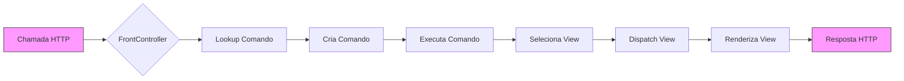

-----

# Padrão Front Controller em sistemas MVC

## Padrão Front Controller

O objetivo do padrão Front Controller é a centralização das chamadas em um único ponto de acesso, agindo como um controlador principal. Ele pode ser implementado em Java com o uso de um servlet.

Ele concentra todas as chamadas de entrada e realiza a manipulação da lógica de negócios, o roteamento e a seleção das Views apropriadas. O Front Controller coordena o fluxo da aplicação, tratando as chamadas, isolando das regras de negócios.

Neste padrão, ele recebe todas as chamadas de um sistema e atua como um coordenador. Ele gerencia as chamadas por meio de servlets, de forma a utilizar apenas uma classe base para gerenciar as chamadas e despachar a execução para a View apropriada.

***(Conteúdo de vídeo omitido)***

Criaremos um projeto de **Java Enterprise Application**, com o nome `ExemploFC`. Ele será configurado para usar o Framework Struts.

### Configuração Struts (arquivo `struts-config.xml`)

```xml
<?xml version="1.0" encoding="UTF-8"?>
<!DOCTYPE struts-config PUBLIC "-//Apache Software Foundation//DTD Struts Configuration 1.2//EN" "http://jakarta.apache.org/struts/dtds/struts-config_1_2.dtd">
<struts-config>
  <form-beans>
  </form-beans>
  <global-exceptions>
  </global-exceptions>
  <global-forwards>
  </global-forwards>
  <action-mappings>
    <action path="/incluirEmpresa" type="br.empresa.web.IncluirEmpresaAction" name="empresaForm" scope="request" input="/incluiEmpresa.jsp">
      <forward name="ok" path="/listaEmpresa.jsp" />
    </action>
    <action path="/listarEmpresas" type="br.empresa.web.ListaEmpresaAction" scope="request">
      <forward name="ok" path="/listaEmpresa.jsp" />
    </action>
    <action path="/excluirEmpresa" type="br.empresa.web.ExcluirEmpresaAction" scope="request">
      <forward name="ok" path="/listaEmpresa.jsp" />
    </action>
  </action-mappings>
  <controller processorClass="org.apache.struts.action.RequestProcessor"/>
</struts-config>
```

Neste projeto, temos o *data model* **EMPRESA** e **DEPARTAMENTO** para o manuseio de dados de um contexto de persistência. Para a Empresa, temos a chave primária (*chave-id*), **CÓDIGO** e a **RAZÃO SOCIAL**. Para DEPARTAMENTO, também podemos observar uma *chave-id* (código), com o nome, DEPTOS, que contabiliza o número de funcionários. O relacionamento entre as duas tabelas é de **um para muitos**, onde uma empresa pode ter vários departamentos.

### Arquivos e pastas do projeto

  * `\java\br\empresa\web`: implementação do aplicativo central de controle (Front Controller) para as regras de negócios da aplicação.
  * `\localEmpresa.jsp`: imagem das empresas e acesso às tabelas
  * `\incluiEmpresa.jsp`: para inclusão dos dados de uma nova empresa
  * `\localDepartamento.jsp`: imagem dos departamentos e acesso às tabelas
  * `\incluiDepartamento.jsp`: entrada dos dados de um departamento
  * `\listaDepartamento.jsp`: entrada dados do departamento que será exibido

Agora, vamos definir os fluxos das chamadas, que centraliza a partir de HTTP, e que pode ser representada em um diagrama.

### Fluxo de Chamadas

Abaixo está uma representação do fluxo de chamadas:



**Em outras palavras:**

  * Todas as páginas (JSPs) são apenas **estáticas**, que representam o **estado** da aplicação.
  * Os **servlets** são os elementos dinâmicos que recebem o tratamento das chamadas e realizam as regras de negócios.
  * As **ações** representam os comandos encapsulados.
  * **FrontController** é o único *servlet* da aplicação, centralizando o fluxo de controle.

Temos as chamadas HTTP que utilizamos:

| Comando | Descrição |
| :--- | :--- |
| `/listarEmpresas` | Lista de empresas |
| `/incluirEmpresa` | Inclui uma nova empresa |
| `/excluirEmpresa` | Exclui uma empresa |
| `/alterarEmpresa` | Altera os dados de uma empresa |
| `/listarDepartamentos` | Lista de departamentos |
| `/incluirDepartamento` | Inclui um novo departamento |
| `/excluirDepartamento` | Exclui um departamento |
| `/alterarDepartamento` | Altera os dados de um departamento |

Nas aplicações Java para J2EE, o Padrão Front Controller pode ser implementado com base em um *servlet*. Ele recebe todas as chamadas da aplicação e, de acordo com o parâmetro *comando*, encaminha a execução das operações que envolvem chamadas aos **EJBs**, disseminando as atividades de conexão ao banco de dados e as regras de negócio. Este mapeamento é realizado no arquivo `web.xml`.

-----

## Camada View

A camada View do padrão MVC é responsável por apresentar as informações obtidas pelo Model para o usuário. Ela deve ser simples, contendo apenas código para a renderização da interface e para a recuperação de dados que compõe a interface do usuário. No desenvolvimento web, essa camada é tipicamente implementada por páginas JSP (JavaServer Pages) ou tecnologias de template similares.

Neste projeto, você verá como a Camada View atua no processo de captura das requisições e exibição das respostas.

***(Conteúdo de vídeo omitido)***

### `camadaView.jsp`

Essa página irá receber o *comando* a ser executado e enviar a requisição para o `FrontController` que irá tratar a requisição e retornar a página com o resultado.

```jsp
<%@ page language="java" contentType="text/html; charset=ISO-8859-1" pageEncoding="ISO-8859-1"%>
<form action="FrontController" method="post">
  <input type="hidden" name="comando" value="<%=request.getParameter("comando")%>"/>
  <jsp:include page="<%=request.getParameter("pagina")%>"/>
</form>
```

Montar a Camada View. Antes, partiremos do princípio que o comando, com um parâmetro do tipo *hidden*, está encapsulado para passar para o Front Controller.

### `incluiEmpresa.jsp`

```jsp
<%@ page language="java" contentType="text/html; charset=ISO-8859-1" pageEncoding="ISO-8859-1"%>
<form action="FrontController" method="post">
  <input type="hidden" name="comando" value="IncluiEmpresa"/>
  <input type="text" name="codigoEmpresa" value="1"/>
  <input type="text" name="razaoSocial" value="Empresa X"/>
  <input type="submit" value="Salvar"/>
</form>
```

A criação do projeto será necessário a partir de um atributo de requisição, com o nome `heading`, para exibir a imagem de cabeçalho da empresa. Assim, essa *view* passa a ter o título da página (heading) para exibir a imagem da empresa.

### `incluiDepartamento.jsp`

```jsp
<%@ page language="java" contentType="text/html; charset=ISO-8859-1" pageEncoding="ISO-8859-1"%>
<form action="FrontController" method="post">
  <input type="hidden" name="comando" value="IncluiDepartamento"/>
  <input type="text" name="codigoDepartamento" value="1"/>
  <input type="text" name="nomeDepartamento" value="Vendas"/>
  <input type="submit" value="Salvar"/>
</form>
```

A página a seguir é a definição de um *link* para o `FrontController`, com o parâmetro *acao* (comando) e a página a ser incluída.

### `listaDepartamento.jsp` (Fragmento)

```jsp
<a href="FrontController?comando=ListaDepartamento&pagina=listaDepartamento.jsp">Listagem de Departamentos</a>
```

### `listaEmpresa.jsp` (Fragmento)

```jsp
<a href="FrontController?comando=ListaEmpresa&pagina=listaEmpresa.jsp">Listagem de Empresas</a>
```

### `listaEmpresa.jsp` (Continuação)

Em uma empresa, podemos observar a listagem do objeto **Empresa** com todos os atributos.

```jsp
<%@ page language="java" contentType="text/html; charset=ISO-8859-1" pageEncoding="ISO-859-1"%>
<table border="1">
  <tr>
    <td>Código</td>
    <td>Razão Social</td>
  </tr>
  <c:forEach items="${empresas}" var="empresa">
    <tr>
      <td>${empresa.codigo}</td>
      <td>${empresa.razaoSocial}</td>
    </tr>
  </c:forEach>
</table>
```

Abaixo temos a imagem de um departamento a ser incluso e a imagem de uma empresa, com a definição dos atributos. Para a empresa, o código é uma *chave id* e a razão social é um atributo.

### `incluiEmpresa.jsp` (Continuação)

```jsp
<%@ page language="java" contentType="text/html; charset=ISO-8859-1" pageEncoding="ISO-859-1"%>
<form action="FrontController" method="post">
  <input type="hidden" name="comando" value="IncluiEmpresa"/>
  Código: <input type="text" name="codigo" /><br/>
  Razão Social: <input type="text" name="razaoSocial" /><br/>
  <input type="submit" value="Salvar"/>
</form>
```

-----

## Camada Model e Controller

O Model é responsável por encapsular os dados da aplicação, o estado da aplicação e as regras de negócio. O Controller recebe a requisição do usuário, traduz a requisição para uma chamada do Model, executa a regra de negócio e seleciona a View apropriada para exibir o resultado.

### Criação do Data Model

**Passo 1: Criação da Classe Empresa**
Crie uma classe `Empresa` no pacote `br.empresa.model`, que implemente a interface `Serializable` e contenha os atributos `codigo` (int) e `razaoSocial` (String), além dos seus respectivos métodos *getters* e *setters*.

**Passo 2: Criação da Classe Departamento**
Crie uma classe `Departamento` no pacote `br.empresa.model`, que implemente a interface `Serializable` e contenha os atributos `codigo` (int), `nome` (String) e `numFuncionarios` (int), além dos *getters* e *setters*.

**Passo 3: Criação da Classe Data**
Crie uma classe `Data` no pacote `br.empresa.model` para simular o acesso ao banco de dados. Esta classe deve ter um método `getEmpresas()` que retorna uma `List<Empresa>` e um método `getDepartamentos()` que retorna uma `List<Departamento>`. Implemente os métodos `incluiEmpresa()` e `incluiDepartamento()` que adicionam objetos à lista.

### Criação do Controller

**Passo 1: Criação da Interface ComandoEncapsulado**
Crie a interface `ComandoEncapsulado` no pacote `br.empresa.web` que define o método `executa()`:

```java
public interface ComandoEncapsulado {
  public String executa(HttpServletRequest request, HttpServletResponse response) throws Exception;
}
```

**Passo 2: Criação da Classe ListaEmpresaComando**
Crie a classe `ListaEmpresaComando` no pacote `br.empresa.web` que implementa `ComandoEncapsulado`. No método `executa()`, ela recupera a lista de empresas do `Data` e a armazena no escopo de requisição para ser acessada pela View, retornando o nome da View (`listaEmpresa.jsp`).

**Passo 3: Criação da Classe IncluiEmpresaComando**
Crie a classe `IncluiEmpresaComando` que implementa `ComandoEncapsulado`. No método `executa()`, ela recupera os parâmetros da requisição para `codigo` e `razaoSocial`, cria um objeto `Empresa`, o inclui na classe `Data` e redireciona para a listagem de empresas.

**Passo 4: Criação do FrontController Servlet**
Crie o `FrontController` como um *servlet* que estende `HttpServlet`. No método `service()` ou `doPost`/`doGet`, ele recupera o parâmetro `comando` da requisição e utiliza um `HashMap` para mapear o nome do comando para a classe de comando correspondente (ex: `"ListaEmpresa"` -\> `ListaEmpresaComando.class`). Ele instancia o comando e chama o método `executa()`, despachando o resultado (a *view* JSP) para o usuário.

### Criação do Comando Encapsulado

**Passo 1: Definição da interface ComandoEncapsulado**
A interface define a assinatura para todos os comandos que serão executados pelo Front Controller.

**Passo 2: Mapeamento no `web.xml`**
O `FrontController` deve ser configurado no `web.xml` para interceptar todas as requisições que se encaixam no padrão definido.

```xml
<servlet>
    <servlet-name>FrontController</servlet-name>
    <servlet-class>br.empresa.web.FrontController</servlet-class>
</servlet>
<servlet-mapping>
    <servlet-name>FrontController</servlet-name>
    <url-pattern>/FrontController</url-pattern>
</servlet-mapping>
```

**Passo 3: Criação da estrutura de pastas**

O projeto deve ter a seguinte estrutura:

```
ExemploFC
|- WebContent
|  |- WEB-INF
|  |  |- lib
|  |  |- web.xml
|  |- incluiEmpresa.jsp
|  |- listaEmpresa.jsp
|  |- ... (outras JSPs)
|  |- index.html (ou index.jsp)
|- src
|  |- br
|  |  |- empresa
|  |  |  |- model
|  |  |  |  |- Empresa.java
|  |  |  |  |- Departamento.java
|  |  |  |  |- Data.java
|  |  |  |- web
|  |  |  |  |- FrontController.java
|  |  |  |  |- ComandoEncapsulado.java
|  |  |  |  |- ListaEmpresaComando.java
|  |  |  |  |- IncluiEmpresaComando.java
|  |  |  |  |- ... (outros comandos)
```

-----

## Implementação do Front Controller

O Front Controller, ao receber o controle, executa as seguintes etapas:

1.  **Manipula** a requisição (lendo parâmetros).
2.  **Mapeia** a requisição para um comando específico (utilizando o padrão de comando).
3.  **Executa** o comando, que interage com o *Model* (lógica de negócio).
4.  **Seleciona** a View a ser apresentada, com base no resultado da execução.
5.  **Despacha** a requisição e a resposta para a View (página JSP).

***(Conteúdo de vídeo omitido)***

### `FrontController.java` (Fragmentos)

O *servlet* `FrontController` irá centralizar todas as requisições, despachando-as para os comandos encapsulados.

**Fragmento 1: Mapeamento de Comandos**

```java
public class FrontController extends HttpServlet {
  private static Map<String, ComandoEncapsulado> comandos = new HashMap<String, ComandoEncapsulado>();

  public void init() throws ServletException {
    super.init();
    comandos.put("ListaEmpresa", new ListaEmpresaComando());
    comandos.put("IncluiEmpresa", new IncluiEmpresaComando());
    // ... outros comandos
  }

  // ... (método service ou doGet/doPost)
}
```

**Fragmento 2: Método `processRequest`**

```java
protected void processRequest(HttpServletRequest request, HttpServletResponse response) throws ServletException, IOException {
    try {
        String comando = request.getParameter("comando");
        if (comando == null) {
            comando = "ListaEmpresa"; // Comando padrão
        }

        ComandoEncapsulado ce = comandos.get(comando);
        if (ce == null) {
            throw new Exception("Comando não encontrado: " + comando);
        }

        String view = ce.executa(request, response);

        request.getRequestDispatcher("/" + view).forward(request, response);
    } catch (Exception e) {
        request.setAttribute("erro", e.getMessage());
        request.getRequestDispatcher("/erro.jsp").forward(request, response);
    }
}
```

*Observação: A implementação real pode usar reflexão para instanciar comandos, como visto em outros exemplos, mas o código acima mostra o princípio do mapeamento.*

### Passo 1: Interação do Usuário

Ao acessar a aplicação, a página inicial geralmente lista as empresas (`ListaEmpresaComando`). Se o usuário clicar em "Nova Empresa", ele será direcionado para `incluiEmpresa.jsp`, que encapsula o comando `IncluiEmpresa` para o `FrontController`.

Com a estratégia de comandos, podemos estender o fluxo para um novo comando sem alterar o `FrontController`. Basta criar uma nova classe que implementa a interface `ComandoEncapsulado` e adicioná-la ao mapeamento.

### Definição da Estrutura

**Interface `ComandoEncapsulado` (Padrão Strategy)**

Esta interface define o contrato para todos os comandos, permitindo que o `FrontController` trate-os de maneira uniforme.

```java
public interface ComandoEncapsulado {
    public String executa(HttpServletRequest request, HttpServletResponse response) throws Exception;
}
```

**Classe `ListaEmpresaComando` (Implementação de Comando)**

Esta classe implementa a lógica de listagem de empresas.

```java
public class ListaEmpresaComando implements ComandoEncapsulado {
    public String executa(HttpServletRequest request, HttpServletResponse response) throws Exception {
        List<Empresa> empresas = new Data().getEmpresas();
        request.setAttribute("empresas", empresas);
        return "/listaEmpresa.jsp";
    }
}
```

### Exemplos de Telas de Output

**Listagem de Departamentos**

(Conteúdo visual omitido, representa uma tabela com dados de departamentos)

**Listagem de Empresas**

(Conteúdo visual omitido, representa uma tabela com dados de empresas, contendo as colunas "Código", "Razão Social" e "Opções")

**Nova Empresa**

(Conteúdo visual omitido, representa um formulário para inclusão de nova empresa com campos "Código" e "Razão Social")

-----

## Aplicação MVC com padrão Front Controller

Nesta seção, você verá como o padrão Front Controller utiliza o *Filtro* no Java, para implementar o controle das requisições, o tratamento de segurança e o roteamento para a camada Model ou a View.

Nestas notas, você verá como implementar o padrão Front Controller utilizando *Filtro* no Java, para controlar o controle das requisições e utilizar as classes Java para a implementação das regras de negócio e o tratamento da segurança, além de rotear para a camada View para a exibição dos dados.

***(Conteúdo de vídeo omitido)***

### Roteiro de prática

Vamos simular a criação de uma aplicação web simples para uma livraria em Java. Seus objetivos é implementar o padrão Front Controller e o padrão *Command* (Comando Encapsulado) em um projeto *Dynamic Web Project*.

1.  Crie as classes do *Model* (`Book`).
2.  Implemente a camada de controle utilizando três interfaces. Para simplificar, utilize uma criação de livros estática no método `findAll()`.
3.  Crie a interface `Controller`.
4.  Crie a classe `FrontController` que estende `HttpServlet` para receber todas as requisições.
5.  Crie um `HashMap` no `FrontController` para mapear os comandos para as classes de *Controller*.
6.  O `FrontController` continuará responsável por lidar com as requisições relacionadas à página inicial.
7.  A interface `Controller` definirá o método `execute(request, response)` que retornará o caminho da *view*.
8.  Cada comando de negócio (ex: `ListarLivrosController`) implementará a interface `Controller` e conterá a lógica específica. Por exemplo, "BookController" mapeará para `br.livraria.web.BookController`, que executa a lógica de listagem.
9.  Configure o mapeamento do `FrontController` no `web.xml` para a URL `/app/*`.
10. O acesso será feito pela URL: `http://localhost:8080/MinhaAplicacao/app?cmd=BookController`.

### Exemplo de Código: `MinhaController`

```java
public class MinhaController implements Controller {
    public String execute(HttpServletRequest request, HttpServletResponse response) throws ServletException, IOException {
        String action = request.getParameter("action");
        if (action == null) {
            action = "list";
        }

        switch (action) {
            case "list":
                return new ListBookController().execute(request, response);
            case "insert":
                return new InsertBookController().execute(request, response);
            default:
                return "/error.jsp";
        }
    }
}
```

### Interface `Controller` (Padrão Strategy)

```java
public interface Controller {
    String execute(HttpServletRequest request, HttpServletResponse response) throws ServletException, IOException;
}
```

### Classe `BasicController` (Exemplo)

```java
public class BasicController implements Controller {
    public String execute(HttpServletRequest request, HttpServletResponse response) throws ServletException, IOException {
        // Lógica para um controller básico
        request.setAttribute("message", "Ação básica executada!");
        return "/view/basic.jsp";
    }
}
```

### Classe `BookController` (Exemplo)

```java
public class BookController implements Controller {
    public String execute(HttpServletRequest request, HttpServletResponse response) throws ServletException, IOException {
        String forward = "/book/list.jsp";
        List<Book> books = new BookService().findAll();
        request.setAttribute("books", books);
        return forward;
    }
}
```

### Classe `Book` (Exemplo de Model)

```java
public class Book {
    private String title;
    private String author;
    private String isbn;
    // ... getters e setters
}
```

-----