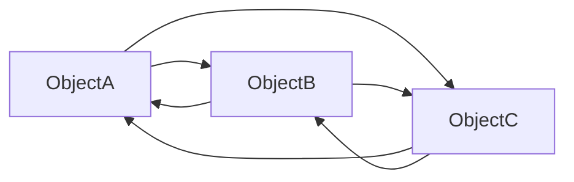
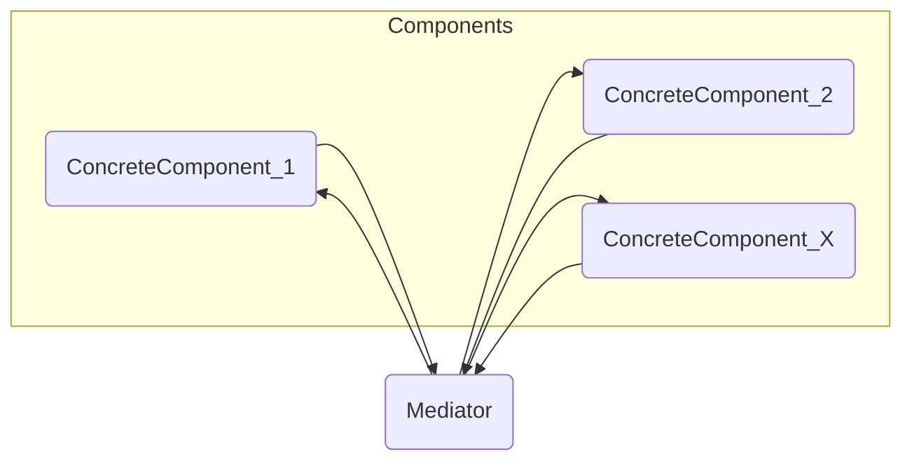
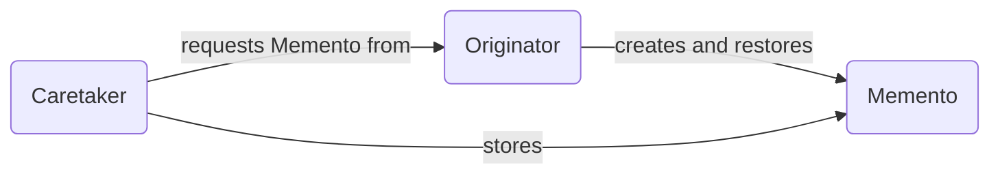
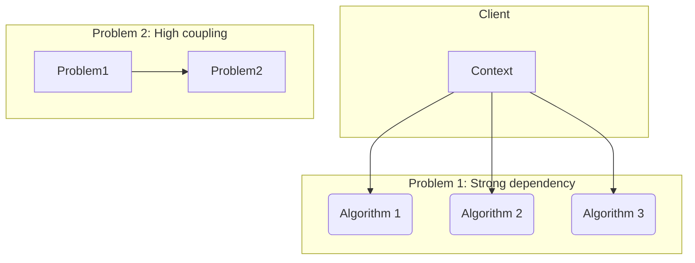

-----

## Behavioral Design Patterns: Mediator, Memento, and Strategy

### Mediator Pattern

The **Mediator pattern** is a behavioral design pattern that aims to promote **low coupling** between classes by making them communicate not directly, but through a mediator object.

Implementing the Mediator pattern can be very useful to reduce the dependency between objects. Instead of a series of objects having references to each other, they communicate through the **Mediator object**, which **acts as a communication hub** and can even centralize control over communication.

#### Problem Solved by the Mediator Pattern

The Mediator pattern encapsulates how a set of objects interact, with the goal of preventing them from communicating directly.

#### Example Solved by the Mediator Pattern

Imagine a project that has an interface with different objects. Control must be centralized so that interactions occur in a standardized manner.

The mediator acts as a centralized element, so that objects do not interact directly, but through the mediator.

**Class diagram of the problem before applying the Mediator pattern:**



If **ObjectA** needs an action in **ObjectC**, it must maintain a reference to it and invoke it directly, just as **ObjectC** will have to maintain a reference to **ObjectA** to interact with it. This makes the relationship more complex and harder to maintain, as the dependency relationship is highly coupled.

The **Mediator** pattern's main goal is to solve the problem of communication and dependency between objects. Imagine interface objects like buttons, text boxes, and checkboxes are classes that, for example, will do something different depending on changes in other design objects. Therefore, communication between them must be standardized by a **Mediator**.

#### To simplify complex interactions between objects, aiming for reuse and maintenance, the Mediator pattern acts as a communication hub so that objects do not communicate directly.

#### Solution of the Mediator Pattern

The design solution for the Mediator pattern is represented in the class diagram below:

**Class diagram:**



From the moment communication between the objects of a system is directed by the mediator, the objects do not need to know how to interact with the other objects. The only thing the objects need to do is communicate with the mediator.

Imagine the case of a form with different types of objects, such as buttons, checkboxes, and textboxes. If it is necessary to modify the behavior of one object when another is changed, the **Mediator** makes sure the changes are noticed in all objects that should be changed.

Below we have the representation of the **code structure** in an object-oriented programming language.

```java
// Mediator Interface
interface Mediator {
    void notify(Component sender, String event);
}

// Base class for Components
class Component {
    protected Mediator mediator;

    public Component(Mediator mediator) {
        this.mediator = mediator;
    }

    public void setMediator(Mediator mediator) {
        this.mediator = mediator;
    }
}

// Concrete Components
class ConcreteComponentA extends Component {
    public ConcreteComponentA(Mediator mediator) {
        super(mediator);
    }

    public void doSomething() {
        // ... Component logic ...
        mediator.notify(this, "eventA");
    }
}

class ConcreteComponentB extends Component {
    public ConcreteComponentB(Mediator mediator) {
        super(mediator);
    }

    public void doSomethingElse() {
        // ... Component logic ...
        mediator.notify(this, "eventB");
    }
}

// Concrete Mediator
class ConcreteMediator implements Mediator {
    private ConcreteComponentA compA;
    private ConcreteComponentB compB;

    public void setComponents(ConcreteComponentA a, ConcreteComponentB b) {
        this.compA = a;
        this.compB = b;
    }

    @Override
    public void notify(Component sender, String event) {
        if (sender == compA) {
            if (event.equals("eventA")) {
                System.out.println("Mediator reacting to eventA from Component A.");
                compB.doSpecificThingElse(); // Example action on the other component
            }
        } else if (sender == compB) {
            if (event.equals("eventB")) {
                System.out.println("Mediator reacting to eventB from Component B.");
                compA.doSpecificThing(); // Example action on the other component
            }
        }
    }
}
```

#### Consequences and Patterns Related to the Mediator Pattern

The Mediator pattern has the following consequences:

  - The mediator can be an **event hub** and act as a control center.
  - One of the benefits of the Mediator pattern is the **low coupling** between the objects of the system.
  - The **reuse** of objects is made easier, as communication between them becomes simpler.

-----

### Memento Pattern

The **Memento pattern** is a behavioral design pattern that aims to allow the **capture and restoration of an object's internal state** without exposing its implementation details.

Implementing the Memento pattern can be very useful in systems where there is a need to save an object's state at a certain moment, such as games, editing systems, or even transaction control systems.

#### Problem Solved by the Memento Pattern

Memento is a pattern that allows **saving the internal state** of an object without breaking its encapsulation and exposing its internal structure. It can be used to **revert an operation** if it does not meet the application's requirements.

#### Example Solved by the Memento Pattern

Imagine a text editor where the user types and deletes characters. At any time, the user can click **"Undo"**. For "Undo" to work, the system must store the previous state of the text (the *memento*), in order to restore it when the operation is requested.

The **Memento** pattern is ideal for acting in situations like these.

Below we have the representation of the **code structure** in an object-oriented programming language.

```java
// The Memento: stores the internal state of the Originator.
// Note that it can be internal and without public setters.
class Memento {
    private final String state;

    public Memento(String state) {
        this.state = state;
    }

    public String getState() {
        return state;
    }
}
```

#### Solution of the Memento Pattern

The design solution for the Memento pattern is represented in the class diagram below:

**Class diagram:**



  - **Originator**: is the object whose internal state needs to be saved and restored. It creates the *memento* and uses the *memento* to restore its state.
  - **Memento**: is the object that stores the **Originator's** internal state.
  - **Caretaker**: is the object that stores the *memento* on behalf of the **Originator**. The *Caretaker* never operates or examines the content of the *memento*.

Below we have the representation of the **code structure** in an object-oriented programming language, where the **Originator** has the state and is responsible for creating the *memento* to save its state and restoring its state.

```java
// Originator: object whose internal state must be saved.
class Originator {
    private String state;

    public void setState(String state) {
        System.out.println("Originator: Setting state to: " + state);
        this.state = state;
    }

    public String getState() {
        return state;
    }

    // Creates a Memento (saves the current state)
    public Memento saveState() {
        System.out.println("Originator: Saving Memento.");
        return new Memento(state);
    }

    // Restores the state from a Memento
    public void restoreState(Memento memento) {
        this.state = memento.getState();
        System.out.println("Originator: State restored to: " + state);
    }
}
```

The **Caretaker** operates its functionalities and the original **Memento** Class.

```java
// Caretaker: responsible for storing and managing Mementos.
class Caretaker {
    private Memento memento;

    public void setMemento(Memento memento) {
        this.memento = memento;
    }

    public Memento getMemento() {
        return memento;
    }
}
```

#### Consequences and Patterns Related to the Memento Pattern

The Memento pattern facilitates the implementation of operations such as **undo/redo**.

The representation of a memento can be in columns (in the *design*), in a large amount of memory (at *runtime*), or in a database. The fact that the **Memento** is **encapsulated** allows the **Caretaker** to manage the mementos **transparently**.

-----

### Strategy Pattern

The **Strategy pattern** is a behavioral design pattern that aims to allow the **definition of a family of algorithms**, encapsulate each one of them, and make them interchangeable.

Implementing the Strategy pattern can be very useful in systems that need to use different algorithms to perform the same task at different times, in a transparent manner.

#### Problem Solved by the Strategy Pattern

The Strategy pattern defines a set of algorithms, encapsulates each one of them, and makes them interchangeable, allowing the client to use them transparently.

#### Example Solved by the Strategy Pattern

Imagine an online store that, depending on the order conditions (weight, region, product type), calculates shipping in different ways. The way to calculate shipping can be one of:

  - Algorithm to calculate high prices.
  - Algorithm to calculate intermediate prices.
  - Algorithm to calculate low prices.

The client can select different calculation options. The Strategy pattern allows these algorithms to be encapsulated.

**Class diagram of the problem before applying the Strategy pattern:**



The client that contains the **Context** (the object that uses the algorithm) is coupled to all algorithms, as it needs to know which one to use at which moment. This makes the code less flexible and difficult to maintain.

#### Solution of the Strategy Pattern

The design solution for the Strategy pattern is represented in the class diagram below:

**Class diagram:**

```mermaid
graph LR
    Context(Context) --> Strategy(Strategy)
    Strategy <|-- ConcreteStrategy_1(ConcreteStrategy_1)
    Strategy <|-- ConcreteStrategy_2(ConcreteStrategy_2)
    Strategy <|-- ConcreteStrategy_X(ConcreteStrategy_X)
    
```

  - **Context**: is the class that uses the algorithm, having a reference to the **Strategy** interface.
  - **Strategy**: is the interface that defines the method to be implemented by the concrete algorithms.
  - **ConcreteStrategy**: are the classes that implement the **Strategy** interface, each with a different implementation of the algorithm.

From the moment the **Context** starts having a reference to the **Strategy** interface, it no longer needs to know which algorithm is being used, only that it implements the **Strategy** interface. This makes the code more flexible and easier to maintain.

Below we have the representation of the **code structure** in an object-oriented programming language, where the **Strategy** interface is implemented by the **ConcreteStrategy\_1** and **ConcreteStrategy\_2** classes.

```java
// Strategy Interface
interface Strategy {
    int execute(int a, int b);
}

// ConcreteStrategy_1
class AdditionStrategy implements Strategy {
    @Override
    public int execute(int a, int b) {
        return a + b;
    }
}

// ConcreteStrategy_2
class SubtractionStrategy implements Strategy {
    @Override
    public int execute(int a, int b) {
        return a - b;
    }
}

// Context
class Context {
    private Strategy strategy;

    public Context(Strategy strategy) {
        this.strategy = strategy;
    }

    public void setStrategy(Strategy strategy) {
        this.strategy = strategy;
    }

    public int executeStrategy(int a, int b) {
        return strategy.execute(a, b);
    }
}
```

The code below demonstrates the application of the pattern, where the **Context** object can change the algorithm at *runtime*.

```java
// Usage example
Context context = new Context(new AdditionStrategy());
System.out.println("Addition: " + context.executeStrategy(10, 5));

context.setStrategy(new SubtractionStrategy());
System.out.println("Subtraction: " + context.executeStrategy(10, 5));
```

#### Consequences and Patterns Related to the Strategy Pattern

The Strategy pattern offers some consequences:

  - **Simplification of the definitions** of the algorithms, making them more cohesive and easy to understand.
  - The context starts having a **reference to the Strategy interface**, instead of having dependency on several concrete algorithm classes.
  - Allows algorithms to be swapped **at runtime**.

To some extent, the Strategy pattern acts as a substitute for the selection statements (if/else or switch/case) that would be used to choose which algorithm to execute. The Strategy pattern is one of the most used, as it makes the code flexible and allows the system to be easily extended with new algorithms.