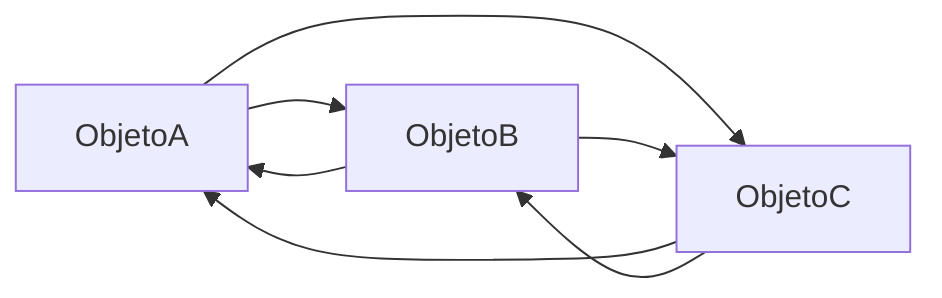
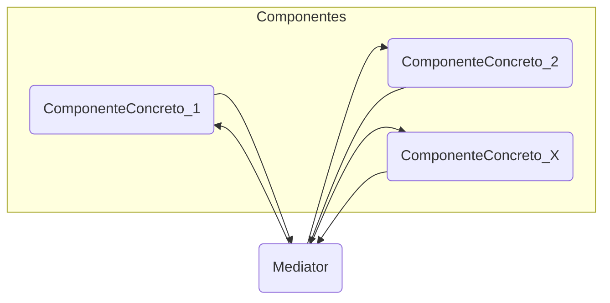
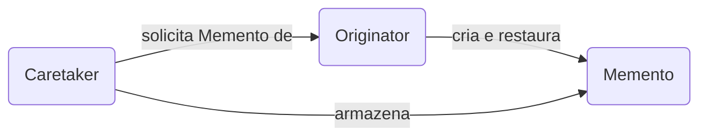
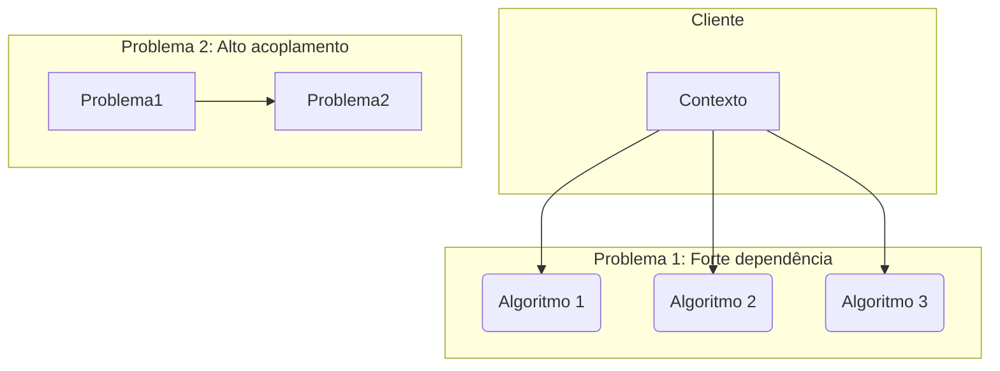

-----

## Padrões de projeto comportamentais Mediator, Memento e Strategy

### Padrão Mediator

O **padrão Mediator** é um padrão de projeto comportamental que tem como objetivo promover o **baixo acoplamento** entre classes ao fazer com que elas não se comuniquem diretamente, mas através de um objeto mediador.

A implementação do padrão Mediator pode ser muito útil para diminuir a dependência entre objetos. Em vez de uma série de objetos terem referências uns aos outros, eles se comunicam através do objeto Mediator, que **atua como um centro de comunicação** e pode até centralizar o controle sobre a comunicação.

#### Problema resolvido pelo padrão Mediator

O padrão Mediator encapsula a forma de interação entre um conjunto de objetos, com o objetivo de evitar que eles se comuniquem diretamente.

#### Exemplo resolvido pelo padrão Mediator

Imagine um projeto que possui uma interface com diferentes objetos. O controle deve ser centralizado para que as interações ocorram de forma padronizada.

O mediador atua em um elemento centralizado, de forma que os objetos não se interajam de forma direta, mas através do mediador.

**Diagrama de classes do problema antes da aplicação do padrão Mediator:**



Se o objeto **ObjetoA** necessitar de uma ação no **ObjetoC**, terá de manter uma referência a ele e invocá-lo diretamente, assim como o **ObjetoC** terá que manter uma referência ao **ObjetoA** para interagir com ele. Isso faz com que a relação fique mais complexa e mais difícil para a manutenção, pois a relação de dependência fica muito acoplada.

O padrão **Mediator** tem como principal objetivo solucionar o problema de comunicação e dependência entre objetos. Imagine que os objetos da interface como botões, caixas de texto e *checkboxes* são classes que, por exemplo, farão algo diferente dependendo de mudanças nos outros objetos do *design*. Logo, a comunicação entre eles deve ser padronizada por um **Mediador**.

#### Como simplificar interações complexas entre os objetos, com o objetivo de reuso e manutenção, o padrão Mediator atua como um centro de comunicação para que os objetos não se comuniquem diretamente.

#### Solução do padrão Mediator

A solução de projeto para o padrão Mediator está representada no diagrama de classes a seguir:

**Diagrama de classes:**



A partir do momento em que a comunicação entre os objetos de um sistema é direcionada pelo mediador, os objetos não precisam saber como interagir com os outros objetos. A única coisa que os objetos precisam fazer é se comunicar com o mediador.

Imagine o caso de um formulário com diferentes tipos de objetos, como botões, *checkbox* e *textbox*. Se for necessário modificar o funcionamento de um objeto quando um outro é alterado, o **Mediator** faz com que as alterações sejam percebidas em todos os objetos que devem ser alterados.

Abaixo temos a representação da **estrutura do código** em uma linguagem de programação orientada a objetos.

```java
// Interface do Mediator
interface Mediator {
    void notificar(Componente remetente, String evento);
}

// Classe base para Componentes
class Componente {
    protected Mediator mediador;

    public Componente(Mediator mediador) {
        this.mediador = mediador;
    }

    public void setMediador(Mediator mediador) {
        this.mediador = mediador;
    }
}

// Componentes Concretos
class ComponenteConcretoA extends Componente {
    public ComponenteConcretoA(Mediator mediador) {
        super(mediador);
    }

    public void fazerAlgo() {
        // ... Lógica do componente ...
        mediador.notificar(this, "eventoA");
    }
}

class ComponenteConcretoB extends Componente {
    public ComponenteConcretoB(Mediator mediador) {
        super(mediador);
    }

    public void fazerOutraCoisa() {
        // ... Lógica do componente ...
        mediador.notificar(this, "eventoB");
    }
}

// Mediator Concreto
class MediatorConcreto implements Mediator {
    private ComponenteConcretoA compA;
    private ComponenteConcretoB compB;

    public void setComponentes(ComponenteConcretoA a, ComponenteConcretoB b) {
        this.compA = a;
        this.compB = b;
    }

    @Override
    public void notificar(Componente remetente, String evento) {
        if (remetente == compA) {
            if (evento.equals("eventoA")) {
                System.out.println("Mediador reagindo ao eventoA do Componente A.");
                compB.fazerOutraCoisaEspecifica(); // Exemplo de ação no outro componente
            }
        } else if (remetente == compB) {
            if (evento.equals("eventoB")) {
                System.out.println("Mediador reagindo ao eventoB do Componente B.");
                compA.fazerAlgoEspecifico(); // Exemplo de ação no outro componente
            }
        }
    }
}
```

#### Consequências e padrões relacionados ao padrão Mediator

O padrão Mediator tem as seguintes consequências:

  - O mediador pode ser um **concentrador de eventos** e atuar como um concentrador de controle.
  - Um dos benefícios do padrão Mediator é o **baixo acoplamento** entre os objetos do sistema.
  - A **reutilização** dos objetos é mais facilitada, pois a comunicação entre eles se torna mais simples.

-----

### Padrão Memento

O **padrão Memento** é um padrão de projeto comportamental que tem como objetivo permitir a **captura e restauração do estado interno** de um objeto sem expor seus detalhes de implementação.

A implementação do padrão Memento pode ser muito útil em sistemas onde existe a necessidade de salvar o estado de um objeto em determinado momento, como jogos, sistemas de edição ou mesmo sistemas de controle de transações.

#### Problema resolvido pelo padrão Memento

Memento é um padrão que permite **salvar o estado interno** de um objeto, sem quebrar o seu encapsulamento e expor a sua estrutura interna. Ele pode ser usado para **reverter uma operação** caso esta não atenda aos requisitos da aplicação.

#### Exemplo resolvido pelo padrão Memento

Imagine um editor de texto onde o usuário digita e apaga caracteres. A qualquer momento, o usuário pode clicar em **"Desfazer" (Undo)**. Para que o "Desfazer" funcione, o sistema deve guardar o estado anterior do texto (o *memento*), para poder restaurá-lo quando a operação for solicitada.

O padrão Memento é ideal para atuar em situações como essas.

Abaixo temos a representação da **estrutura do código** em uma linguagem de programação orientada a objetos.

```java
// O Memento: armazena o estado interno do Originator.
// Note que ele pode ser interno e sem setters públicos.
class Memento {
    private final String estado;

    public Memento(String estado) {
        this.estado = estado;
    }

    public String getEstado() {
        return estado;
    }
}
```

#### Solução do padrão Memento

A solução de projeto para o padrão Memento está representada no diagrama de classes a seguir:

**Diagrama de classes:**



  - **Originator**: é o objeto cujo estado interno precisa ser salvo e restaurado. Ele cria o *memento* e usa o *memento* para restaurar seu estado.
  - **Memento**: é o objeto que armazena o estado interno do *Originator*.
  - **Caretaker**: é o objeto que armazena o *memento* em nome do *Originator*. O *Caretaker* nunca opera ou examina o conteúdo do *memento*.

Abaixo temos a representação da **estrutura do código** em uma linguagem de programação orientada a objetos, onde o **Originator** possui o estado e é responsável por criar o *memento* para salvar seu estado e restaurar seu estado.

```java
// Originator: objeto cujo estado interno deve ser salvo.
class Originator {
    private String estado;

    public void setEstado(String estado) {
        System.out.println("Originator: Configurando estado para: " + estado);
        this.estado = estado;
    }

    public String getEstado() {
        return estado;
    }

    // Cria um Memento (salva o estado atual)
    public Memento salvarEstado() {
        System.out.println("Originator: Salvando Memento.");
        return new Memento(estado);
    }

    // Restaura o estado a partir de um Memento
    public void restaurarEstado(Memento memento) {
        this.estado = memento.getEstado();
        System.out.println("Originator: Estado restaurado para: " + estado);
    }
}
```

O **Caretaker** opera suas funcionalidades e a Classe **Memento** original.

```java
// Caretaker: responsável por guardar e gerenciar Mementos.
class Caretaker {
    private Memento memento;

    public void setMemento(Memento memento) {
        this.memento = memento;
    }

    public Memento getMemento() {
        return memento;
    }
}
```

#### Consequências e padrões relacionados ao padrão Memento

O padrão Memento facilita a implementação de operações como **undo/redo** (desfazer/refazer).

A representação de um memento pode ser em colunas (no *design*), em uma grande quantidade de memória (em *runtime*) ou em uma base de dados. O fato de o **Memento** ser **encapsulado** permite que o **Caretaker** possa gerenciar os mementos de forma **transparente**.

-----

### Padrão Strategy

O **padrão Strategy** é um padrão de projeto comportamental que tem como objetivo permitir a **definição de uma família de algoritmos**, encapsular cada um deles e torná-los intercambiáveis.

A implementação do padrão Strategy pode ser muito útil em sistemas que precisam usar diferentes algoritmos para realizar a mesma tarefa em diferentes momentos, de forma transparente.

#### Problema resolvido pelo padrão Strategy

O padrão Strategy define um conjunto de algoritmos, encapsula cada um deles e os torna intercambiáveis, permitindo que o cliente os utilize de forma transparente.

#### Exemplo resolvido pelo padrão Strategy

Imagine uma loja virtual que, dependendo das condições do pedido (peso, região, tipo de produto), calcula o frete de diferentes maneiras. A forma de calcular o frete pode ser uma:

  - Algoritmo para calcular preços altos.
  - Algoritmo para calcular preços intermediários.
  - Algoritmo para calcular preços baixos.

O cliente pode selecionar diferentes opções de cálculo. O padrão Strategy permite encapsular esses algoritmos.

**Diagrama de classes do problema antes da aplicação do padrão Strategy:**



O cliente que contém o **Contexto** (o objeto que usa o algoritmo) está acoplado a todos os algoritmos, pois ele precisa saber qual deles usar em qual momento. Isso torna o código menos flexível e difícil de manter.

#### Solução do padrão Strategy

A solução de projeto para o padrão Strategy está representada no diagrama de classes a seguir:

**Diagrama de classes:**

```mermaid
graph LR
    Contexto(Contexto) --> Strategy(Strategy)
    Strategy <|-- ConcreteStrategy_1(ConcreteStrategy_1)
    Strategy <|-- ConcreteStrategy_2(ConcreteStrategy_2)
    Strategy <|-- ConcreteStrategy_X(ConcreteStrategy_X)
    
```

  - **Contexto**: é a classe que utiliza o algoritmo, possuindo uma referência para a interface **Strategy**.
  - **Strategy**: é a interface que define o método que será implementado pelos algoritmos concretos.
  - **ConcreteStrategy**: são as classes que implementam a interface **Strategy**, cada uma com uma implementação diferente do algoritmo.

A partir do momento em que o **Contexto** passa a ter uma referência para a interface **Strategy**, ele não precisa mais saber qual algoritmo está sendo usado, apenas que ele implementa a interface **Strategy**. Isso faz com que o código fique mais flexível e mais fácil de manter.

Abaixo temos a representação da **estrutura do código** em uma linguagem de programação orientada a objetos, onde a interface **Strategy** é implementada pelas classes **ConcreteStrategy\_1** e **ConcreteStrategy\_2**.

```java
// Interface Strategy
interface Strategy {
    int executar(int a, int b);
}

// ConcreteStrategy_1
class SomaStrategy implements Strategy {
    @Override
    public int executar(int a, int b) {
        return a + b;
    }
}

// ConcreteStrategy_2
class SubtracaoStrategy implements Strategy {
    @Override
    public int executar(int a, int b) {
        return a - b;
    }
}

// Contexto
class Contexto {
    private Strategy strategy;

    public Contexto(Strategy strategy) {
        this.strategy = strategy;
    }

    public void setStrategy(Strategy strategy) {
        this.strategy = strategy;
    }

    public int executarStrategy(int a, int b) {
        return strategy.executar(a, b);
    }
}
```

O código abaixo demonstra a aplicação do padrão, onde o objeto **Contexto** pode mudar o algoritmo em *runtime*.

```java
// Exemplo de uso
Contexto contexto = new Contexto(new SomaStrategy());
System.out.println("Soma: " + contexto.executarStrategy(10, 5));

contexto.setStrategy(new SubtracaoStrategy());
System.out.println("Subtração: " + contexto.executarStrategy(10, 5));
```

#### Consequências e padrões relacionados ao padrão Strategy

O padrão Strategy oferece algumas consequências:

  - **Simplificação das definições** dos algoritmos, tornando-os mais coesos e fáceis de entender.
  - O contexto passa a ter uma **referência para a interface Strategy**, em vez de ter dependência de diversas classes concretas de algoritmos.
  - Permite que os algoritmos sejam trocados **em tempo de execução**.

Em certa medida, o padrão Strategy atua como um substituto para as instruções de seleção (if/else ou switch/case) que seriam usadas para escolher qual algoritmo executar. O padrão Strategy é um dos mais usados, pois flexibiliza o código e permite que o sistema seja facilmente estendido com novos algoritmos.