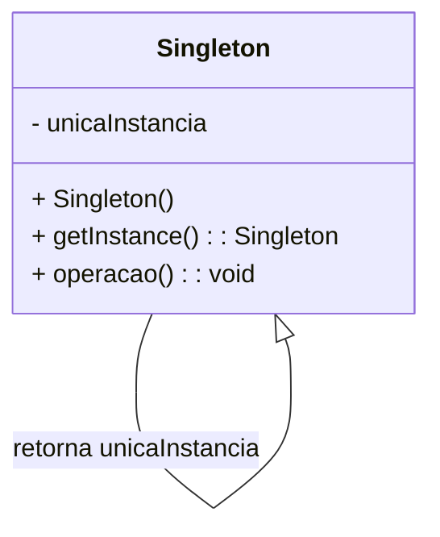
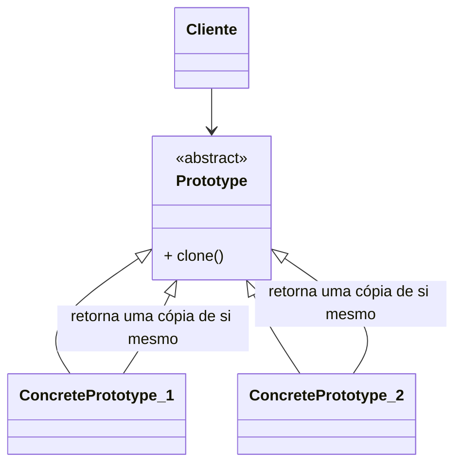

## 4\. Prototype and Singleton Design Patterns

### Intention, Problem, and Solution of the Singleton Pattern

In **software** engineering, a common problem is the management of globally shared resources, such as **database connection pools**, **caches**, **registrars**, and **event logs**. In these situations, we need to ensure that there is **only one single instance** of the class that manages this resource. Its implementation becomes more complex when we guarantee that the single instance is accessible throughout the application.

### Intention of the Singleton Pattern

The purpose of the **Singleton pattern** is to ensure that only a **single instance** of a class exists, providing a global access point to it.

### Problem of the Singleton Pattern

Suppose a situation where you want to ensure that only one **instance** of a class, such as the **event log** class, is created during program execution. This instance needs to be accessible throughout the application.

This **log** class stores, in a global variable, references to objects and behavior. In this way, all modules that process these objects will have access via this global variable. When many modules use this global variable, your code becomes highly coupled and difficult to maintain.

Another solution would be to define all operations of the class whose single object must be shared with class scope. In Java, for example, attributes can be declared as **static** and **public** so that they can be accessed by any object, throughout the entire application. The problem is the difficulty in managing instances, especially in **concurrent environments**.

### Solution of the Singleton Pattern

The diagram below presents the structure of the **Singleton pattern**:



The name **Singleton** represents the name of the class you want to have **only one instance**. The attribute **$unicalnstancia** is a reference to this single instance to be shared by the other modules.

The constructor **Singleton()** is declared as private, so that other objects cannot instantiate it directly. Both the **variable** and the **constructor** are declared as **private** to make access difficult.

### Implementation of the Singleton Pattern

The **unique variable** and the **constructor** are declared as **private**, preventing the class from being directly instantiated. The only way to obtain the **unique instance** is through the function **$getlnstance()** which is the only way to obtain the **unique instance**. This function must be declared as **static** (or class-level), so that it can be accessed throughout the entire application.

### Example Code

```java
package OpenClosed.Factory;

public class MyRegisterClientDecoder implements MyRegisterClient {

    private static MyRegisterClientDecoder myRegisterClientDecoder;

    private MyRegisterClientDecoder() {}

    public static MyRegisterClientDecoder getInstance() {
        if (myRegisterClientDecoder == null) {
            myRegisterClientDecoder = new MyRegisterClientDecoder();
        }

        return myRegisterClientDecoder;
    }

    @Override
    public String decode(String value, String origin) {
        // Implementation of the decoder
        return "Decoded: " + value + " from: " + origin;
    }

    @Override
    public String encode(String value, String origin) {
        // Implementation of the encoder
        return "Encoded: " + value + " to: " + origin;
    }
}
```

```java
package OpenClosed.Factory;

import java.util.HashMap;
import java.util.Map;

public class Main {
    public static void main(String[] args) {
        MyRegisterClientDecoder myRegisterClientDecoder = MyRegisterClientDecoder.getInstance();
        MyRegisterClientDecoder myRegisterClientDecoder2 = MyRegisterClientDecoder.getInstance();

        System.out.println("Are both instances the same? " + (myRegisterClientDecoder == myRegisterClientDecoder2));

        String originalString = "Mensagem de teste";
        String encodedString = myRegisterClientDecoder.encode(originalString, "Origem A");
        System.out.println("Encoded string: " + encodedString);

        String decodedString = myRegisterClientDecoder2.decode(encodedString, "Destino B");
        System.out.println("Decoded string: " + decodedString);
    }
}
```

We can define the **abstract factory** as a registry of the various **Singletons** corresponding to the **concrete factories**.

In the example, the **MyRegisterClientDecoder** class implements the **Singleton pattern** through the static function **$getlnstance()**. This data structure stores an **origin** and a **Singleton** of the respective **concrete factory**. The operation **$getlnstance()** accesses this **map** and returns the instance of the **factory** corresponding to the **origin**.

```java
package OpenClosed.Factory;

import java.util.HashMap;
import java.util.Map;

public class MyRegisterClientFactory {
    private static final Map<String, MyRegisterClient> factories = new HashMap<>();

    static {
        factories.put("DecodeFactory", MyRegisterClientDecoder.getInstance());
        factories.put("EncodeFactory", MyRegisterClientEncoder.getInstance());
        // Add other concrete factories if necessary
    }

    public static MyRegisterClient getFactory(String type) {
        return factories.get(type);
    }
}
```

-----

## 4\. Prototype and Singleton Design Patterns

### Solution of the Prototype Pattern

The **Prototype pattern** provides a simple solution: a class cloning method, responsible for instantiating a new object, based on an already existing object. The **class instance** to be cloned is called the **prototype**. Instead of creating instances through the **new** operator, we ask the prototype to clone itself.

The **Prototype pattern** is applicable in at least three specific situations. Understand\!

Below is the diagram and structure of the solution proposed by the **Prototype pattern**:



### Problem of the Prototype Pattern

Suppose that, in the problem presented in the **Abstract Factory pattern**, the **message decodings** depend on **specific classes**, such as **MyRegisterClientA** and **MyRegisterClientB**, in which the act of creating objects of specific classes confirms the **origin of the message**.

The **Abstract Factory pattern** solves this problem by defining an interface for creating families of objects, where each concrete factory will create the instance of **MyRegisterClientA** or **MyRegisterClientB**.

However, this may generate the need to create a class creation hierarchy parallel to the object class hierarchy, which makes the system more complex. The problem is that, when using the **Abstract Factory pattern**, each concrete factory must have its own object creation code, which can lead to high coupling between the abstract factory and the object classes.

The **central idea of the pattern is to make a client class that needs to create instances of a specific library or of various classes in a class hierarchy do so by copying an already existing object, instead of using an abstract factory.**

### Message Decoding Selection

Can you visualize how the solution presented would look like with the **decoder message selection**?

In **Java**, all classes that have a hierarchy and the **Clone pattern** implemented, define the interface **java.lang.Cloneable**.

If an object, for example, wishes to have an **attribute** that is a **reference** to a related **Client** object, this object can be copied through the **clone()** function. This function will create an exact copy of the object, except for the attributes that contain references to the original objects instead of cloned ones.

### Can you visualize this solution selects decoding complexity?

```java
package OpenClosed.Factory;

public class MyRegisterClient implements Cloneable {
    private String name;
    private String origin;
    private String value;

    public MyRegisterClient(String name, String origin, String value) {
        this.name = name;
        this.origin = origin;
        this.value = value;
    }

    @Override
    protected Object clone() throws CloneNotSupportedException {
        return super.clone();
    }

    public String getName() {
        return name;
    }

    public String getOrigin() {
        return origin;
    }

    public String getValue() {
        return value;
    }
}
```

```java
package OpenClosed.Factory;

import java.util.HashMap;
import java.util.Map;

public class MyRegisterClientManager {
    private static final Map<String, MyRegisterClient> prototypes = new HashMap<>();

    static {
        prototypes.put("MyRegisterClientA", new MyRegisterClient("MyRegisterClientA", "OriginA", "ValueA"));
        prototypes.put("MyRegisterClientB", new MyRegisterClient("MyRegisterClientB", "OriginB", "ValueB"));
        // Add other prototypes if necessary
    }

    public static MyRegisterClient getPrototype(String type) throws CloneNotSupportedException {
        return (MyRegisterClient) prototypes.get(type).clone();
    }
}
```

You realize that, with this code, you can now instantiate several subclasses of **MyRegisterClients**, without needing to implement the **new** operator every time you want to create a new object.

-----

## 4\. Prototype and Singleton Design Patterns

### Intention and Problem of the Prototype Pattern

When faced with this challenge, the **Prototype pattern** helps us deal with the complexity of creating objects of different classes, instead of using a class creation hierarchy parallel to the object classes. The **idea** is to create a **copy of an already existing object**, instead of creating it from scratch.

### Problem of the Prototype Pattern

Suppose that, in the problem presented in the **Abstract Factory pattern**, the **message decodings** depend on **specific classes**, such as **MyRegisterClientA** and **MyRegisterClientB**, in which the act of creating objects of specific classes confirms the **origin of the message**.

The **Abstract Factory pattern** solves this problem by defining an interface for creating families of objects, where each concrete factory will create the instance of **MyRegisterClientA** or **MyRegisterClientB**.

### Message Decoding Selection

Can you visualize that this solution selects **decoding** complexity?

```java
// Java: Example of MyRegisterClient Decoder
public class MyRegisterClientDecoder implements MyRegisterClient {
    // ... fields and constructor ...

    @Override
    public String decode(String value, String origin) {
        // Specific decoding logic
        return "Decoded: " + value + " from: " + origin;
    }

    @Override
    public String encode(String value, String origin) {
        // Specific encoding logic
        return "Encoded: " + value + " to: " + origin;
    }
}
```

-----

## 4\. Prototype and Singleton Design Patterns

### Consequences and Patterns Related to Singleton

**Singleton** centralizes responsibilities, but requires care, such as the use of **semaphores** in **asynchronous thread synchronization** to avoid multiple instances in **concurrent environments**. Another **limitation** is the **difficulty in unit tests**, as the pattern does not easily allow the **creation of mocks** or **test doubles**. Furthermore, in some cases, the pattern can lead to other patterns, due to the non-intentional evolution of **Builders** or **Factory Methods** in object construction.

The **Singleton pattern** allows **controlled access** to a **single instance** of a class, being a superior solution to the use of **global variables**. It even allows the **creation of more specific subclasses** without impact on the **modules** that use the **Singleton instance**.

**Comment**

> The **Singleton pattern** is frequently used in conjunction with the **Abstract Factory pattern**.

### Singleton: Pattern or Anti-Pattern

It is important to emphasize that the **Singleton pattern** has been a subject of debate, sometimes being considered an **anti-pattern** due to its characteristics.

### Consequences and Patterns Related to Prototype

The **Prototype pattern** allows for **reducing the amount of code in the system**, by working with already existing, often global objects, for generating new objects with a defined initial configuration. Furthermore, **Prototype** allows the **definition of class hierarchies** for the **creation of objects** that are also objects that need to be clonable. For example, the use of **Prototype** in a **system** that requires **copies of objects** for **transactions**. The **Prototype pattern** allows avoiding this difficulty, and allows its **use to define previously configured models**, which will serve as a base for **creating new objects** in the **system**.

### Simplification of Creating Product Families

When there are many **specific factories** for different **product families**, this pattern allows the **creation** of new products to be done by **cloning** already existing objects, using a **single factory class** and **instantiating each family configured with the prototypes that will be cloned**.

While the **Factory Method pattern** defines a **creation class hierarchy** parallel to the **object classes**, the **Prototype pattern** allows the **creation of new objects** by **cloning** an object. Its **factory** registers only one **prototype instance**, which is cloned afterward.

The **Prototype pattern** allows for **flexible creation of families** that can have their **creation** **configuration** defined by **cloning**, instead of **creating classes** derived by the **Factory pattern**, which is **basically static**.

However, the **Prototype pattern** requires that each **product subclass** to be **instantiated** implement the **clone() method**. This can lead to **code duplication**, especially in the **case of using third-party classes** or **classes shared with other systems**.

In addition, the **side effects** arising from a **copy based on a shallow copy strategy** and the **maintenance of data structures that contain objects from third-party classes** with **high coupling of relationships** or **circular relationships** can bring **difficulties** to the **implementation** of this pattern.