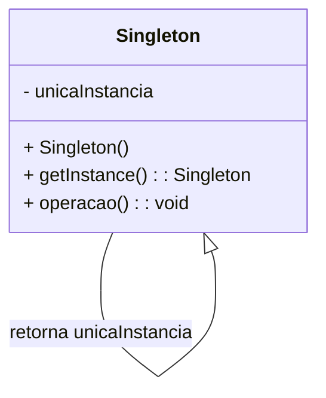
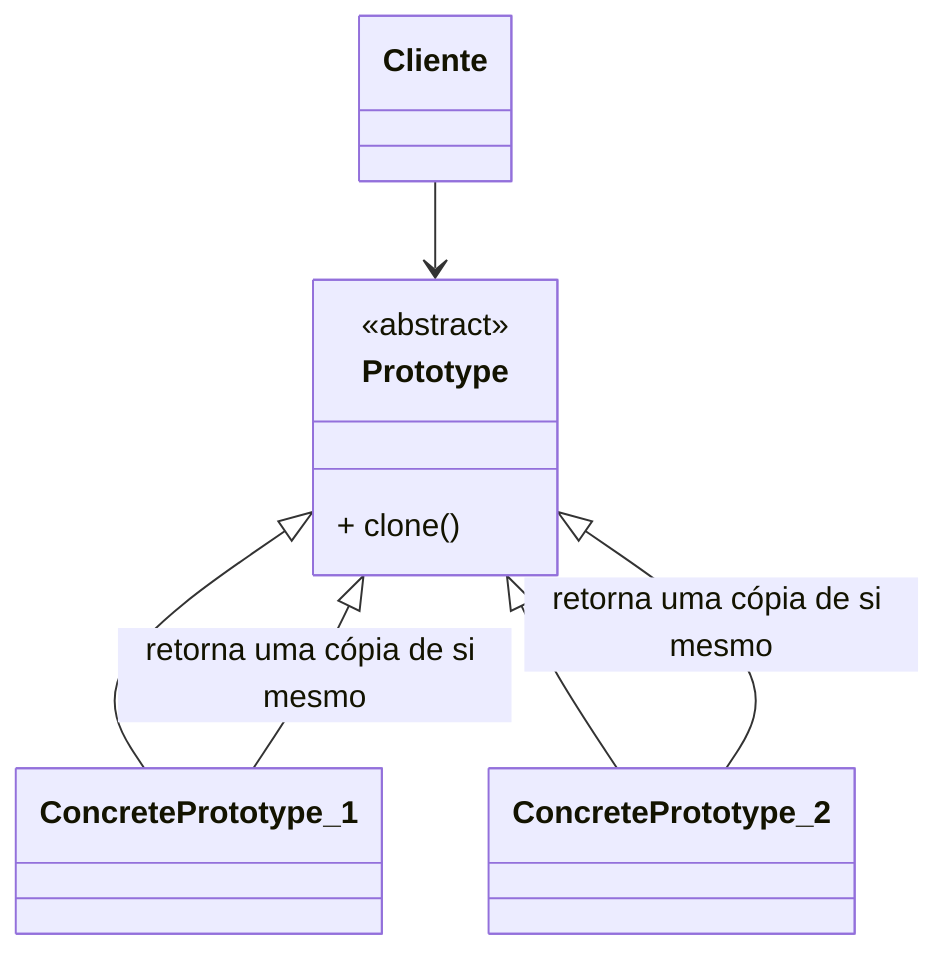

-----

## 4\. Padrões de projeto Prototype e Singleton

### Intenção, problema e solução do padrão Singleton

Na engenharia de **software**, um problema comum é o gerenciamento de recursos compartilhados globalmente, como **pools de conexão com bancos de dados**, **caches**, **registradores** e **logs de eventos**. Nessas situações, precisamos garantir que exista **apenas uma única instância** da classe que gerencia esse recurso. A sua implementação se torna mais complexa ao garantirmos que a única instância seja acessível por toda a aplicação.

Entenda no vídeo a intenção, o problema e a solução do **padrão Singleton**:

### Intenção do padrão Singleton

O propósito do **padrão Singleton** é garantir que exista apenas uma **única instância** de uma classe, provendo um ponto de acesso global para ela.

### Problema do padrão Singleton

Suponha uma situação em que você queira garantir que apenas uma **instância** de uma classe, como a classe de **log de eventos**, seja criada durante a execução de um programa. Essa instância precisa ser acessível por toda a aplicação.

Essa classe de **log** armazena, em uma variável global, referências a objetos e ao comportamento. Desse forma, todos os módulos que processarem esses objetos terão o acesso via essa variável global. Quando muitos módulos usam essa variável global, seu código se torna muito acoplado e difícil de manter.

Outra solução seria definir com o escopo de classe todas as operações da classe cujo objeto único deve ser compartilhado. Em Java, por exemplo, os atributos podem ser declarados como **estáticos** e **públicos** para que, assim, sejam acessados por qualquer objeto, dentro de toda a aplicação. O problema é a dificuldade de gerenciar as instâncias, principalmente em **ambientes concorrentes**.

### Solução do padrão Singleton

O diagrama a seguir apresenta a estrutura do **padrão Singleton**:



O nome **Singleton** representa o nome da classe que você deseja ter **apenas uma instância**. O atributo **$unicalnstancia** é uma referência à essa única instância a ser compartilhada pelos demais módulos.

O construtor **Singleton()** é declarado como privado, para que outros objetos não consigam instanciá-lo diretamente. Tanto a **variável** quanto o **construtor** são declarados como **private** para dificultar o acesso.

### Implementação do padrão Singleton

A **variável única** e o **construtor** são declarados como **privados**, impedindo que a classe seja instanciada diretamente. A única forma de obter a **instância única** é através da função **$getlnstance()** que é a única forma de obter a **instância única**. Essa função deve ser declarada como **estática** (ou de classe), para que possa ser acessada por toda a aplicação.

### Código de exemplo

```java
package OpenClosed.Factory;

public class MyRegisterClientDecoder implements MyRegisterClient {

    private static MyRegisterClientDecoder myRegisterClientDecoder;

    private MyRegisterClientDecoder() {}

    public static MyRegisterClientDecoder getInstance() {
        if (myRegisterClientDecoder == null) {
            myRegisterClientDecoder = new MyRegisterClientDecoder();
        }

        return myRegisterClientDecoder;
    }

    @Override
    public String decode(String value, String origin) {
        // Implementação do decodificador
        return "Decoded: " + value + " from: " + origin;
    }

    @Override
    public String encode(String value, String origin) {
        // Implementação do codificador
        return "Encoded: " + value + " to: " + origin;
    }
}
```

```java
package OpenClosed.Factory;

import java.util.HashMap;
import java.util.Map;

public class Main {
    public static void main(String[] args) {
        MyRegisterClientDecoder myRegisterClientDecoder = MyRegisterClientDecoder.getInstance();
        MyRegisterClientDecoder myRegisterClientDecoder2 = MyRegisterClientDecoder.getInstance();

        System.out.println("Are both instances the same? " + (myRegisterClientDecoder == myRegisterClientDecoder2));

        String originalString = "Mensagem de teste";
        String encodedString = myRegisterClientDecoder.encode(originalString, "Origem A");
        System.out.println("Encoded string: " + encodedString);

        String decodedString = myRegisterClientDecoder2.decode(encodedString, "Destino B");
        System.out.println("Decoded string: " + decodedString);
    }
}
```

Podemos definir a **fábrica abstrata** como um registro dos diversos **Singletons** correspondentes as **fábricas concretas**.

No exemplo, a classe **MyRegisterClientDecoder** implementa o **padrão Singleton** através da função estática **$getlnstance()**. Essa estrutura de dados armazena uma **origem** e um **Singleton** da respectiva **fábrica concreta**. A operação **$getlnstance()** acessa esse **map** e retorna a instância da **fábrica** correspondente à **origem**.

```java
package OpenClosed.Factory;

import java.util.HashMap;
import java.util.Map;

public class MyRegisterClientFactory {
    private static final Map<String, MyRegisterClient> factories = new HashMap<>();

    static {
        factories.put("DecodeFactory", MyRegisterClientDecoder.getInstance());
        factories.put("EncodeFactory", MyRegisterClientEncoder.getInstance());
        // Adicionar outras fábricas concretas se necessário
    }

    public static MyRegisterClient getFactory(String type) {
        return factories.get(type);
    }
}
```

-----

## 4\. Padrões de projeto Prototype e Singleton

### Solução do padrão Prototype

O **padrão Prototype** provê uma solução simples: um método de clonagem de classes, responsável por instanciar um novo objeto, com base em um objeto já existente. A **instância de classe** a ser clonada é chamada de **protótipo**. Ao invés de criarmos instâncias através do operador **new**, nós solicitamos que o protótipo clone a si mesmo.

O **padrão Prototype** é aplicável em pelo menos três situações específicas. Entenda\!

A seguir está o diagrama e a estrutura da solução proposta pelo **padrão Prototype**:



### Problema do padrão Prototype

Suponha que, no problema apresentado no **padrão Abstract Factory**, as **decodificações da mensagem** dependam de **classes específicas**, como **MyRegisterClientA** e **MyRegisterClientB**, no qual o ato de criar objetos de classes específicas confirmam a **origem da mensagem**.

O **padrão Abstract Factory** resolve esse problema ao definir uma interface de criação de famílias de objetos, onde cada fábrica concreta irá criar a instância de **MyRegisterClientA** ou **MyRegisterClientB**.

Contudo, isso pode gerar a necessidade de criar uma hierarquia de classes de criação paralela à hierarquia de classes de objetos, o que torna o sistema mais complexo. O problema é que, ao usar o **padrão Abstract Factory**, cada fábrica concreta deve ter seu próprio código de criação de objetos, o que pode levar a um alto acoplamento entre a fábrica abstrata e as classes de objetos.

A **ideia central do padrão é fazer com que uma classe cliente que precise criar instâncias de uma biblioteca específica ou de diversas classes em uma hierarquia de classes, o faça através de uma cópia de um objeto já existente, ao invés de usar uma fábrica abstrata.**

### Seleção de decodificação de mensagens

Você consegue visualizar como ficaria a solução do problema apresentado com a **seleção da mensagem decodificadora**?

Em **Java**, todas as classes que possuem uma hierarquia e o **padrão Clone** implementada, para tanto, definem a interface **java.lang.Cloneable**.

Se um objeto deseja, por exemplo, possuir um **atributo** que seja uma **referência** para um objeto **Cliente** relacionado, a cópia desse objeto pode ser realizada através da função **clone()**. Essa função irá criar uma cópia exata do objeto, exceto pelos atributos que contém referências para objetos originais em vez de clonados.

### Você consegue visualizar essa solução seleciona complexidade de decodificação?

```java
package OpenClosed.Factory;

public class MyRegisterClient implements Cloneable {
    private String name;
    private String origin;
    private String value;

    public MyRegisterClient(String name, String origin, String value) {
        this.name = name;
        this.origin = origin;
        this.value = value;
    }

    @Override
    protected Object clone() throws CloneNotSupportedException {
        return super.clone();
    }

    public String getName() {
        return name;
    }

    public String getOrigin() {
        return origin;
    }

    public String getValue() {
        return value;
    }
}
```

```java
package OpenClosed.Factory;

import java.util.HashMap;
import java.util.Map;

public class MyRegisterClientManager {
    private static final Map<String, MyRegisterClient> prototypes = new HashMap<>();

    static {
        prototypes.put("MyRegisterClientA", new MyRegisterClient("MyRegisterClientA", "OriginA", "ValueA"));
        prototypes.put("MyRegisterClientB", new MyRegisterClient("MyRegisterClientB", "OriginB", "ValueB"));
        // Adicionar outros protótipos se necessário
    }

    public static MyRegisterClient getPrototype(String type) throws CloneNotSupportedException {
        return (MyRegisterClient) prototypes.get(type).clone();
    }
}
```

Você percebe que, com esse código, agora, pode instanciar várias subclasses de **MyRegisterClients**, sem que seja necessário implementar o operador **new** toda vez que for criar um novo objeto.

-----

## 4\. Padrões de projeto Prototype e Singleton

### Intenção e problema do padrão Prototype

Ao se deparar com esse desafio, o **padrão Prototype** nos ajuda a lidar com a complexidade de criar objetos de diferentes classes, ao invés de usar uma hierarquia de classes de criação paralela às classes de objetos. A **ideia** é criar uma **cópia de um objeto já existente**, em vez de criá-lo do zero.

### Problema do padrão Prototype

Suponha que, no problema apresentado no **padrão Abstract Factory**, as **decodificações da mensagem** dependam de **classes específicas**, como **MyRegisterClientA** e **MyRegisterClientB**, no qual o ato de criar objetos de classes específicas confirmam a **origem da mensagem**.

O **padrão Abstract Factory** resolve esse problema ao definir uma interface de criação de famílias de objetos, onde cada fábrica concreta irá criar a instância de **MyRegisterClientA** ou **MyRegisterClientB**.

### Seleção de decodificação de mensagens

Você consegue visualizar que essa solução seleciona complexidade de **decodificação**?

```java
// Java: Exemplo de MyRegisterClient Decoder
public class MyRegisterClientDecoder implements MyRegisterClient {
    // ... campos e construtor ...

    @Override
    public String decode(String value, String origin) {
        // Lógica de decodificação específica
        return "Decoded: " + value + " from: " + origin;
    }

    @Override
    public String encode(String value, String origin) {
        // Lógica de codificação específica
        return "Encoded: " + value + " to: " + origin;
    }
}
```

-----

## 4\. Padrões de projeto Prototype e Singleton

### Consequências e padrões relacionados ao Singleton

O **Singleton** centraliza responsabilidades, mas exige cuidados, como o uso de **semáforos** na **sincronização** de **threads** assíncronas para evitar múltiplas instâncias em **ambientes concorrentes**. Outra **limitação** é a **dificuldade em testes unitários**, pois o padrão não permite a **criação de *mocks*** ou **test doubles** facilmente. Além disso, em alguns casos, o padrão pode levar a outros padrões, pela evolução não-intencional de **Builders** ou **Factory Methods** na construção de objetos.

O **padrão Singleton** permite o **acesso controlado** a uma **única instância** de uma classe, sendo uma solução superior à utilização de **variáveis globais**. Permite, inclusive, a **criação de subclasses mais específicas** sem impacto para os **módulos** que utilizam a **instância Singleton**.

**Comentário**

> O **padrão Singleton** é frequentemente utilizado em conjunto com o **padrão Abstract Factory**.

### Singleton: Pattern ou Anti-Pattern

É importante ressaltar que o **padrão Singleton** tem sido tema de debate, sendo, por vezes, considerado um **anti-pattern** devido às suas características.

-----

## 4\. Padrões de projeto Prototype e Singleton

### Consequências e padrões relacionados ao Prototype

O **padrão Prototype** permite **diminuir a quantidade de código no sistema**, ao trabalhar com objetos já existentes, muitas vezes globais, para a geração dos novos objetos com uma configuração inicial definida. Além disso, o **Prototype** permite a **definição de hierarquias de classes** para a **criação de objetos** que são objetos que também precisam ser clonáveis. Por exemplo, o uso de **Prototype** em um **sistema** que precisa de **cópias de objetos** para **transações**. O **padrão Prototype** permite evitar essa dificuldade, e permite o **uso dele para definir modelos previamente configurados**, que servirão como base para a **criação de novos objetos** no **sistema**.

### Simplificação de criação de famílias de produtos

Quando há muitas **fábricas específicas** para diferentes **famílias de produtos**, esse padrão permite que a **criação** de novos produtos seja feita por **clonagem** de objetos já existentes, usando uma **única classe fábrica** e **instanciar cada família configurada com os protótipos que serão clonados**.

Enquanto o **padrão Factory Method** define uma **hierarquia de classes de criação** paralela às **classes de objetos**, o **padrão Prototype** permite a **criação de novos objetos** por **clonagem** de um objeto. A **fábrica** dele registra só uma **instância protótipo**, que é clonada posteriormente.

O **padrão Prototype** permite a **criação de famílias** flexíveis que podem ter sua **configuração** de **criação** definida por meio de **clonagem**, ao invés da **criação** de **classes** derivadas pelo **padrão Factory**, que é **basicamente estática**.

Em contrapartida, o **padrão Prototype** demanda que cada **subclasse de produto** a ser **instanciada** implemente o **método clone()**. Isso pode levar a **duplicação de código**, especialmente no **caso de utilização de classes de terceiros** ou **compartilhadas com outros sistemas**.

Assim disso, os **efeitos colaterais** oriundos de uma **cópia baseada em uma estratégia shallow copy** e a **manutenção de estruturas de dados que contenham objetos de classes de terceiros** com **alto acoplamento de relacionamentos** ou **relacionamentos circulares**, podem trazer **dificuldades** à **implementação** desse padrão.