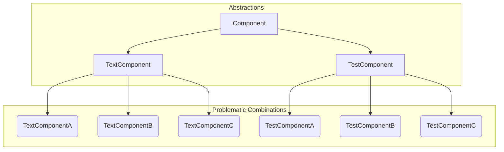
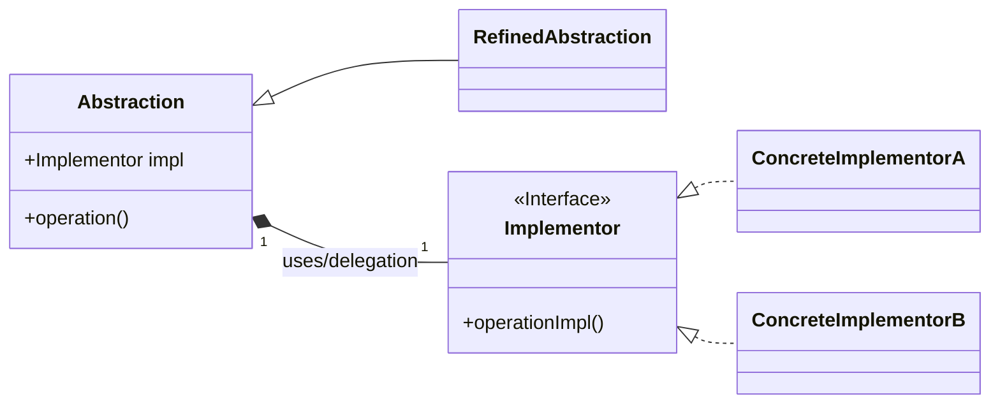
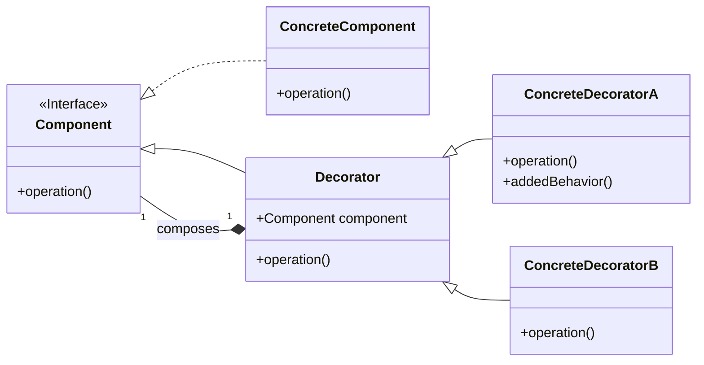

-----

### 1\. The *Bridge* and *Decorator* Design Patterns

#### Intent and Problem Solved by the *Bridge* Pattern

The **Bridge** design pattern consists of **decoupling an abstraction from its implementation** so that the two can vary independently.

Its intent is to allow a class client to interact only with its **abstraction** and not with its **implementation**, using the resource of **delegation**.

The **Bridge** separates the abstraction hierarchy and the implementation (platform) hierarchy. Both can evolve independently, preventing the **class explosion** that would occur by creating a subclass for every combination.

#### Problem Solved by the *Bridge* Pattern: Class Explosion

The problem manifests when we have multiple abstractions (components) that need to be implemented across multiple platforms. Creating a subclass for every combination leads to a proliferation of classes that makes maintenance and extensibility difficult.

Imagine that, in addition to the three platforms, we have two types of components (`TextComponent` and `TestComponent`), which must be implemented on each of the platforms (`PlatformA`, `PlatformB`, and `PlatformC`). We would have six concrete classes.

**Diagram of the Problem (Class Explosion)**:



#### Solution of the *Bridge* Pattern: Main Structure

The solution proposed by the **Bridge** pattern is to have the Abstraction contain an Implementation object (**delegation**), to which it delegates the operations. This allows both the Abstraction and the Implementation to vary independently.

**Diagram of the *Bridge* Solution**:



-----

### Intent and Problem Solved by the *Decorator* Pattern

The **Decorator** pattern consists of **adding responsibilities to an object dynamically and transparently**, without affecting other objects.

#### Problem Solved by the *Decorator* Pattern

Using **inheritance** to add functionalities also leads to a **class explosion**. For example, for a `FileStream` that needs encryption, compression, and logging functionalities, subclasses for all combinations would be necessary (e.g., `LoggedCompressedEncryptedFileStream`).

The **Decorator** solves this problem by allowing **flexible compositions of behaviors** through composition, delegation, and common interfaces. This allows new responsibilities to be added at runtime.

#### Solution of the *Decorator* Pattern: Main Structure

The solution is to have the base object (**Component**) be decorated by **Decorator** classes, which inherit the base interface and contain an object of the base class (composition), delegating the operations to that object.

**Diagram of the *Decorator* Solution**:



-----

### Implementations and Related Patterns

#### *Decorator* Applied in Java (Code Example)

The example below shows how `EncryptedStream` acts as a *Decorator*, receiving and wrapping a `FileStream` to add functionality without modifying the original hierarchy.

```java
// Implementation of the FileStream class in the Decorator (Concrete Component)
public class FileStream extends Stream {
    @Override
    public void write(String data) {
        System.out.println("Escrevendo dados: " + data); // Writing data:
        // ... code for writing the data.
    }
}
// Implementation of the EncryptedStream class in the Decorator (Concrete Decorator)
public class EncryptedStream extends StreamDecorator {
    public EncryptedStream(Stream stream) {
        super(stream);
    }
    @Override
    public void write(String data) {
        String encryptedData = encrypt(data);
        super.write(encryptedData); // Delegates to the internal component
    }
    private String encrypt(String data) {
        // ... encryption code.
        return data.chars()
            .map(c -> c + 1)
            .collect(StringBuilder::new, StringBuilder::appendCodePoint, StringBuilder::append)
            .toString();
    }
}
// Application of the Decorator pattern
Stream stream = new FileStream();
stream = new EncryptedStream(stream); // Decorates the functionality
stream.write("Olá Mundo!"); // Output: Escrevendo dados: #nmb!pmp!
```

#### *Bridge* Applied in Java (Code Example)

The **Bridge** pattern is the separation of the Abstraction (`TextComponent`) from the Implementation (`TextComponentImpl`). The abstraction delegates the execution of platform-specific operations to the implementation object.

```java
// Implementation of the TextComponentImpl interface (Implementor Interface)
public interface TextComponentImpl {
    void drawText(String text, int x, int y);
    void setFont(String font);
}
// Implementation of the TextComponentWindows class (Concrete Implementor)
public class TextComponentWindows implements TextComponentImpl {
    @Override
    public void drawText(String text, int x, int y) {
        // Windows specific code
        System.out.println("Windows: Desenhando texto '" + text + "' em (" + x + ", " + y + ")");
    }
    @Override
    public void setFont(String font) {
        // Windows specific code
        System.out.println("Windows: Configurando fonte: " + font);
    }
}
// Implementation of the TextComponent class (Abstraction)
public class TextComponent {
    private TextComponentImpl impl; // Reference to the Implementation
    public TextComponent(TextComponentImpl impl) {
        this.impl = impl;
    }
    public void draw(String text, int x, int y) {
        impl.drawText(text, x, y);
    }
    public void changeFont(String font) {
        impl.setFont(font);
    }
}
```

#### Consequences and Related Patterns

The **Bridge** pattern is a structural design pattern that allows the separation of the abstraction from its implementation, allowing both to vary independently.

| Pattern | Primary Goal |
| :--- | :--- |
| **Adapter** | To make classes with **incompatible interfaces compatible**. It is a structural bridge that facilitates collaboration between existing classes. |
| **Bridge** | **To separate the abstraction from the implementation**, allowing both to evolve independently. It is used when the client only needs to interact with the abstraction. |