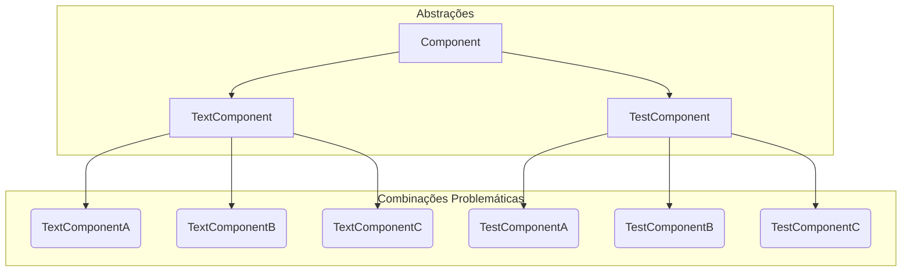
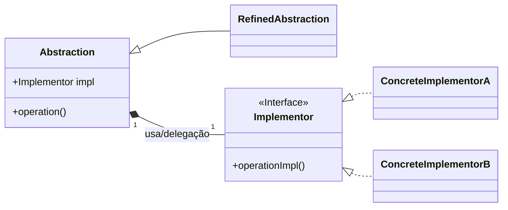
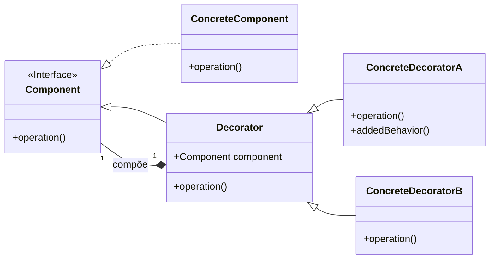

-----

### 1\. Padrões de projeto *Bridge* e *Decorator*

#### Intenção e problema resolvido pelo padrão *Bridge*

O padrão de projeto **Bridge** consiste em **desacoplar uma abstração da sua implementação** de modo que as duas possam variar independentemente.

Sua intenção é permitir que o cliente de uma classe interaja apenas com a sua **abstração** e não com a sua **implementação**, utilizando o recurso de **delegação**.

O **Bridge** separa a hierarquia de abstrações e a hierarquia de implementações (plataformas). Ambas podem evoluir de forma independente, evitando a **explosão de classes** que ocorreria ao criar subclasses para cada combinação.

#### Problema resolvido pelo padrão *Bridge*: A Explosão de Classes

O problema se manifesta quando temos múltiplas abstrações (componentes) para serem implementadas em múltiplas plataformas. A criação de uma subclasse para cada combinação resulta em uma proliferação de classes que dificulta a manutenção e a extensibilidade.

Imagine que, além das três plataformas, temos dois tipos de componentes (`TextComponent` e `TestComponent`), que devem ser implementados em cada uma das plataformas (`PlatformA`, `PlatformB` e `PlatformC`). Teríamos seis classes concretas.

**Diagrama do Problema (Explosão de Classes)**:



#### Solução do padrão *Bridge*: Estrutura Principal

A solução que o padrão **Bridge** propõe é fazer com que a Abstração contenha um objeto de Implementação (**delegação**), para o qual delega as operações. Isso permite que a Abstração e a Implementação variem de forma independente.

**Diagrama da Solução *Bridge***:



-----

### Intenção e problema resolvido pelo padrão *Decorator*

O padrão **Decorator** consiste em **adicionar responsabilidades a um objeto de forma dinâmica e transparente**, sem afetar outros objetos.

#### Problema resolvido pelo padrão *Decorator*

O uso de **herança** para adicionar funcionalidades também leva a uma **explosão de classes**. Por exemplo, para um `FileStream` que precisa de funcionalidades de criptografia, compactação e *logging*, seriam necessárias subclasses para todas as combinações (ex: `LoggedCompressedEncryptedFileStream`).

O **Decorator** resolve esse problema permitindo **composições flexíveis de comportamentos** através de composição, delegação e interfaces comuns. Isso permite que novas responsabilidades possam ser adicionadas em tempo de execução.

#### Solução do padrão *Decorator*: Estrutura Principal

A solução é fazer com que o objeto base (**Component**) seja decorado por classes **Decorator**, que herdam da interface base e contêm um objeto da classe base (composição), delegando as operações para esse objeto.

**Diagrama da Solução *Decorator***:



-----

### Implementações e Padrões Relacionados

#### *Decorator* Aplicado em Java (Exemplo de Código)

O exemplo abaixo mostra como o `EncryptedStream` atua como um *Decorator*, recebendo e envolvendo um `FileStream` para adicionar funcionalidade sem modificar a hierarquia original.

```java
// Implementação da classe FileStream no Decorator (Componente Concreto)
public class FileStream extends Stream {
    @Override
    public void write(String data) {
        System.out.println("Escrevendo dados: " + data);
        // ... código para escrita do dado.
    }
}
// Implementação da classe EncryptedStream no Decorator (Decorador Concreto)
public class EncryptedStream extends StreamDecorator {
    public EncryptedStream(Stream stream) {
        super(stream);
    }
    @Override
    public void write(String data) {
        String encryptedData = encrypt(data);
        super.write(encryptedData); // Delega ao componente interno
    }
    private String encrypt(String data) {
        // ... código para criptografia.
        return data.chars()
            .map(c -> c + 1)
            .collect(StringBuilder::new, StringBuilder::appendCodePoint, StringBuilder::append)
            .toString();
    }
}
// Aplicação do padrão Decorator
Stream stream = new FileStream();
stream = new EncryptedStream(stream); // Decora a funcionalidade
stream.write("Olá Mundo!"); // Saída: Escrevendo dados: #nmb!pmp!
```

#### *Bridge* Aplicado em Java (Exemplo de Código)

O padrão **Bridge** é a separação da Abstração (`TextComponent`) da Implementação (`TextComponentImpl`). A abstração delega a execução de operações específicas da plataforma para o objeto de implementação.

```java
// Implementação da classe TextComponentImpl (Interface Implementor)
public interface TextComponentImpl {
    void drawText(String text, int x, int y);
    void setFont(String font);
}
// Implementação da classe TextComponentWindows (Concrete Implementor)
public class TextComponentWindows implements TextComponentImpl {
    @Override
    public void drawText(String text, int x, int y) {
        // Código específico do Windows
        System.out.println("Windows: Desenhando texto '" + text + "' em (" + x + ", " + y + ")");
    }
    @Override
    public void setFont(String font) {
        // Código específico do Windows
        System.out.println("Windows: Configurando fonte: " + font);
    }
}
// Implementação da classe TextComponent (Abstração)
public class TextComponent {
    private TextComponentImpl impl; // Referência à Implementação
    public TextComponent(TextComponentImpl impl) {
        this.impl = impl;
    }
    public void draw(String text, int x, int y) {
        impl.drawText(text, x, y);
    }
    public void changeFont(String font) {
        impl.setFont(font);
    }
}
```

#### Consequências e Padrões Relacionados

O padrão **Bridge** é um padrão de projeto estrutural que permite a separação da abstração da sua implementação, o que permite que ambas variem independentemente.

| Padrão | Objetivo Principal |
| :--- | :--- |
| **Adapter** | Tornar classes com **interfaces incompatíveis compatíveis**. É uma ponte estrutural que facilita a colaboração entre classes existentes. |
| **Bridge** | **Separar a abstração da implementação**, permitindo que ambas evoluam independentemente. É usado quando o cliente só precisa interagir com a abstração. |