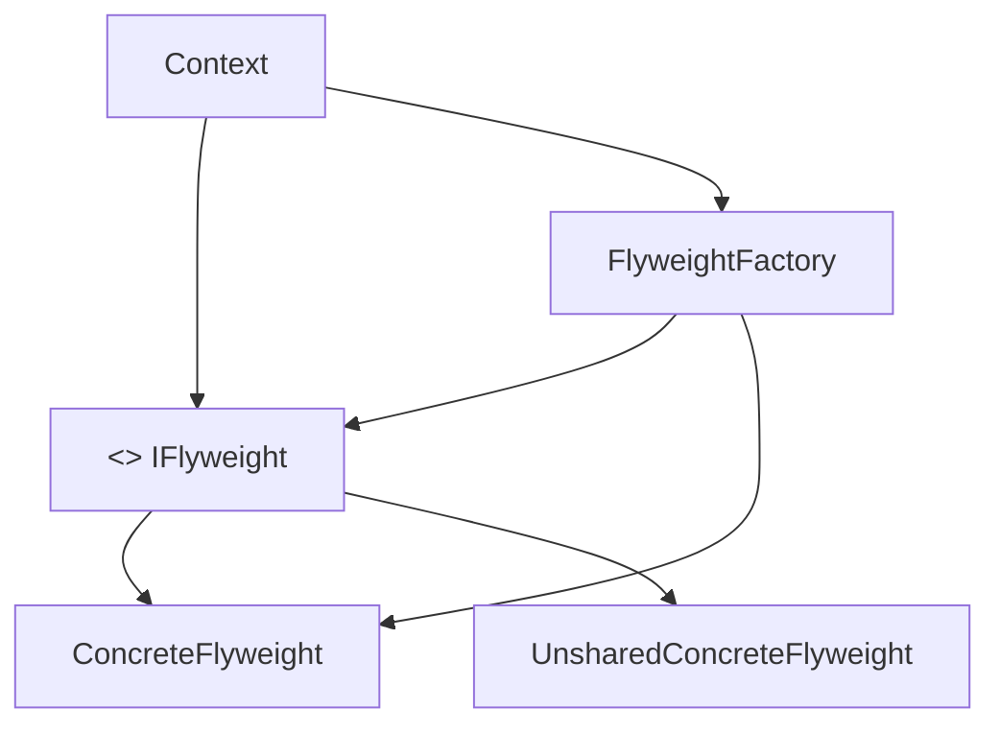
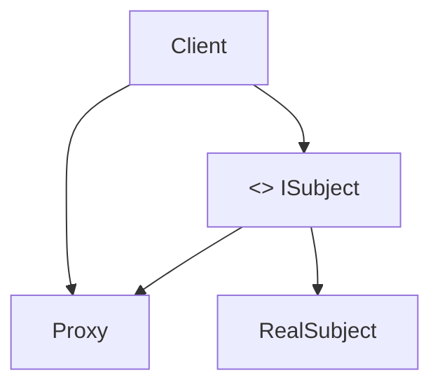
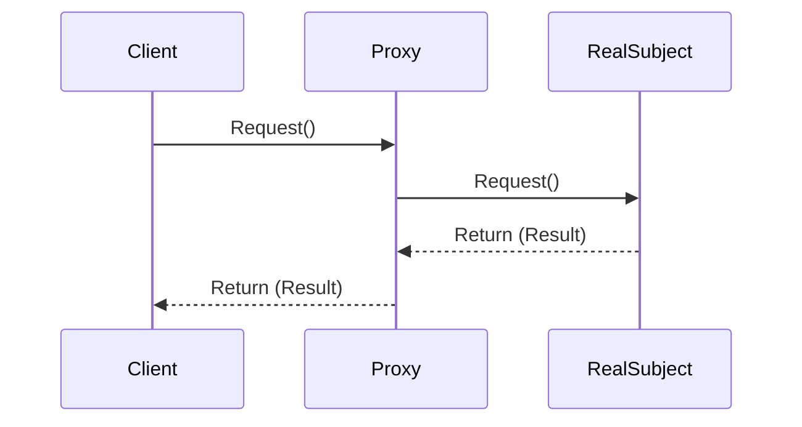

-----

# Design Patterns: Flyweight and Proxy

## Intent and Problem Solved by the Flyweight Pattern

The **Flyweight** pattern's intent is to minimize memory usage by sharing objects as efficiently as possible. It applies when your application uses a large number of similar, memory-consuming objects that only differ by a few pieces of information. In such cases, these objects might have a large amount of internal data, but only a small portion of that data is specific to each object (the **intrinsic** state). The Flyweight pattern allows you to extract the **extrinsic** state (the part that differs) and store it externally, enabling many real objects to share a single copy of the internal data (intrinsic state), thereby saving memory.

In this video, you will understand the intent and the problem solved by the **Flyweight** pattern, which allows efficient object formatting so that several similar, memory-consuming objects can share a common set of data.

### Flyweight Pattern Intent

The **Flyweight** pattern suggests the efficient extraction and optimized use of multiple small objects by extracting them based on **intrinsic** and **extrinsic** data.

### Problem Solved by the Flyweight Pattern

Suppose you are implementing an application involving chemical elements.

You have a class that represents chemical elements, and for each element, you need to store information such as name, symbol, atomic number, atomic mass, melting point, boiling point, etc.

Imagine an application composed and formatted by various mixed elements that need different attributes, such as water ($\text{H}_2\text{O}$), bread fermentation, white rice, or even surfaces, to use as an example.

One way to represent these elements in Java is expressed in the following code:

```java
// Java Code 
public class ElementoQuimico {
    private String nome;
    private String simbolo;
    private int numeroAtomico;
    private double massaAtomica;
    private double pontoFusao;
    private double pontoEbulição;
    // Other attributes...

    public ElementoQuimico(String nome, String simbolo, int numeroAtomico, double massaAtomica, double pontoFusao, double pontoEbulição) {
        this.nome = nome;
        this.simbolo = simbolo;
        this.numeroAtomico = numeroAtomico;
        this.massaAtomica = massaAtomica;
        this.pontoFusao = pontoFusao;
        this.pontoEbulição = pontoEbulição;
    }
    // Getters and setters omitted...
}
```

The chemical elements contained in the application are water, $\text{H}_2\text{O}$, and salt $\text{NaCl}$, expressed in the following code:

```java
// Java Code
// SimpleSubstance Class
public class SubstanciaSimples extends ElementoQuimico {
    private String tipo;

    public SubstanciaSimples(String nome, String simbolo, int numeroAtomico, double massaAtomica, double pontoFusao, double pontoEbulição, String tipo) {
        super(nome, simbolo, numeroAtomico, massaAtomica, pontoFusao, pontoEbulição);
        this.tipo = tipo;
    }
    // Getters and setters omitted
}

// CompoundSubstance Class
public class SubstanciaComposta extends ElementoQuimico {
    private List<ElementoQuimico> elementos;

    public SubstanciaComposta(String nome, String simbolo, int numeroAtomico, double massaAtomica, double pontoFusao, double pontoEbulição, List<ElementoQuimico> elementos) {
        super(nome, simbolo, numeroAtomico, massaAtomica, pontoFusao, pontoEbulição);
        this.elementos = elementos;
    }
    // Getters and setters omitted
}
```

The following code illustrates some elements:

```java
// Java Code 
// Usage example
// Creating substance instances
SubstanciaComposta agua = new SubstanciaComposta("Água", "H2O", 0, 18.015, 0.0, 100.0, Arrays.asList(
    new SubstanciaSimples("Hidrogênio", "H", 1, 1.008, -259.16, -252.87, "Gás"),
    new SubstanciaSimples("Oxigênio", "O", 8, 15.999, -218.79, -182.95, "Gás")
));

SubstanciaComposta sal = new SubstanciaComposta("Sal de Cozinha", "NaCl", 0, 58.44, 801.0, 1413.0, Arrays.asList(
    new SubstanciaSimples("Sódio", "Na", 11, 22.99, 97.72, 883.0, "Metal"),
    new SubstanciaSimples("Cloro", "Cl", 17, 35.45, -101.5, -34.04, "Não-metal")
));

// Displaying information
System.out.println("Água: " + agua.getNome() + " - " + agua.getSimbolo());
System.out.println("Sal: " + sal.getNome() + " - " + sal.getSimbolo());
```

<br>

The drawback, therefore, is that if the application has many similar objects, such as multiple instances of water or salt, each one will carry all its attributes or object instance patterns, thus using memory resources inefficiently.

**Comment**

The **Flyweight** pattern allows defining common data (**intrinsic** state) in a single shared object, while data that varies between substances (**extrinsic** state) is stored separately. Thus, instead of creating many instances of water or salt, the application can create a single instance for each and pass the extrinsic data at the time of use.

-----

## Solution, Consequences, and Related Patterns for the Flyweight Pattern

The **Flyweight** pattern allows managing and controlling the creation of instances that will be shared and formatting the object to obtain a single copy of the intrinsic data of each of them, storing only one instance for all. This way, memory consumption can be reduced, especially when there is a large number of similar objects. The Flyweight pattern is based on the principle that most objects in an application are similar to each other, differing only by small details (the extrinsic state). The Flyweight pattern suggests extracting the extrinsic state to an external location, allowing many real objects to share a single copy of the internal data (the intrinsic state). For this purpose, the Flyweight pattern uses the concept of a **factory** or **object pool**, which is responsible for managing and maintaining the shared instances.

In this video, you will understand the solution to the problem solved by the **Flyweight** pattern, which allows efficient object formatting so that several similar, memory-consuming objects can share a common set of data.

### Flyweight Pattern Solution

The solution proposed by the **Flyweight** pattern is suggested in the following class diagram representation:



**Comment on the diagram**

  * **Flyweight (IFlyweight):** defines the interface for the objects that will be shared, allowing the client to use them through a single instance.
  * **ConcreteFlyweight:** implements the **Flyweight** interface and stores the **intrinsic** state (what is shared between objects).
  * **UnsharedConcreteFlyweight:** implements the **Flyweight** interface and is not shared.
  * **FlyweightFactory:** creates and manages the **Flyweight** objects, ensuring that only one instance of each shared object is created (the object pool).
  * **Context:** stores the **extrinsic** state (what is specific to each object) and passes it to the **Flyweight** object when necessary.

The main part of the **Flyweight** pattern, therefore, is to extract and store the intrinsic state in a shared object. The extrinsic state is stored externally (in the **Context**) and passed as an argument to the **Flyweight** methods when they are called.

For this purpose, the **Flyweight** pattern proposes the following classes:

```mermaid
graph LR
    classDef interface fill:#ccffcc,stroke:#333;
    classDef concrete fill:#ccccff,stroke:#333;

    IFlyweight[<<Interface>> IFlyweight]
    ConcreteFlyweight[ConcreteFlyweight | + operacao(estadoExtrinseco: String) ]
    FlyweightFactory[FlyweightFactory | + obterFlyweight(chave: String) ]

    IFlyweight --> ConcreteFlyweight;
    FlyweightFactory --> ConcreteFlyweight;
```

Where:

| Class | Description |
| :--- | :--- |
| **IFlyweight** | Defines the interface for the objects that will be shared. |
| **ConcreteFlyweight** | Stores the intrinsic object that will be shared. |
| **FlyweightFactory** | Manages the objects that will be shared. |

<br>

**Implementation Example**

A Java implementation example for the **Flyweight** pattern is the following:

```java
// Java Code
// 1. Flyweight Interface
interface IFlyweight {
    void operacao(String estadoExtrinseco);
}

// 2. ConcreteFlyweight
class ConcreteFlyweight implements IFlyweight {
    private final String estadoIntrinseco; // State that is shared

    public ConcreteFlyweight(String estadoIntrinseco) {
        this.estadoIntrinseco = estadoIntrinseco;
    }

    @Override
    public void operacao(String estadoExtrinseco) {
        System.out.println("Flyweight Intrinsic: " + estadoIntrinseco + ", Extrinsic: " + estadoExtrinseco);
    }
}

// 3. FlyweightFactory
class FlyweightFactory {
    private final Map<String, IFlyweight> flyweights = new HashMap<>();

    public IFlyweight obterFlyweight(String chave) {
        if (!flyweights.containsKey(chave)) {
            flyweights.put(chave, new ConcreteFlyweight(chave));
        }
        return flyweights.get(chave);
    }
}

// Usage Example
class Cliente {
    public static void main(String[] args) {
        FlyweightFactory factory = new FlyweightFactory();

        // Getting and using shared Flyweights
        IFlyweight flyweight1 = factory.obterFlyweight("A");
        flyweight1.operacao("Contexto 1");

        IFlyweight flyweight2 = factory.obterFlyweight("B");
        flyweight2.operacao("Contexto 2");

        IFlyweight flyweight3 = factory.obterFlyweight("A"); // Reuses the "A" Flyweight
        flyweight3.operacao("Contexto 3");

        System.out.println("Number of Flyweights created: " + factory.flyweights.size()); // Will be 2 (A and B)
    }
}
```

### Consequences and Related Patterns for the Flyweight Pattern

**Consequences**

The main consequence of the **Flyweight** pattern is a **drastic reduction in memory consumption**, mainly in applications that use a large number of similar objects. Thus, instead of constantly creating strings or substances, the **Flyweight** pattern allows many objects to share a single instance of the common data (intrinsic state), storing only the data that varies (extrinsic state) externally, in the context. This makes the application more performant and efficient.

**Related Patterns**

The **Flyweight** pattern can be combined with the **Factory** pattern, which is responsible for implementing the mechanism for creating and managing **Flyweight** objects. The **Factory** ensures that only one instance of each shared object is created and that the client can obtain the correct instance transparently.

-----

## Intent and Problem Solved by the Proxy Pattern

The **Proxy** pattern aims to provide a **substitute** or **placeholder** to control and access a real object. It applies when we want to add a layer of control or security over access to an object, or when we want to defer the creation of an expensive object until it is actually needed (**lazy loading**). The **Proxy** acts as an intermediary, intercepting and managing the interaction between the client object and the real object.

It is useful when it is necessary to load objects on demand (**lazy loading**), control and access the real object (**security proxy**), or provide additional functionalities such as caching, access logging, permission control, and positioning, improving the system's efficiency and security without changing the real object.

In this video, you will understand the intent and the problem solved by the **Proxy** pattern, which allows efficient object formatting so that several similar, memory-consuming objects can share a common set of data.

### Proxy Pattern Intent

The purpose of the **Proxy** pattern is to **provide clients with a proxy object, with the same access interface as the real object**, to control access and add functionalities to it.

This pattern is widely used when the real object is heavy or costly to initialize, such as a connection to a database or an external service, and should only be loaded or created when actually needed for use, monitoring, validation, among others.

### Problem Solved by the Proxy Pattern

When developing object-oriented programming, implementing and calling an operation of a real object requires that this object is available and accessible at the moment.

Imagine that these objects are in different processes, running on distinct servers, or even in separate applications.

For an object to call an operation of a remote object (in another process or server), it needs to implement the network call to transmit the operation and receive the response. Furthermore, calling a remote object is significantly slower than calling a local object.

You can better understand the problem by looking at the code below, which implements the interaction of a **service module** with a **client module** in Java, using the **Netflix** example, with a client who wants to obtain the list of available movies from an external service, using the same interface with the user who needs to request this service in Netflix's **business layer**.

If you are not familiar with **RMI** technology, that is not a problem. The important thing is to realize the complexity and difficulty of managing method calls of remote objects, which involve all the network communication and the complexities of the business logic.

```java
// Java Code
// Service Interface
public interface IService {
    String getData();
}

// Real Service Implementation
public class RealService implements IService {
    @Override
    public String getData() {
        System.out.println("RealService: Getting data from the service...");
        // Simulates a heavy or slow operation (e.g., database access, external service)
        try {
            Thread.sleep(2000); 
        } catch (InterruptedException e) {
            Thread.currentThread().interrupt();
        }
        return "Real service data";
    }
}

// Client that interacts directly with the service
public class Cliente {
    public static void main(String[] args) {
        IService service = new RealService();
        System.out.println("Cliente: Requesting data...");
        String data = service.getData();
        System.out.println("Cliente: Received -> " + data);
    }
}
```

Now, imagine that **Netflix** wants you to use functionality for accessing remote objects that need to interact with the SDK objects that perform the business logic. Furthermore, suppose you need to apply security and caching rules over this access to the real object.

What would be the impact on the client modules? If we think of a **gigabyte** of data, would you accept it?

Although the **SDK** project already uses a **Proxy** pattern implementation, offering a proxy object with the same interface as the real object, you need to realize that by using this proxy object, you will benefit from features such as lazy loading, security, and caching, without dealing with the details of the remote technology or communication between the application cores.

What did you think of the content?

-----

## Solution, Consequences, and Related Patterns for the Proxy Pattern

The **Proxy** pattern allows managing and controlling the creation of instances that will be shared and formatting the object to obtain a single copy of the intrinsic data of each of them, storing only one instance for all. This way, memory consumption can be reduced, especially when there is a large number of similar objects. The **Proxy** pattern is based on the principle that most objects in an application are similar to each other, differing only by small details (the extrinsic state). The **Proxy** pattern suggests extracting the extrinsic state to an external location, allowing many real objects to share a single copy of the internal data (the intrinsic state). For this purpose, the **Proxy** pattern uses the concept of a **factory** or **object pool**, which is responsible for managing and maintaining the shared instances.

In this video, you will understand the solution to the problem solved by the **Proxy** pattern, which allows efficient object formatting so that several similar, memory-consuming objects can share a common set of data.

### Proxy Pattern Solution

The solution proposed by the **Proxy** pattern is suggested in the following class diagram representation:



**Comment on the diagram**

The class diagram illustrates the correlation between the **Proxy** and the **RealSubject**, which implement the same interface (**ISubject**). The **Client** interacts with the **Proxy**, which, in turn, controls access to the **RealSubject**.

A sequence diagram, below, illustrates the interaction between the objects:



The main purpose of the **Proxy** pattern is to present the **Client** with the beauty of the real object through an abstract interface.

**Main Types**

The **Proxy** pattern has some main types, depending on the functionality it adds to the real object:

| Proxy | Description |
| :--- | :--- |
| **Security Proxy** | Implements the access verification mechanism, controlling the real object through rules and restrictions. |
| **Virtual Proxy** | Implements the **lazy loading** mechanism, deferring the creation and initialization of the real object until it is actually needed. |
| **Remote Proxy** | Implements communication with the real object that is at another address, process, or server, encapsulating the details of remote communication. |

<br>

The **Proxy** class must contain an implementation of the interface (**ISubject**) and reference the **RealSubject** object. The **Proxy** implements the same interface as the **RealSubject** object, and in each method, it adds the control, security, or lazy loading logic before or after calling the corresponding method of the **RealSubject**.

Below is the Java implementation of the **Security Proxy** (for user validation before accessing the service):

```java
// Java Code
// 3. Security Proxy
public class SecurityProxy implements IService {
    private RealService realService;
    private String user;

    public SecurityProxy(String user) {
        this.user = user;
    }

    @Override
    public String getData() {
        if (checkAccess(user)) {
            if (realService == null) {
                realService = new RealService(); // Lazy initialization
            }
            return realService.getData();
        } else {
            return "Access denied for user: " + user;
        }
    }

    private boolean checkAccess(String user) {
        // Simulates an access check
        return user.equals("admin"); 
    }
}
```

Below is the Java implementation of the **Virtual Proxy** (to defer the creation of the real object until it is called):

```java
// Java Code
// Proxy Usage Example
public class Cliente {
    public static void main(String[] args) {
        // Access denied
        IService service1 = new SecurityProxy("guest");
        System.out.println("Cliente 1: " + service1.getData()); 

        System.out.println("---");

        // Access allowed, RealService will be created and called
        IService service2 = new SecurityProxy("admin"); 
        System.out.println("Cliente 2: " + service2.getData()); 
    }
}
```

### Consequences and Related Patterns for the Proxy Pattern

**Consequences**

The **Proxy** pattern allows adding extra functionalities (security, lazy loading, caching, etc.) to the real object transparently for the client. This way, it is possible to control and manage access to the real object, or defer its creation and initialization, improving the application's efficiency and performance.

**Related Patterns**

| Pattern | Description |
| :--- | :--- |
| **Decorator** | Also involves implementing the same interface and referencing the real object. The difference is that the **Decorator** adds new functionalities, and the **Proxy** controls access to the real object without changing the real object. |
| **Adapter** | Has the intention of adapting a different interface, not controlling access. |
| **Flyweight** | Can be used in conjunction with the **Proxy** to manage and optimize access to objects that consume a lot of memory but only differ by a few pieces of information. |

<br>

See you next time, developer\! Implement and use a **Proxy**\! Your project has a highly relevant purpose in the communication between the cores of an application.

-----


