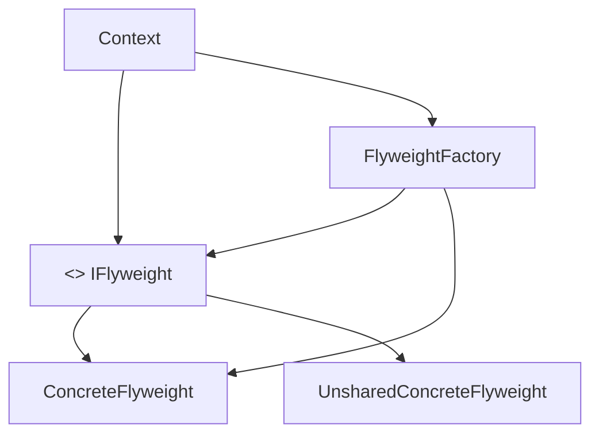
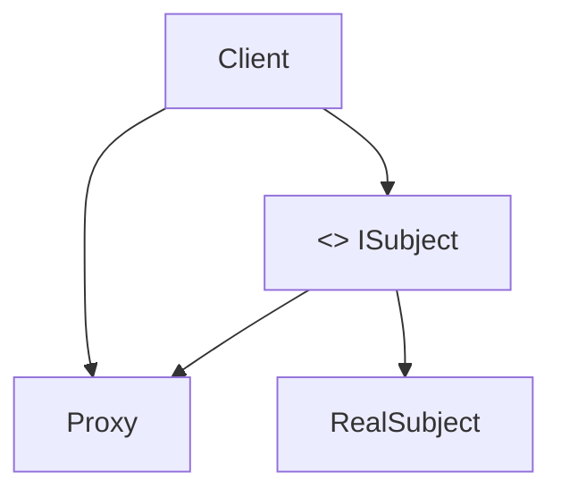
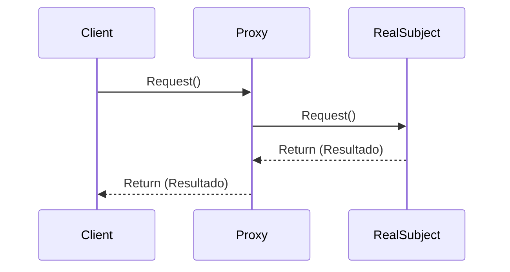

-----

# Padrões de projeto Flyweight e Proxy

## Intenção e problema resolvido pelo padrão Flyweight

O padrão **Flyweight** tem como intenção minimizar o uso de memória, compartilhando o máximo possível de objetos de forma eficiente. Ele se aplica quando a sua aplicação utiliza uma grande quantidade de objetos semelhantes, que consomem muita memória, mas que, na verdade, só se diferenciam por poucas informações. Nesses casos, esses objetos podem ter uma grande quantidade de dados internos, mas apenas uma pequena parte desses dados é específica para cada objeto (o estado **intrínseco**). O padrão Flyweight permite que você extraia o estado **extrínseco** (a parte que se diferencia) e armazene-o externamente, fazendo com que muitos objetos reais compartilhem uma única cópia dos dados internos (estado intrínseco), economizando memória.

Nesse vídeo, você vai entender a intenção e o problema resolvido pelo padrão **Flyweight**, que permite formatar objetos de forma eficiente, de modo que diversos objetos semelhantes, que consomem muita memória, possam compartilhar um conjunto de dados comum.

### Intenção do padrão Flyweight

O padrão **Flyweight** sugere a extração e o uso otimizado de diversos pequenos objetos de forma eficiente, por meio de sua extração baseada em dados **intrínsecos** e **extrínsecos**.

### Problema resolvido pelo padrão Flyweight

Suponha que você esteja implementando uma aplicação envolvendo elementos químicos.

Você tem uma classe que representa os elementos químicos, e para cada elemento você precisa armazenar informações como o nome, símbolo, número atômico, massa atômica, ponto de fusão, ponto de ebulição, etc.

Imagine que uma aplicação composta e formatada por diversos elementos de mistura, quer ter atributos diferentes como a água ($\text{H}_2\text{O}$), a fermentação do pão, o arroz branco ou até mesmo superfícies, para usar como exemplo.

Uma maneira de representar esses elementos em Java é expressa no código a seguir:

```java
// Código Java 
public class ElementoQuimico {
    private String nome;
    private String simbolo;
    private int numeroAtomico;
    private double massaAtomica;
    private double pontoFusao;
    private double pontoEbulição;
    // Outros atributos...

    public ElementoQuimico(String nome, String simbolo, int numeroAtomico, double massaAtomica, double pontoFusao, double pontoEbulição) {
        this.nome = nome;
        this.simbolo = simbolo;
        this.numeroAtomico = numeroAtomico;
        this.massaAtomica = massaAtomica;
        this.pontoFusao = pontoFusao;
        this.pontoEbulição = pontoEbulição;
    }
    // Getters e setters omitidos...
}
```

Os elementos químicos contidos na aplicação são a água, o $\text{H}_2\text{O}$, e o sal $\text{NaCl}$, expressos no código a seguir definem:

```java
// Código Java
// Classe SubstanciaSimples
public class SubstanciaSimples extends ElementoQuimico {
    private String tipo;

    public SubstanciaSimples(String nome, String simbolo, int numeroAtomico, double massaAtomica, double pontoFusao, double pontoEbulição, String tipo) {
        super(nome, simbolo, numeroAtomico, massaAtomica, pontoFusao, pontoEbulição);
        this.tipo = tipo;
    }
    // Getters e setters omitidos
}

// Classe SubstanciaComposta
public class SubstanciaComposta extends ElementoQuimico {
    private List<ElementoQuimico> elementos;

    public SubstanciaComposta(String nome, String simbolo, int numeroAtomico, double massaAtomica, double pontoFusao, double pontoEbulição, List<ElementoQuimico> elementos) {
        super(nome, simbolo, numeroAtomico, massaAtomica, pontoFusao, pontoEbulição);
        this.elementos = elementos;
    }
    // Getters e setters omitidos
}
```

O código que segue, ilustra alguns elementos:

```java
// Código Java 
// Exemplo de uso
// Criando instâncias de substâncias
SubstanciaComposta agua = new SubstanciaComposta("Água", "H2O", 0, 18.015, 0.0, 100.0, Arrays.asList(
    new SubstanciaSimples("Hidrogênio", "H", 1, 1.008, -259.16, -252.87, "Gás"),
    new SubstanciaSimples("Oxigênio", "O", 8, 15.999, -218.79, -182.95, "Gás")
));

SubstanciaComposta sal = new SubstanciaComposta("Sal de Cozinha", "NaCl", 0, 58.44, 801.0, 1413.0, Arrays.asList(
    new SubstanciaSimples("Sódio", "Na", 11, 22.99, 97.72, 883.0, "Metal"),
    new SubstanciaSimples("Cloro", "Cl", 17, 35.45, -101.5, -34.04, "Não-metal")
));

// Exibindo informações
System.out.println("Água: " + agua.getNome() + " - " + agua.getSimbolo());
System.out.println("Sal: " + sal.getNome() + " - " + sal.getSimbolo());
```

<br>

A desvantagem, portanto, é que, se a aplicação tiver muitos objetos semelhantes, como várias instâncias de água ou sal, cada uma carregará consigo todos os seus atributos, ou os padrões de instâncias de objetos, de modo a utilizar os recursos de memória de forma mais ineficiente.

**Comentário**

O padrão **Flyweight** permite definir dados comuns (estado **intrínseco**) em um único objeto compartilhado, enquanto os dados que variam entre as substâncias (estado **extrínseco**) são armazenados separadamente. Com isso, ao invés de criar muitas instâncias de água ou sal, a aplicação pode criar uma única instância para cada e passar os dados extrínsecos no momento da utilização.

-----

## Solução, consequências e padrões relacionados ao padrão Flyweight

O padrão **Flyweight** permite gerenciar e controlar a criação de instâncias que serão compartilhadas e formatar o objeto para obter uma única cópia dos dados intrínsecos de cada um deles, armazenando apenas uma instância para todos. Dessa forma, é possível reduzir o consumo de memória, especialmente quando há uma grande quantidade de objetos semelhantes. O padrão Flyweight se baseia no princípio de que a maioria dos objetos de uma aplicação são semelhantes entre si, diferenciando-se apenas por pequenos detalhes (o estado extrínseco). O padrão Flyweight sugere a extração do estado extrínseco para um local externo, permitindo que muitos objetos reais compartilhem uma única cópia dos dados internos (o estado intrínseco). Para isso, o padrão Flyweight utiliza o conceito de **fábrica** ou ***pool* de objetos**, que é responsável por gerenciar e manter as instâncias compartilhadas.

Nesse vídeo, você vai entender a solução para o problema resolvido pelo padrão **Flyweight**, que permite formatar objetos de forma eficiente, de modo que diversos objetos semelhantes, que consomem muita memória, possam compartilhar um conjunto de dados comum.

### Solução do padrão Flyweight

A solução proposta pelo padrão **Flyweight** é sugerida na representação no diagrama de classes a seguir:



**Comentário sobre o diagrama**

  * **Flyweight (IFlyweight):** define a interface para os objetos que serão compartilhados, permitindo que o cliente os utilize por meio de uma única instância.
  * **ConcreteFlyweight:** implementa a interface **Flyweight** e armazena o estado **intrínseco** (o que é compartilhado entre objetos).
  * **UnsharedConcreteFlyweight:** implementa a interface **Flyweight** e não é compartilhado.
  * **FlyweightFactory:** cria e gerencia os objetos **Flyweight**, garantindo que apenas uma instância de cada objeto compartilhado seja criada (o *pool* de objetos).
  * **Context:** armazena o estado **extrínseco** (o que é específico para cada objeto) e passa-o para o objeto **Flyweight** quando necessário.

A parte principal, portanto, do padrão **Flyweight** é extrair e armazenar o estado intrínseco em um objeto compartilhado. O estado extrínseco é armazenado externamente (no **Context**) e passado como argumento para os métodos do **Flyweight** quando são chamados.

Para isso, o padrão **Flyweight** propõe as seguintes classes:

```mermaid
graph LR
    classDef interface fill:#ccffcc,stroke:#333;
    classDef concrete fill:#ccccff,stroke:#333;

    IFlyweight[<<Interface>> IFlyweight]
    ConcreteFlyweight[ConcreteFlyweight | + operacao(estadoExtrinseco: String) ]
    FlyweightFactory[FlyweightFactory | + obterFlyweight(chave: String) ]

    IFlyweight --> ConcreteFlyweight;
    FlyweightFactory --> ConcreteFlyweight;
```

Onde:

| Classe | Descrição |
| :--- | :--- |
| **IFlyweight** | Define a interface para os objetos que serão compartilhados. |
| **ConcreteFlyweight** | Armazena o objeto intrínseco que será compartilhado. |
| **FlyweightFactory** | Gerencia os objetos que serão compartilhados. |

<br>

**Exemplo de implementação**

Um exemplo de implementação para o padrão **Flyweight** em Java é o seguinte:

```java
// Código Java
// 1. Interface Flyweight
interface IFlyweight {
    void operacao(String estadoExtrinseco);
}

// 2. ConcreteFlyweight
class ConcreteFlyweight implements IFlyweight {
    private final String estadoIntrinseco; // Estado que é compartilhado

    public ConcreteFlyweight(String estadoIntrinseco) {
        this.estadoIntrinseco = estadoIntrinseco;
    }

    @Override
    public void operacao(String estadoExtrinseco) {
        System.out.println("Flyweight Intrínseco: " + estadoIntrinseco + ", Extrínseco: " + estadoExtrinseco);
    }
}

// 3. FlyweightFactory
class FlyweightFactory {
    private final Map<String, IFlyweight> flyweights = new HashMap<>();

    public IFlyweight obterFlyweight(String chave) {
        if (!flyweights.containsKey(chave)) {
            flyweights.put(chave, new ConcreteFlyweight(chave));
        }
        return flyweights.get(chave);
    }
}

// Exemplo de Uso
class Cliente {
    public static void main(String[] args) {
        FlyweightFactory factory = new FlyweightFactory();

        // Obtendo e usando Flyweights compartilhados
        IFlyweight flyweight1 = factory.obterFlyweight("A");
        flyweight1.operacao("Contexto 1");

        IFlyweight flyweight2 = factory.obterFlyweight("B");
        flyweight2.operacao("Contexto 2");

        IFlyweight flyweight3 = factory.obterFlyweight("A"); // Reutiliza o Flyweight "A"
        flyweight3.operacao("Contexto 3");

        System.out.println("Número de Flyweights criados: " + factory.flyweights.size()); // Será 2 (A e B)
    }
}
```

### Consequências e padrões relacionados ao padrão Flyweight

**Consequências**

O padrão **Flyweight** tem como principal consequência a **redução drástica no consumo de memória**, principalmente em aplicações que utilizam uma grande quantidade de objetos semelhantes. Desse modo, ao invés de uma constante criação de *strings* ou substâncias, o padrão **Flyweight** permite que muitos objetos compartilhem uma única instância dos dados comuns (estado intrínseco), armazenando apenas os dados que variam (estado extrínseco) de forma externa, no contexto. Dessa forma, a aplicação se torna mais performática e eficiente.

**Padrões relacionados**

O padrão **Flyweight** pode ser combinado com o padrão **Factory**, que é responsável por implementar o mecanismo de criação e gerenciamento dos objetos **Flyweight**. A **Factory** garante que apenas uma instância de cada objeto compartilhado seja criada, e que o cliente possa obter a instância correta de forma transparente.

-----

## Intenção e problema resolvido pelo padrão Proxy

O padrão **Proxy** tem como objetivo fornecer um **substituto** ou **mandatário** para controlar e acessar a um objeto real. Ele se aplica quando queremos adicionar uma camada de controle ou segurança sobre o acesso a um objeto, ou quando queremos adiar a criação de um objeto caro até que seja realmente necessário (**lazy loading**). O **Proxy** atua como um intermediário, interceptando e gerenciando a interação entre o objeto cliente e o objeto real.

É interessante quando for necessário carregar objetos sob demanda (**lazy loading**), controlar e acessar o objeto real (**security proxy**), ou fornecer funcionalidades adicionais, como *cache*, registro de acesso, controle de permissões e posicionamento, melhorando a eficiência e segurança do sistema sem alterar o objeto real.

Nesse vídeo, você entenderá a intenção e o problema resolvido pelo padrão **Proxy**, que permite formatar objetos de forma eficiente, de modo que diversos objetos semelhantes, que consomem muita memória, possam compartilhar um conjunto de dados comum.

### Intenção do padrão Proxy

O propósito do padrão **Proxy** é **fornecer aos clientes um objeto proxy, com a mesma interface de acesso ao objeto real**, para controlar o acesso e adicionar funcionalidades a ele.

Esse padrão é muito utilizado quando o objeto real é pesado ou de inicialização muito custosa, como a conexão com um banco de dados ou um serviço externo, e ele só deve ser carregado ou criado realmente na hora de sua utilização, monitoração, validação, entre outros.

### Problema resolvido pelo padrão Proxy

Quando estamos desenvolvendo uma programação orientada a objetos, implementar e a chamada de uma operação de um objeto real exige que este objeto esteja disponível e acessível no momento.

Imagine que esses objetos estejam em processos diferentes, rodando em servidores distintos ou até mesmo em aplicações separadas.

Para que um objeto consiga chamar uma operação de um objeto remoto (em outro processo ou servidor), é preciso que ele implemente e a chamada da rede para transmitir a operação e receber a resposta. Além disso, a chamada de um objeto remoto é significativamente mais lenta do que a chamada de um objeto local.

Você pode entender melhor o problema, veja o código adiante, que implementa a interação de um **módulo de serviço** com um **módulo de cliente**, em Java, usando o exemplo da **Netflix**, com um cliente que quer obter a lista de filmes disponíveis em um serviço externo, usando a mesma interface com o usuário que precisa solicitar esse serviço na **camada de negócios** da Netflix.

Se você não conhece a tecnologia **RMI**, não tem problema. O importante é você perceber a complexidade e a dificuldade de gerenciar as chamadas de métodos de objetos remotos, que envolvem toda a comunicação de rede e as complexidades da lógica de negócios.

```java
// Código Java
// Interface de Serviço
public interface IService {
    String getData();
}

// Implementação do Serviço Real
public class RealService implements IService {
    @Override
    public String getData() {
        System.out.println("RealService: Obtendo dados do serviço...");
        // Simula uma operação pesada ou lenta (ex: acesso a banco de dados, serviço externo)
        try {
            Thread.sleep(2000); 
        } catch (InterruptedException e) {
            Thread.currentThread().interrupt();
        }
        return "Dados reais do serviço";
    }
}

// Cliente que interage diretamente com o serviço
public class Cliente {
    public static void main(String[] args) {
        IService service = new RealService();
        System.out.println("Cliente: Solicitando dados...");
        String data = service.getData();
        System.out.println("Cliente: Recebido -> " + data);
    }
}
```

Imagine, agora, que a **Netflix** quer que você use funcionalidade para acesso de objetos remotos, que precisam interagir com os objetos SDKs que realizam a lógica de negócios. Indo além, suponha que você precise aplicar regras de segurança e *cache* sobre esse acesso ao objeto real.

Qual seria o impacto nos módulos clientes? Se pensarmos em um **gigabyte** de dados, você acataria?

Embora o projeto **SDK** já consuma uma implementação de padrão **Proxy**, oferecendo um objeto *proxy* com a mesma interface do objeto real, é preciso que você perceba que, ao usar esse objeto *proxy*, você estará se beneficiando de recursos como *lazy loading*, segurança e *cache*, sem lidar com detalhes da tecnologia remota ou comunicação entre os core da aplicação.

O que você achou do conteúdo?

-----

## Solução, consequências e padrões relacionados ao padrão Proxy

O padrão **Proxy** permite gerenciar e controlar a criação de instâncias que serão compartilhadas e formatar o objeto para obter uma única cópia dos dados intrínsecos de cada um deles, armazenando apenas uma instância para todos. Dessa forma, é possível reduzir o consumo de memória, especialmente quando há uma grande quantidade de objetos semelhantes. O padrão **Proxy** se baseia no princípio de que a maioria dos objetos de uma aplicação são semelhantes entre si, diferenciando-se apenas por pequenos detalhes (o estado extrínseco). O padrão **Proxy** sugere a extração do estado extrínseco para um local externo, permitindo que muitos objetos reais compartilhem uma única cópia dos dados internos (o estado intrínseco). Para isso, o padrão **Proxy** utiliza o conceito de **fábrica** ou ***pool* de objetos**, que é responsável por gerenciar e manter as instâncias compartilhadas.

Nesse vídeo, você vai entender a solução para o problema resolvido pelo padrão **Proxy**, que permite formatar objetos de forma eficiente, de modo que diversos objetos semelhantes, que consomem muita memória, possam compartilhar um conjunto de dados comum.

### Solução do padrão Proxy

A solução proposta pelo padrão **Proxy** é sugerida na representação no diagrama de classes a seguir:



**Comentário sobre o diagrama**

O diagrama de classes ilustra a correlação entre o **Proxy** e o **RealSubject**, que implementam a mesma interface (**ISubject**). O **Client** interage com o **Proxy**, que, por sua vez, controla o acesso ao **RealSubject**.

Um diagrama de sequência, a seguir, ilustra a interação entre os objetos:



O principal propósito do padrão **Proxy** é apresentar ao **Client** a beleza do objeto real, por meio de uma interface abstrata.

**Tipos principais**

O padrão **Proxy** possui alguns tipos principais, dependendo da funcionalidade que ele adiciona ao objeto real:

| Proxy | Descrição |
| :--- | :--- |
| **Proxy de segurança** | Implementa o mecanismo de verificação de acesso, controlando o objeto real por meio de regras e restrições. |
| **Proxy virtual** | Implementa o mecanismo de **lazy loading**, adiando a criação e a inicialização do objeto real até que ele seja realmente necessário. |
| **Proxy remoto** | Implementa a comunicação com o objeto real que está em outro endereço, processo ou servidor, encapsulando os detalhes da comunicação remota. |

<br>

A classe **Proxy** deverá conter uma implementação da interface (**ISubject**) e referenciar o objeto **RealSubject**. O **Proxy** implementa a mesma interface que o objeto **RealSubject** e, em cada método, adiciona a lógica de controle, segurança ou *lazy loading* antes ou depois de chamar o método correspondente do **RealSubject**.

A seguir, a implementação em Java do **Proxy de segurança** (para validação do usuário antes de acessar o serviço):

```java
// Código Java
// 3. Proxy de Segurança
public class SecurityProxy implements IService {
    private RealService realService;
    private String user;

    public SecurityProxy(String user) {
        this.user = user;
    }

    @Override
    public String getData() {
        if (checkAccess(user)) {
            if (realService == null) {
                realService = new RealService(); // Lazy initialization
            }
            return realService.getData();
        } else {
            return "Acesso negado para o usuário: " + user;
        }
    }

    private boolean checkAccess(String user) {
        // Simula uma verificação de acesso
        return user.equals("admin"); 
    }
}
```

A seguir, a implementação em Java do **Proxy virtual** (para adiar a criação do objeto real até que ele seja chamado):

```java
// Código Java
// Exemplo de Uso do Proxy
public class Cliente {
    public static void main(String[] args) {
        // Acesso negado
        IService service1 = new SecurityProxy("guest");
        System.out.println("Cliente 1: " + service1.getData()); 

        System.out.println("---");

        // Acesso permitido, RealService será criado e chamado
        IService service2 = new SecurityProxy("admin"); 
        System.out.println("Cliente 2: " + service2.getData()); 
    }
}
```

### Consequências e padrões relacionados ao padrão Proxy

**Consequências**

O padrão **Proxy** permite adicionar funcionalidades extras (segurança, *lazy loading*, *cache*, etc.) ao objeto real de forma transparente para o cliente. Dessa forma, é possível controlar e gerenciar o acesso ao objeto real, ou adiar a sua criação e inicialização, melhorando a eficiência e a performance da aplicação.

**Padrões relacionados**

| Padrão | Descrição |
| :--- | :--- |
| **Decorator** | Também envolve a implementação da mesma interface e a referência ao objeto real. A diferença é que o **Decorator** adiciona novas funcionalidades, e o **Proxy** controla o acesso ao objeto real, sem alterar o objeto real. |
| **Adapter** | Tem a intenção de adaptar uma interface diferente, e não de controlar o acesso. |
| **Flyweight** | Pode ser utilizado em conjunto com o **Proxy** para gerenciar e otimizar o acesso a objetos que consomem muita memória, mas que, na verdade, só se diferenciam por poucas informações. |

<br>

Até a próxima, desenvolvedor\! Implemente e use um **Proxy**\! Seu projeto tem um propósito altamente relevante na comunicação entre os *cores* de uma aplicação.

-----