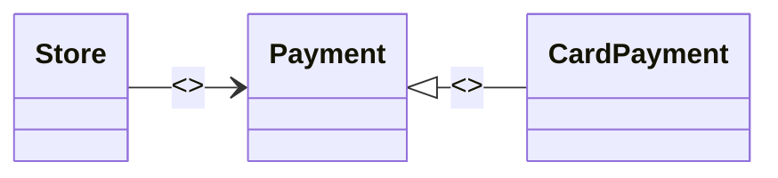
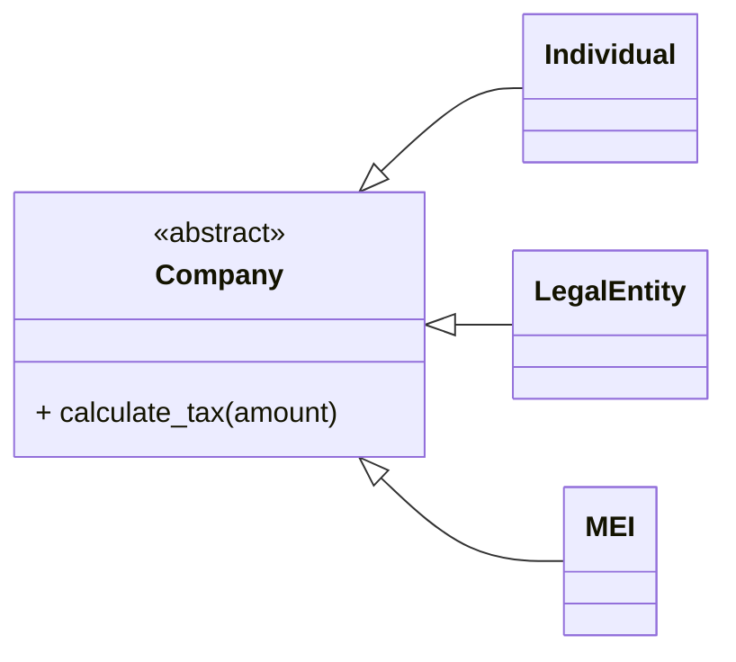

-----

# 1\. Low Coupling and Polymorphism Patterns

## The Pattern: Low Coupling

The concept of **Low Coupling** (or Loose Coupling) is one of the pillars of Object-Oriented Programming (OOP) and robust software design. It focuses on creating classes that have the minimum possible dependence on each other. This means that changing one class should not require modifications in many other classes.

> **Note:** Maintaining classes with **low coupling** and **high cohesion** (high cohesion refers to classes with well-defined responsibilities) is crucial for a system that is easy to maintain and evolve.

### Coupling

It is the measure of how strongly two or more classes are connected to each other.

A system with highly coupled classes becomes rigid. Changes in one class force changes in dependent classes, hindering maintenance, introducing bugs, and increasing the cost of software evolution.

### Coupling and Polymorphism

Classes that depend on **interfaces** or **abstract classes** instead of concrete implementations have **low coupling**. This is the central concept of the **Low Coupling pattern**.

**Polymorphism**, which means "many forms," is a fundamental OOP concept that allows an object to behave in multiple ways, using the same interface or method. When combined, they create a flexible architecture.

### Example

The following diagram illustrates the relationship between the `Store`, `CardPayment` classes, and the `Payment` interface.

#### Diagram (Simplified Textual UML Representation)



The code below shows an initial example where the `Store` class directly depends on the concrete `CardPayment` class, an example of **High Coupling**.

#### Code 1: High Coupling

```python
class CardPayment:
    def process(self, amount):
        print(f"Credit card payment for the amount of $ {amount}")

class Store:
    def __init__(self):
        # Coupling: Store depends directly on the CardPayment implementation
        self.payment_method = CardPayment()

    def make_purchase(self, amount):
        # Calls the process method of CardPayment
        self.payment_method.process(amount)

# Usage:
store = Store()
store.make_purchase(100)
# To change the payment method (e.g., to BankSlipPayment), 
# the code inside the Store class must be changed.
```

The refactored code introduces an abstract class/interface `Payment`, implementing the Low Coupling pattern.

#### Code 2: Introducing the Interface

```python
import abc # Library for defining abstract classes

class Payment(abc.ABC): # abc.ABC simulates an interface/abstract class
    @abc.abstractmethod
    def process(self, amount):
        """Abstract method that must be implemented by child classes."""
        pass

class CardPayment(Payment):
    def process(self, amount):
        print(f"Credit card payment for the amount of $ {amount}")
```

#### Code 3: Low Coupling (Refactored Store Class)

```python
class Store:
    # The constructor now receives the Payment interface
    def __init__(self, payment_method: Payment):
        self.payment_method = payment_method

    def make_purchase(self, amount):
        # Calls the process method of the interface/abstract class
        self.payment_method.process(amount)

# Usage:
card_payment = CardPayment()
store = Store(card_payment)
store.make_purchase(250)

# The Store class can now receive any object that implements 
# the Payment interface, without needing to change its internal code.
```

### Advantages of Low Coupling

  * **Ease of maintenance:** Changes in one class rarely affect others.
  * **Flexibility:** Allows for easy replacement of components.
  * **Reusability:** Less dependent components can be reused in different parts of the system.
  * **Testability:** Classes with single responsibilities and fewer dependencies are easier to test in isolation.

### SOLID Principles

Low Coupling is closely linked to the SOLID Principles, especially:

  * **Dependency Inversion Principle (DIP):** Dependencies should be on abstractions (interfaces) and not on concretions (concrete classes).
  * **Open/Closed Principle (OCP):** Software entities should be open for extension but closed for modification.

### Dependency Injection

The refactored example uses the concept of **Dependency Injection**, where the `Store` class is not responsible for creating its payment object, but rather for receiving it in its constructor (`__init__`).

### Strategy Pattern

The Strategy pattern is a behavioral design pattern that encapsulates behaviors (algorithms) into separate classes, making it easy to swap these behaviors at runtime. The `Store` and `Payment` example is a direct application of this pattern.

-----

## The Polymorphism Pattern

Polymorphism, from the Greek "many forms," is the ability for the same method name to be implemented in different ways by different objects.

### Context

Suppose you need to process tax calculation operations for different types of companies (Individual, Legal Entity, MEI - Micro-entrepreneur).

The problem: If we use conditional structures (`if/else` or `switch`) to determine the calculation, the function will be highly coupled to the business rules of each company type.

#### Code 4: High Coupling and Low Polymorphism Solution

```python
def calculate_tax(company, amount):
    if company == "Individual":
        return amount * 0.10
    elif company == "LegalEntity":
        return amount * 0.15
    elif company == "MEI":
        return amount * 0.05
    else:
        return 0

# Usage:
print(f"Individual Tax: {calculate_tax('Individual', 1000)}")
print(f"Legal Entity Tax: {calculate_tax('LegalEntity', 2000)}")
# To add a new company type, the calculate_tax function must be altered.
```

In this scenario, any new rule (e.g., a new company type) forces the modification of the `calculate_tax` function, violating the Open/Closed Principle (OCP) and resulting in high coupling.

### Polymorphism Solution

The solution is based on replacing concrete classes with interfaces or abstract classes (DIP).

Polymorphism ensures that the code using the classes does not need to know which specific object type is being used, only that it implements a specific interface or inherits from an abstract class.

#### Diagram (Simplified Textual UML Representation)



The application of polymorphism consists of creating a **generic interface** so that the child classes inherit and implement the specific method differently (polymorphism).

#### Code 5: Polymorphism and Low Coupling Solution

```python
import abc

class Company(abc.ABC):
    @abc.abstractmethod
    def calculate_tax(self, amount):
        pass

class Individual(Company):
    def calculate_tax(self, amount):
        return amount * 0.10

class LegalEntity(Company):
    def calculate_tax(self, amount):
        return amount * 0.15

class MEI(Company):
    def calculate_tax(self, amount):
        return amount * 0.05

# Usage:
companies = [Individual(), LegalEntity(), MEI()]
amounts = [1000, 2000, 500]

for company, amount in zip(companies, amounts):
    # Polymorphism allows calling the same method (calculate_tax)
    # on objects of different classes.
    tax = company.calculate_tax(amount)
    print(f"Tax: $ {tax}")

# Now, to add a new company type, simply create a new class 
# that inherits from Company, without changing the code that uses them.
```

### Concept of Interface and Inheritance/Polymorphism

In the case of abstract classes (like `Company`), inheritance is used to force child classes (`Individual`, `LegalEntity`, etc.) to implement a common method (`calculate_tax`), ensuring polymorphism.

### Advantages of Polymorphism

  * Greater code clarity and organization.
  * Ease of extension (Open/Closed Principle - OCP).
  * Low coupling (the class that uses `Company` does not worry about the concrete type).
  * Code reuse.
  * Enhanced testability.

### Connecting the Patterns: Polymorphism and Low Coupling

The union of the patterns is powerful. Polymorphism is the technique that enables the implementation of low coupling: by depending on an abstraction (interface), the client class is not tied to any concrete implementation, resulting in flexible, extensible, and maintainable code.

### Other Design Patterns That Use Polymorphism

  * Strategy (e.g., the `Payment` example)
  * Adapter
  * Template Method
  * Factory
  * Proxy

### Conclusion

It is essential for the Software Developer to understand and apply **Low Coupling** and **Polymorphism**, as they are powerful tools that lead to the creation of more robust, flexible, and scalable software.