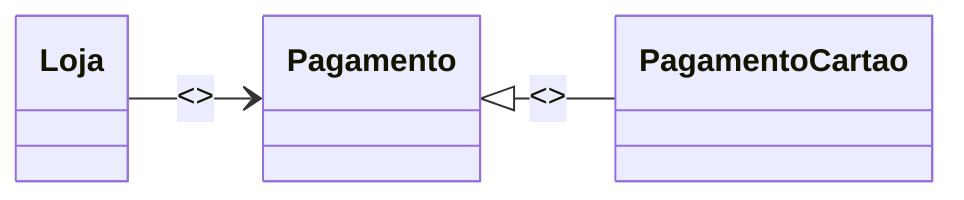
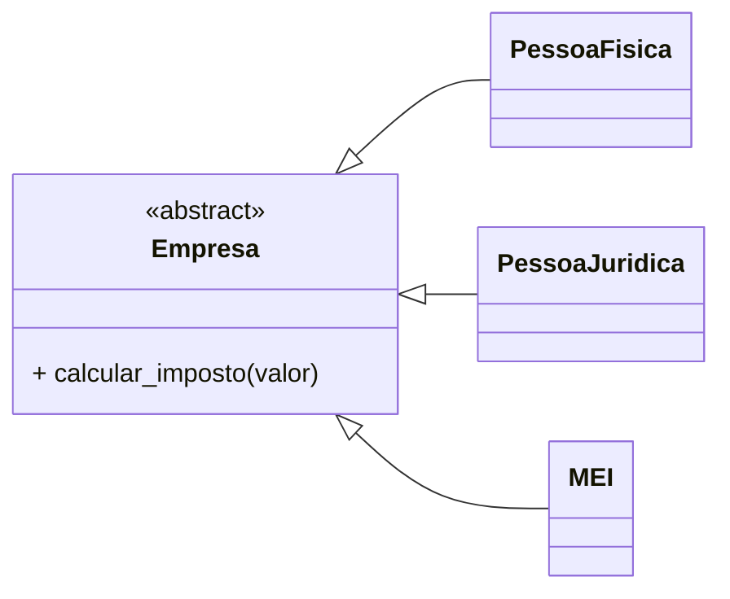

-----

# 1\. Padrões Acoplamento Baixo e Polimorfismo

## O padrão: Acoplamento Baixo

O conceito de Acoplamento Baixo (ou Loose Coupling) é um dos pilares da programação orientada a objetos (POO) e design de software robusto. Ele se concentra em criar classes que tenham o mínimo de dependência possível umas das outras. Isso significa que a alteração em uma classe não deve exigir modificações em muitas outras classes.

> **Nota:** Manter classes com **baixo acoplamento** e **alta coesão** (alta coesão refere-se a classes com responsabilidades bem definidas) é crucial para um sistema de fácil manutenção e evolução.

### Acoplamento

É a medida de quão fortemente duas ou mais classes estão conectadas entre si.

Um sistema com classes altamente acopladas torna-se rígido. Alterações em uma classe forçam alterações em classes dependentes, dificultando a manutenção, introduzindo *bugs* (erros) e aumentando o custo de evolução do software.

### Acoplamento e polimorfismo

Classes que dependem de interfaces ou classes abstratas em vez de implementações concretas possuem um **baixo acoplamento**. Este é o conceito central do **padrão de Acoplamento Baixo**.

O polimorfismo, que significa "muitas formas", é um conceito fundamental de POO que permite que um objeto se comporte de múltiplas maneiras, usando a mesma interface ou método. Quando combinados, eles criam uma arquitetura flexível.

### Exemplo

O diagrama a seguir ilustra a relação entre as classes `Loja`, `PagamentoCartao` e a interface `Pagamento`.

#### Diagrama (Representação Textual UML Simplificada)



O código abaixo mostra um exemplo inicial, onde a classe `Loja` depende diretamente da classe concreta `PagamentoCartao`, um exemplo de **Alto Acoplamento**.

#### Código 1: Alto Acoplamento

```python
class PagamentoCartao:
    def processar(self, valor):
        print(f"Pagamento com cartão de crédito no valor de R$ {valor}")

class Loja:
    def __init__(self):
        # Acoplamento: Loja depende diretamente da implementação PagamentoCartao
        self.meio_pagamento = PagamentoCartao()

    def realizar_compra(self, valor):
        # Chama o método processar de PagamentoCartao
        self.meio_pagamento.processar(valor)

# Uso:
loja = Loja()
loja.realizar_compra(100)
# Para mudar o meio de pagamento (ex: para PagamentoBoleto), 
# é necessário alterar o código interno da classe Loja.
```

O código refatorado introduz uma classe abstrata/interface `Pagamento`, implementando o padrão de Acoplamento Baixo.

#### Código 2: Introdução da Interface

```python
import abc # Biblioteca para definir classes abstratas

class Pagamento(abc.ABC): # abc.ABC simula uma interface/classe abstrata
    @abc.abstractmethod
    def processar(self, valor):
        """Método abstrato que deve ser implementado pelas classes filhas."""
        pass

class PagamentoCartao(Pagamento):
    def processar(self, valor):
        print(f"Pagamento com cartão de crédito no valor de R$ {valor}")
```

#### Código 3: Baixo Acoplamento (Classe Loja Refatorada)

```python
class Loja:
    # O construtor agora recebe a interface Pagamento
    def __init__(self, meio_pagamento: Pagamento):
        self.meio_pagamento = meio_pagamento

    def realizar_compra(self, valor):
        # Chama o método processar da interface/classe abstrata
        self.meio_pagamento.processar(valor)

# Uso:
pagamento_cartao = PagamentoCartao()
loja = Loja(pagamento_cartao)
loja.realizar_compra(250)

# A classe Loja agora pode receber qualquer objeto que implemente 
# a interface Pagamento, sem precisar mudar seu código interno.
```

### Vantagens do baixo acoplamento

  * **Facilidade de manutenção:** Alterações em uma classe raramente afetam outras.
  * **Flexibilidade:** Permite a fácil substituição de componentes.
  * **Reutilização:** Componentes menos dependentes podem ser reutilizados em diferentes partes do sistema.
  * **Testabilidade:** Classes com responsabilidades únicas e menos dependências são mais fáceis de testar isoladamente.

### Princípios SOLID

O baixo acoplamento está intimamente ligado aos Princípios SOLID, especialmente:

  * **Princípio da Inversão de Dependência (DIP):** As dependências devem ser em abstrações (interfaces) e não em concretizações (classes concretas).
  * **Princípio Aberto-Fechado (OCP):** Entidades de software devem estar abertas para extensão, mas fechadas para modificação.

### Injeção de dependência

O exemplo refatorado utiliza o conceito de **Injeção de Dependência**, onde a classe `Loja` não é responsável por criar seu objeto de pagamento, mas sim por recebê-lo em seu construtor (`__init__`).

### Padrão Strategy

O padrão Strategy é um padrão de projeto comportamental que encapsula comportamentos (algoritmos) em classes separadas, facilitando a troca desses comportamentos em tempo de execução. O exemplo de `Loja` e `Pagamento` é uma aplicação direta deste padrão.

## O padrão Polimorfismo

Polimorfismo, do grego "muitas formas", é a capacidade de um mesmo nome de método ser implementado de diferentes formas por diferentes objetos.

### Contexto

Suponha que você precise processar operações de cálculo de impostos para diferentes tipos de empresas (Pessoa Física, Pessoa Jurídica, MEI).

O problema: se usarmos estruturas condicionais (`if/else` ou `switch`) para determinar o cálculo, a função ficará altamente acoplada às regras de negócio de cada tipo de empresa.

#### Código 4: Solução de Alto Acoplamento e Baixo Polimorfismo

```python
def calcular_imposto(empresa, valor):
    if empresa == "PF":
        return valor * 0.10
    elif empresa == "PJ":
        return valor * 0.15
    elif empresa == "MEI":
        return valor * 0.05
    else:
        return 0

# Uso:
print(f"Imposto PF: {calcular_imposto('PF', 1000)}")
print(f"Imposto PJ: {calcular_imposto('PJ', 2000)}")
# Para adicionar um novo tipo de empresa, é necessário alterar a função calcular_imposto.
```

Neste cenário, qualquer nova regra (e.g., um novo tipo de empresa) obriga a modificação da função `calcular_imposto`, violando o Princípio Aberto-Fechado (OCP) e resultando em alto acoplamento.

### Solução do Polimorfismo

A solução é baseada na substituição de classes concretas por interfaces ou classes abstratas (o DIP).

O polimorfismo garante que o código que usa as classes não precise saber qual tipo de objeto específico está sendo usado, apenas que ele implementa uma determinada interface ou herda de uma classe abstrata.

#### Diagrama (Representação Textual UML Simplificada)



A aplicação de polimorfismo consiste em criar uma **interface genérica** para que as classes filhas herdem e implementem o método específico de forma diferente (polimorfismo).

#### Código 5: Solução com Polimorfismo e Baixo Acoplamento

```python
import abc

class Empresa(abc.ABC):
    @abc.abstractmethod
    def calcular_imposto(self, valor):
        pass

class PessoaFisica(Empresa):
    def calcular_imposto(self, valor):
        return valor * 0.10

class PessoaJuridica(Empresa):
    def calcular_imposto(self, valor):
        return valor * 0.15

class MEI(Empresa):
    def calcular_imposto(self, valor):
        return valor * 0.05

# Uso:
empresas = [PessoaFisica(), PessoaJuridica(), MEI()]
valores = [1000, 2000, 500]

for empresa, valor in zip(empresas, valores):
    # O polimorfismo permite chamar o mesmo método (calcular_imposto)
    # em objetos de diferentes classes.
    imposto = empresa.calcular_imposto(valor)
    print(f"Imposto: R$ {imposto}")

# Agora, para adicionar um novo tipo de empresa, basta criar uma 
# nova classe que herde de Empresa, sem mudar o código que as usa.
```

### Conceito de Interface e Herança/Polimorfismo

No caso de classes abstratas (como `Empresa`), a herança é usada para forçar as classes filhas (`PessoaFisica`, `PessoaJuridica`, etc.) a implementar um método comum (`calcular_imposto`), garantindo o polimorfismo.

### Vantagens do Polimorfismo

  * Maior clareza e organização do código.
  * Facilidade de extensão (Princípio Aberto-Fechado - OCP).
  * Baixo acoplamento (a classe que usa a `Empresa` não se preocupa com o tipo concreto).
  * Reutilização de código.
  * Testabilidade aprimorada.

### Conectando os Padrões: Polimorfismo e Baixo Acoplamento

A união dos padrões é poderosa. O polimorfismo é a técnica que permite a implementação do baixo acoplamento: ao depender de uma interface (abstração), a classe cliente não fica presa a nenhuma implementação concreta, resultando em um código flexível, extensível e manutenível.

### Outros Padrões de Projeto que usam Polimorfismo

  * Strategy (exemplo de `Pagamento`)
  * Adapter
  * Template Method
  * Factory
  * Proxy

### Conclusão

É essencial para o Desenvolvedor de Software entender e aplicar o Acoplamento Baixo e o Polimorfismo, pois eles são ferramentas poderosas que levam à criação de software mais robusto, flexível e escalável.