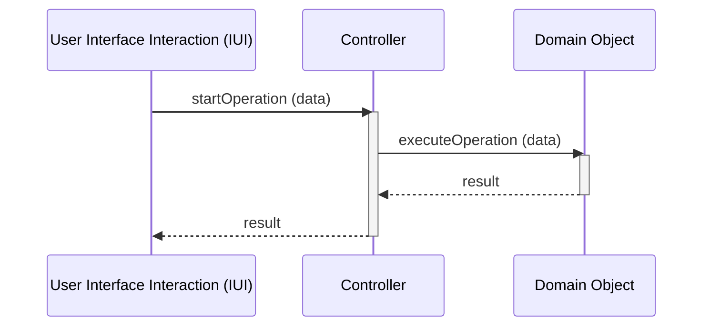

## 3\. High Cohesion and Controller Patterns

### The High Cohesion Pattern

The concept of **High Cohesion** is a pattern that ensures the maintainability, usability, and reusability of systems. It results from distributing responsibilities among classes in a cohesive (meaningful) way. The *High Cohesion* pattern is a measure of how the responsibilities of a class are related in a coherent and significant manner. The *High Cohesion* pattern guarantees that each class has only one responsibility, i.e., a single purpose.

#### High Cohesion Pattern Solution

The *High Cohesion* pattern is one of the main object-oriented patterns. In it, a class must:

  * Have a small, well-defined set of responsibilities.
  * Be associated with a small set of other classes.
  * Be specialized in a specific type of domain.

Thus, the *High Cohesion* pattern is based on four models:

  * Functional Model
  * Logical Model
  * Temporal Model
  * Practical Model

#### Functional Model

This model considers the functions of a class's methods. A class is considered cohesive if the methods' goals are related in a coherent and well-defined manner.

```java
// High Cohesion: Class methods are related in a coherent and well-defined manner.
public class Fatura {
    public void calcularTotal() {}
    public void gerarNotaFiscal() {}
    public void registrarPagamento() {}
    public void enviarPorEmail() {}
}
```

#### Logical Model

The logical model considers the grouping of a class's methods. A class has logical cohesion when its methods perform similar tasks or tasks within the same domain.

```java
// High Cohesion: Class methods perform similar tasks or tasks within the same domain.
public class Pedido {
    public void adicionarItem(Item item) {}
    public void removerItem(Item item) {}
    public void atualizarQuantidade(Item item, int quantidade) {}
    public void limparItens() {}
}
```

#### Temporal Model

The temporal model considers the execution time of a class's methods. A class has temporal cohesion if its methods are called at different times or moments.

  * Initialization (Constructor).
  * Ending the session (Session *logout*).
  * Object initialization (*get* and *set* methods).
  * Object finalization (*destroy* method).

<!-- end list -->

```java
// Medium Cohesion: Class methods are called at different times or moments.
public class ServicoDeDados {
    public void abrirConexao() {}
    public void fecharConexao() {}
    public void enviarLogs() {}
}
```

#### Practical Model

This model considers the grouping of methods that access data, resources, or *hardware*. A class has practical cohesion if its methods use one or more external resources or access a *hardware* device or a Database.

```java
// High Cohesion: Class methods use one or more external resources.
public class AcessoBD {
    public void conectar() {}
    public void desconectar() {}
    public void executarComando(String sql) {}
}
```

The High Cohesion Pattern is the result of a class that has well-defined responsibilities, maintains a single purpose (responsibility), and is associated with a small set of other classes, guaranteeing its reuse and maintainability.

**Low Cohesion vs. High Cohesion Example:**

| Low Cohesion | High Cohesion |
| :--- | :--- |
| `java public class Aluno { public void matricular() {} public void realizarPagamento() {} public void acessarMaterial() {} public void enviarEmail() {} } // Low Cohesion - Does too many things.` | `java public class Matricula { public void matricular() {} } public class Pagamento { public void realizarPagamento() {} } public class Material { public void acessarMaterial() {} } public class Email { public void enviarEmail() {} } // High Cohesion - Each class does one thing, and does it well.` |

#### Mechanical Model

The mechanical model considers the grouping of methods that perform tasks to support the application, i.e., to support basic system operations. A class has mechanical cohesion if its methods offer support to the application.

```java
// High Cohesion: Class methods offer support to the application.
public class UtilidadesString {
    public String formatarString(String texto) {}
    public String removerEspacos(String texto) {}
    public String converterParaMaiuscula(String texto) {}
}
```

#### Consequences of High Cohesion

The *High Cohesion* pattern generates a large number of classes, but the maintainability, reusability, and usability of the systems are increased.

  * Classes are easier to understand and easier to use.
  * Coupling and defects are reduced.
  * Classes are not affected by modifications.
  * Classes can be used in other contexts with fewer tests.

-----

### The Controller Pattern

The **Controller Pattern** (Controller) handles and communicates a user's input regarding system events, encapsulating, centralizing, and delegating event handling to other classes, according to the responsibilities assigned to them. The Controller has a function very similar to that of a "sheriff" or a "control manager" in the real world. It doesn't do the work itself but delegates the execution of the work and coordinates the activities. Thus, a Controller Pattern represents the most important part of handling system events and actions, which keeps the entire system organized and elegant.

#### Putting the Case into Practice

A system interacts with external elements, receiving unique and diverse commands. Many of these external elements originate from user input, such as in a menu, a dialog box, or a button.

> When the system undergoes a pattern intervention in a rule of three, this input needs to be handled and processed. The controller pattern is what handles these events.

> Thus, we must assign the responsibility of processing events that comprise the request for system elements to a class not belonging to the interface, which is the controller pattern.

#### Controller Solution

A controller or façade class must be designated to receive messages from the interface to orchestrate the production of a sequence of services and a class that represents one of the following options:

  * **Option 1:** A class that represents the entire system (System or Subsystem).
  * **Option 2:** A class that represents a use case or a session (SalesRegister or PlaceOrder).

> An interface class captures user event inputs (menu selection, a button click, a field completion) but does not manipulate the event itself. This is the job of the controller pattern, which is responsible for receiving a request from the interface and coordinating the production of the appropriate response.

#### The controller is not part of the user interface

The Controller class should be the first class to receive user input, following a UserInterfaceInteraction - **IUI** (the user interface). This is an easy solution, with low coupling and reusability. The IUI does not handle application responsibility and business logic. This task is the responsibility of the classes that implement the application control operations.

> In an internet banking system, the interface receives inputs from the bank for an account transfer or a bank deposit. Instead of processing the information in the IUI itself, the controller performs the service. This controller receives the information from the IUI and delegates business responsibilities to the appropriate classes. Thus, it is possible to switch user interfaces (Desktop, Web, mobile) without needing to change the controller.

**Figure 1 - Sequence of events**

Figure 1 illustrates an event sequence diagram that needs to start from an interface object to the control object, the controller. The controller then delegates secondary responsibilities to manipulate the operation to domain objects that interact within the User Interface Interaction.



#### Consequences of the Controller

If the IUI assumes the responsibilities of the Controller, it will be overloaded, and we won't be able to use the same IUI in another context. This should sound an alarm, as it has taken on the incorrect function.

It is always important to ensure that classes have the minimum number of object components - **IUIs** without the logic of responsibilities (rules), and **DB** (Databases) without the logic.

A problem that can occur with this pattern is **Controller Inflation** (*Bloated/Fat Controller*), which is when the Controller assumes too many responsibilities. This can be resolved by using the **Facade** pattern and, later, by using other tools.

#### High Cohesion and Low Coupling via the Controller Pattern

An important characteristic of using this pattern is that the user interface components (IUI) do not perform data manipulation or processing or business rules. As a result, they are only tasked with collecting user data and interacting with and routing the system's rules and logic and business logic to the appropriate classes.

With the Controller Pattern, interface classes are light and easy to use in different contexts, as they act as a **GUI Facade**. This mass of classes provides a high-level interface for the system and is a good candidate for the Controller Pattern, as it does not handle responsibilities.