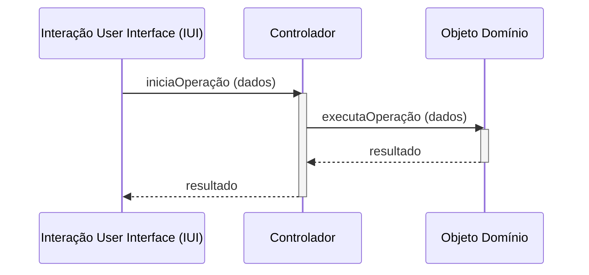

-----

## 3\. Padrões Coesão Alta e Controlador

### O Padrão Coesão Alta

O conceito de **Coesão Alta** ou *High Cohesion* é um padrão que assegura a manutenibilidade, a usabilidade e a reusabilidade dos sistemas, sendo o resultado da distribuição das responsabilidades por classes de uma forma coesa (que fazem sentido). O padrão *High Cohesion* é uma medida de como as responsabilidades de uma classe são relacionadas de uma forma coerente e significativa. O padrão *High Cohesion* garante que cada classe tenha apenas uma responsabilidade, ou seja, um único propósito.

#### Solução do Padrão Coesão Alta

O padrão *High Cohesion* é um dos principais padrões de orientação a objetos. Nele, uma classe deve:

  * Ter um conjunto pequeno e bem definido de responsabilidades.
  * Estar associada a um conjunto pequeno de outras classes.
  * Ser especializada em um tipo específico de domínio.

Assim, o padrão *High Cohesion* tem como base quatro modelos:

  * Modelo Funcional
  * Modelo Lógico
  * Modelo Temporal
  * Modelo Prático

#### Modelo Funcional

É o modelo que considera as funções dos métodos de uma classe. Uma classe é considerada coesa se o objetivo dos métodos estiverem relacionados de maneira coerente e bem definida.

```java
// Coesão Alta: Métodos da classe estão relacionados de maneira coerente e bem definida.
public class Fatura {
    public void calcularTotal() {}
    public void gerarNotaFiscal() {}
    public void registrarPagamento() {}
    public void enviarPorEmail() {}
}
```

#### Modelo Lógico

O modelo lógico considera o agrupamento dos métodos de uma classe. Uma classe possui coesão lógica quando os seus métodos realizam tarefas parecidas ou de um mesmo domínio.

```java
// Coesão Alta: Métodos da classe realizam tarefas parecidas ou de um mesmo domínio.
public class Pedido {
    public void adicionarItem(Item item) {}
    public void removerItem(Item item) {}
    public void atualizarQuantidade(Item item, int quantidade) {}
    public void limparItens() {}
}
```

#### Modelo Temporal

O modelo temporal considera o tempo de execução dos métodos de uma classe. Uma classe possui coesão temporal se os seus métodos são chamados em períodos de tempo diferentes ou em momentos distintos.

  * Inicialização (Construtor).
  * Encerrando a sessão (Sessão *logout*).
  * Inicialização de objetos (Método *get* e *set*).
  * Finalização de objetos (Método *destroy*).

<!-- end list -->

```java
// Coesão Média: Métodos da classe são chamados em períodos de tempo diferentes ou em momentos distintos.
public class ServicoDeDados {
    public void abrirConexao() {}
    public void fecharConexao() {}
    public void enviarLogs() {}
}
```

#### Modelo Prático

Esse modelo considera o agrupamento dos métodos que fazem acesso a dados, recursos ou *hardware*. Uma classe possui coesão prática se os seus métodos usam um ou mais recursos externos ou fazem acesso a um dispositivo de *hardware* ou a um Banco de Dados.

```java
// Coesão Alta: Métodos da classe usam um ou mais recursos externos.
public class AcessoBD {
    public void conectar() {}
    public void desconectar() {}
    public void executarComando(String sql) {}
}
```

O Padrão Coesão Alta é o resultado de uma classe que possui responsabilidades bem definidas, que mantém uma única finalidade (responsabilidade) e que está associada a um pequeno conjunto de outras classes, garantindo a sua reutilização e manutenibilidade.

**Exemplo de Coesão Baixa vs. Coesão Alta:**

| Coesão Baixa | Coesão Alta |
| :--- | :--- |
| `java public class Aluno { public void matricular() {} public void realizarPagamento() {} public void acessarMaterial() {} public void enviarEmail() {} } // Coesão Baixa - Faz muita coisa.` | `java public class Matricula { public void matricular() {} } public class Pagamento { public void realizarPagamento() {} } public class Material { public void acessarMaterial() {} } public class Email { public void enviarEmail() {} } // Coesão Alta - Cada classe faz uma única coisa e bem feita.` |

#### Modelo Mecânico

O modelo mecânico considera o agrupamento de métodos que realizam a tarefa para dar suporte à aplicação, ou seja, dar suporte a operações básicas do sistema. Uma classe possui coesão mecânica se os seus métodos oferecem suporte à aplicação.

```java
// Coesão Alta: Métodos da classe oferecem suporte à aplicação.
public class UtilidadesString {
    public String formatarString(String texto) {}
    public String removerEspacos(String texto) {}
    public String converterParaMaiuscula(String texto) {}
}
```

#### Consequências da Coesão Alta

O padrão *High Cohesion* produz um grande número de classes, mas a manutenibilidade, a reusabilidade e a usabilidade dos sistemas são elevadas.

  * As classes são mais fáceis de entender e fáceis de usar.
  * O acoplamento e os defeitos são reduzidos.
  * As classes não são afetadas por modificações.
  * As classes podem ser usadas em outros contextos com menos testes.

-----

### O Padrão Controlador

O Padrão Controlador (Controller) lida e comunica a entrada de um usuário a respeito de eventos do sistema, encapsulando, centralizando e delegando o tratamento dos eventos a outras classes, de acordo com as responsabilidades que lhes são atribuídas. O controlador, em inglês Controller, possui uma função muito parecida com a de um "xerife" ou a de um "gerente de controle" no mundo real. Ele não faz o trabalho, mas delega a execução do trabalho e coordena as atividades. Assim, um Padrão Controlador representa a parte mais importante no tratamento de eventos e ações do sistema, o qual mantém todo o sistema organizado e elegante.

#### Levando o caso à prática

Um sistema interage com elementos externos, recebendo comandos únicos e diversos. Muitos desses elementos externos são originados por entradas do usuário, como em um menu, uma caixa de diálogo ou um botão.

> Quando o sistema sofre a intervenção de um padrão em uma regra de três, essa entrada precisa ser tratada e processada. Quem trata esses eventos é o padrão controlador.

> Assim, devemos atribuir a responsabilidade de processar eventos que compreendam a requisição de elementos do sistema a uma classe não pertencente à interface, que é o padrão controlador.

#### Solução do Controlador

Uma classe de controlador ou fachada deve ser designada a receber as mensagens da interface para armar a produção de uma sequência de serviços e uma classe que representa uma das seguintes opções:

  * **Opção 1:** Uma classe que representa o sistema todo (Sistema ou Subsistema).
  * **Opção 2:** Uma classe que representa um caso de uso ou uma sessão (RegistroVenda ou FazerPedido).

> Uma classe de interface captura as entradas de eventos do usuário (seleção de menus, um botão clicado, um campo preenchido), mas não manipula o evento em si. Esse é o trabalho do padrão controlador, responsável por receber uma solicitação da interface e coordenar a produção da resposta adequada.

#### O controlador não faz parte da interface com o usuário

A classe Controller (Controlador) deve ser a primeira classe a receber a entrada de um usuário, após uma InteraçãoUserInterface - **IUI** (a interface com o usuário). É uma solução fácil, com baixo acoplamento e reusabilidade. A IUI não lida com responsabilidades de aplicação e lógica de negócio. Essa tarefa é responsabilidade das classes que implementam as operações de controle de aplicação.

> Em um sistema de internet banking, a interface recebe inputs do banco de uma transferência de conta ou um depósito bancário. Em vez de tratar a informação na própria IUI, o controlador é que realiza o serviço. Esse controlador recebe a informação da IUI e delega as responsabilidades de negócio às classes apropriadas. Assim, é possível trocar as interfaces com o usuário (Desktop, Web, mobile) sem precisar alterar o controlador.

**Figura 1 - Sequência de eventos**

A Figura 1 ilustra um diagrama de sequência de eventos que precisa começar de um objeto de interface para o objeto de controle, o controlador. O controlador, então, delega as responsabilidades secundárias à manipulação da operação a objetos de domínio que interagem na Interação User Interface (Interface do Usuário com a Interação).



#### Consequências do Controlador

Se por acaso a IUI assumir as responsabilidades do Controller, ela estará sendo sobrecarregada, e não poderemos usar a mesma IUI em outro contexto. Isso deve soar um alerta, pois ela assumiu nas mãos dela a função incorreta.

É sempre importante fazer com que as classes tenham o menor número de componentes de objetos - **IUI's** sem Iogic das responsabilidades (leis), nem **BD** (Bancos de Dados) sem a Iogic.

Um problema que pode ocorrer com esse padrão é o **Inflar o Controlador** (*Bloated/Fat Controller*), que é quando o Controller assume responsabilidades demais. Isso pode ser resolvido com o uso do padrão **Fachada** e, mais tarde, o uso dos outros instrumentos.

#### A Coesão Alta e Baixo Acoplamento por meio do Padrão Controlador

Uma importante característica da utilização desse padrão é a de que os componentes de interface com o usuário (IUI) não fazem manipulação ou processamento de dados e regras de negócio. Com isso, eles têm apenas a tarefa de coleta de dados do usuário e de interagir e trafegar as leis e a Iógica de sistema e negócio para as classes adequadas.

Com o Padrão Controller, as classes de interface são leves e fáceis de usar em contextos diferentes, por ser um **GUI Facade**, pois essa massa de classes fornece uma interface de alto nível para o sistema e é um bom candidato para o Padrão Controller, pois não lida com responsabilidades.