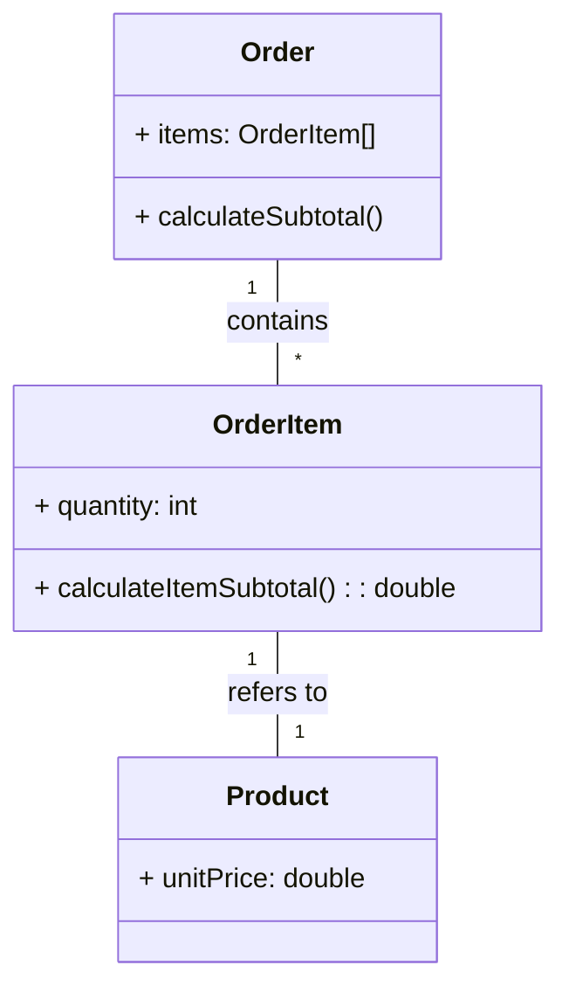
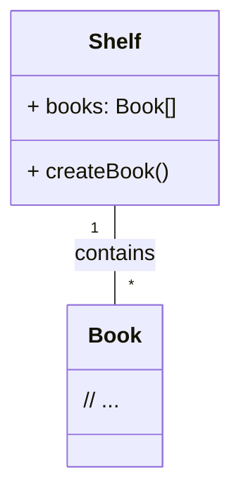

## The Information Expert and Creator Patterns

-----

### The Information Expert Pattern

The **Information Expert** pattern is a strategy for determining which class should be responsible for a specific operation. In practical terms, it suggests that responsibility should be assigned to the class that possesses the **necessary information** to perform the operation. This information can be maintained as **attributes** within the class itself or can be accessed through **associations** with other classes. In other words, the class that "knows" what is needed for the task is the **Expert**.

Information Expert is a fundamental principle in object-orientation. Its application results in systems with better **high cohesion** and **low coupling**. Cohesion refers to how related the responsibilities within a class are, and coupling refers to the degree of dependency between classes. By keeping the responsibility close to the data, we reduce external dependence and increase the internal coherence of the class.

### Identifying the Problem

Imagine an e-commerce system. You need to calculate the subtotal for a shopping cart, based on the items and their quantities.

**Which classes would be responsible for calculating the subtotal?**

If we look at the involved classes, such as **Order**, **OrderItem**, and **Product**, we notice that:

  * **Order** has the list of **OrderItem**s.
  * **OrderItem** knows the **quantity** of a product in the order and has an association with the **Product**.
  * **Product** knows the **unit price**.

To calculate the subtotal, we need to know the quantity of each item and the price of each product. The **OrderItem** holds the necessary information (the quantity and the link to the product's price). Therefore, the **OrderItem** class is the **Information Expert**.

1.  **Line Item Calculation:**
      * OrderItem $\rightarrow$ Knows the **quantity** and accesses the **unit price** of the Product.
2.  **Total Subtotal Calculation:**
      * Order $\rightarrow$ Knows all the **OrderItem**s.

Therefore, the necessary responsibilities are:

1.  **CalculateItemSubtotal()**: OrderItem
2.  **CalculateSubtotal()**: Order

#### Class Diagram (Textual Diagram)



### Application of the Information Expert

With the application of the Information Expert, the responsibility for calculating the subtotal is distributed among the classes that hold the information.

The responsibility for calculating the subtotal of a single item is assigned to **OrderItem**, as it is the class that has the **quantity** information and access to the associated product's **unit price**.

The responsibility for calculating the total order subtotal is assigned to **Order**, which is the class that has the list of **OrderItem**s and can sum up the subtotals of each one.

#### The Importance of Knowing Where the Information Resides

Often, the information required for an operation may not all be in a single class. In such cases, the responsibility should be assigned to the class that possesses the **majority** of the information. The **Expert** class can then request the missing information from associated classes.

**Example:**

| Class that holds the information | Classes that access the information |
| :--- | :--- |
| **OrderItem**: holds the **quantity** data and has an association with the **Product** class. | **Product**: holds the **unitPrice** data. |
| **OrderItem** has the **majority** of the information and should have the responsibility to calculate the item subtotal. | **OrderItem** accesses the **unitPrice** from the **Product**. |

#### OrderItem Code (Textual Diagram - Code Simulation)

```java
// The calculateItemSubtotal() method is defined in OrderItem.
// It uses the quantity that OrderItem possesses and the price of the associated Product.

public class OrderItem {
    private int quantity;
    private Product product;

    public OrderItem(Product product, int quantity) {
        this.product = product;
        this.quantity = quantity;
    }

    // OrderItem is the Information Expert
    public double calculateItemSubtotal() {
        return this.quantity * this.product.getUnitPrice();
    }
    // ...
}
```

#### Order Code (Textual Diagram - Code Simulation)

```java
// The calculateSubtotal() method is defined in Order.
// It iterates over all OrderItems to sum up their subtotals.

public class Order {
    private List<OrderItem> items;

    public Order(List<OrderItem> items) {
        this.items = items;
    }

    // Order is the Information Expert for the overall subtotal
    public double calculateSubtotal() {
        double subtotal = 0.0;
        for (OrderItem item : items) {
            subtotal += item.calculateItemSubtotal();
        }
        return subtotal;
    }
    // ...
}
```

### Consequences of Information Expert

The Information Expert is the first and most important tool to use when assigning responsibilities. It has three main consequences:

| Positive Consequence | Positive Consequence | Negative Consequence |
| :--- | :--- | :--- |
| **High Cohesion** - Responsibilities are assigned where the information resides. | **Low Coupling** - Classes are less dependent on others to perform their tasks. | **Increased Visibility** - May require more associations and/or attributes for the class to have the necessary information. |

-----

## The Creator Pattern

### The Creator Pattern

The **Creator** pattern is a strategy for determining which class should be responsible for the **creation** of a new instance of another class. In object-oriented systems, object creation is a common task, but choosing who should do it is important for maintaining low cohesion and coupling.

Creator suggests that class **A** should be responsible for creating instances of class **B** if one or more of the following conditions are true:

1.  **A** contains **B** (aggregation or composition).
2.  **A** records instances of **B** (a manager/container).
3.  **A** uses instances of **B** intensively.
4.  **A** has the necessary initialization data to create **B**.

The first condition (aggregation/composition) is the most common and strongest. By assigning the creation responsibility to a class that is already related to the class being created, the system becomes more cohesive and maintains low coupling.

### Identifying the Problem

In a library system, you need to create an instance of a **Book**.

**Which class should be responsible for creating the Book object?**

To apply the Creator pattern, we look for the class that contains, intensely uses, records, or possesses the initialization data for the **Book** instance.

Let's assume the **Shelf** class contains several **Book**s (composition/aggregation) and is responsible for managing them.

In this scenario:

  * The **Shelf** class contains instances of **Book** (Condition 1).
  * The **Shelf** class is the one that has the most information about the context where the **Book** will exist.

Therefore, the **Shelf** class is the **Creator** of **Book**.

**Class A should create Class B if:**

  * A contains B (aggregation/composition).
  * A records instances of B (a manager).
  * A uses instances of B intensively.
  * A has the initialization data for B.

In the example, **Shelf** should be the Creator of **Book** because the **Shelf** **contains** the **Book**.

#### Class Diagram (Textual Diagram)



### Consequences of Creator

The Creator pattern is important because it delegates the function of object creation to classes that form a type of aggregation or composition. This results in a system with:

1.  **Low Coupling**: The creator class is already logically linked to the created class, which avoids introducing unnecessary dependencies.
2.  **High Cohesion**: The responsibility for creation is in the class that already manages or contains the created object.

#### Example of Factories

In more complex scenarios, different software engineering patterns can expand the concept of Creator, such as the **Factory Method** or **Abstract Factory**, which belong to the GoF (Gang of Four) design patterns. These are useful when object creation is more complex, requires conditional logic, or when the created class might change.

Creator is a fundamental guideline. If the creation of an object is more complex, you can consider applying the specific patterns mentioned to abstract the creation process.