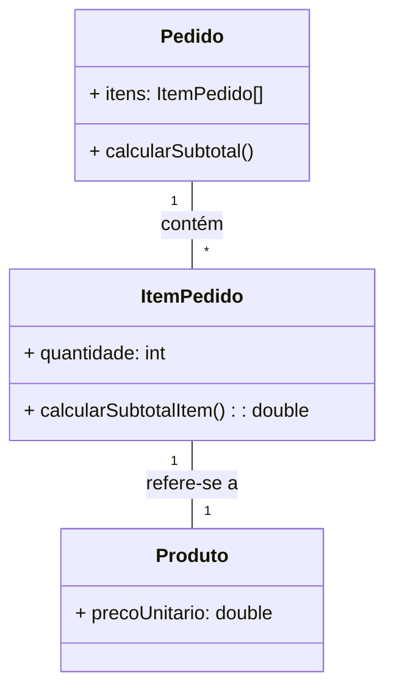
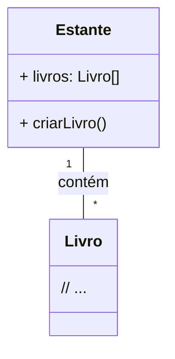

## Padrões Especialista na Informação e Criador

-----

### O padrão Especialista na Informação

O **padrão Especialista na Informação** (Information Expert) é uma estratégia para determinar a classe que deve ser responsável por uma determinada operação. Em termos práticos, ele sugere que a responsabilidade deve ser atribuída à classe que possui a **informação necessária** para realizar a operação. Essa informação pode ser mantida como **atributos** dentro da própria classe ou pode ser acessada por meio de **associações** com outras classes. Em outras palavras, a classe que "sabe" o que é necessário para a tarefa é a **Especialista**.

O Especialista na Informação é um princípio fundamental em orientação a objetos. Sua aplicação resulta em sistemas com melhor coesão e baixo acoplamento. A coesão se refere a quão relacionadas estão as responsabilidades dentro de uma classe, e o acoplamento se refere ao grau de dependência entre classes. Ao manter a responsabilidade junto aos dados, reduzimos a dependência externa e aumentamos a coerência interna da classe.

### Identificando o problema

Imagine um sistema para uma loja virtual. Você precisa calcular o subtotal de um carrinho de compras, com base nos itens e suas quantidades.

**Quais classes seriam responsáveis por calcular o subtotal?**

Se olharmos para as classes envolvidas, como **Pedido**, **ItemPedido**, e **Produto**, percebemos que:

  * **Pedido** tem a lista de **ItemPedido**s.
  * **ItemPedido** sabe a **quantidade** de um produto no pedido e tem uma associação com o **Produto**.
  * **Produto** sabe o **preço unitário**.

Para calcular o subtotal, precisamos saber a quantidade de cada item e o preço de cada produto. O **ItemPedido** possui as informações necessárias (a quantidade e o link para o preço do produto). Portanto, a classe **ItemPedido** é a **Especialista na Informação**.

1.  **Cálculo da linha do pedido:**
      * ItemPedido $\rightarrow$ Sabe a **quantidade** e acessa o **preço unitário** do Produto.
2.  **Cálculo do subtotal total:**
      * Pedido $\rightarrow$ Sabe todos os **ItemPedido**s.

Portanto, as responsabilidades necessárias são:

1.  **CalcularSubtotalItem()**: ItemPedido
2.  **CalcularSubtotal()**: Pedido

#### Diagrama de Classes (Diagrama textual)



### Aplicação do Especialista na Informação

Com a aplicação do Especialista na Informação, a responsabilidade de calcular o subtotal é distribuída entre as classes que detêm a informação.

A responsabilidade de calcular o subtotal de um item é atribuída a **ItemPedido**, pois é a classe que tem a informação da **quantidade** e acesso ao **preço unitário** do produto associado.

A responsabilidade de calcular o subtotal total do pedido é atribuída a **Pedido**, que é a classe que tem a lista de **ItemPedido**s e pode somar os subtotais de cada um.

#### A importância de saber onde a informação reside

Muitas vezes, a informação necessária para a operação pode não estar toda em uma única classe. Nesses casos, a responsabilidade deve ser atribuída à classe que possui a **maior parte** da informação. A classe **Especialista** pode então solicitar as informações que faltam às classes associadas.

**Exemplo:**

| Classe que possui a informação | Classes que acessam as informações |
| :--- | :--- |
| **ItemPedido**: possui o dado **quantidade** e uma associação com a classe **Produto**. | **Produto**: possui o dado **preçoUnitario**. |
| **ItemPedido** tem a **maior parte** da informação e deve ter a responsabilidade de calcular o subtotal do item. | **ItemPedido** acessa o **preçoUnitario** do **Produto**. |

#### Código de ItemPedido (Diagrama textual - Simulação de Código)

```java
// O método calcularSubtotalItem() é definido em ItemPedido.
// Ele usa a quantidade que ItemPedido possui e o preço do Produto associado.

public class ItemPedido {
    private int quantidade;
    private Produto produto;

    public ItemPedido(Produto produto, int quantidade) {
        this.produto = produto;
        this.quantidade = quantidade;
    }

    // ItemPedido é o Especialista na Informação
    public double calcularSubtotalItem() {
        return this.quantidade * this.produto.getPrecoUnitario();
    }
    // ...
}
```

#### Código de Pedido (Diagrama textual - Simulação de Código)

```java
// O método calcularSubtotal() é definido em Pedido.
// Ele itera sobre todos os ItemPedidos para somar seus subtotais.

public class Pedido {
    private List<ItemPedido> itens;

    public Pedido(List<ItemPedido> itens) {
        this.itens = itens;
    }

    // Pedido é o Especialista na Informação para o subtotal geral
    public double calcularSubtotal() {
        double subtotal = 0.0;
        for (ItemPedido item : itens) {
            subtotal += item.calcularSubtotalItem();
        }
        return subtotal;
    }
    // ...
}
```

### Consequências do Especialista na Informação

O Especialista na Informação é a primeira e mais importante ferramenta para se utilizar na atribuição de responsabilidades. Ele tem três consequências principais:

| Consequência Positiva | Consequência Positiva | Consequência Negativa |
| :--- | :--- | :--- |
| **Coesão elevada** (High Cohesion) - as responsabilidades são atribuídas onde a informação reside. | **Acoplamento baixo** (Low Coupling) - as classes são menos dependentes de outras para realizar suas tarefas. | **Aumento da visibilidade** - pode exigir mais associações e/ou atributos para que a classe tenha a informação necessária. |

-----

## O padrão Criador

### O padrão Criador

O **padrão Criador** (Creator) é uma estratégia para determinar qual classe deve ser responsável pela **criação** de uma nova instância de outra classe. Em sistemas orientados a objetos, a criação de objetos é uma tarefa comum, mas a escolha de quem deve fazê-lo é importante para manter a coesão e o acoplamento baixos.

O Criador sugere que a classe **A** deve ser responsável por criar instâncias da classe **B** se uma ou mais das seguintes condições forem verdadeiras:

1.  **A** contém **B** (agregação ou composição).
2.  **A** registra as instâncias de **B** (um gerenciador/container).
3.  **A** usa intensamente as instâncias de **B**.
4.  **A** tem os dados de inicialização necessários para criar **B**.

A primeira condição (agregação/composição) é a mais comum e forte. Ao atribuir a responsabilidade de criação a uma classe que já está relacionada com a classe a ser criada, o sistema se torna mais coeso e mantém o acoplamento baixo.

### Identificando o problema

Em um sistema de biblioteca, você precisa criar uma instância de **Livro**.

**Qual classe deve ser responsável por criar o objeto Livro?**

Para aplicar o padrão Criador, procuramos a classe que contém, usa intensamente, registra ou possui os dados de inicialização para a instância de **Livro**.

Vamos supor que a classe **Estante** contém vários **Livro**s (composição/agregação) e é responsável por gerenciá-los.

Neste cenário:

  * A classe **Estante** contém instâncias de **Livro** (Condição 1).
  * A classe **Estante** é a que tem mais informações sobre o contexto onde o **Livro** existirá.

Portanto, a classe **Estante** é a **Criadora** de **Livro**.

**A classe A deve criar a classe B se:**

  * A contém B (agregação/composição).
  * A registra as instâncias de B (um gerenciador).
  * A usa intensamente as instâncias de B.
  * A tem os dados de inicialização para B.

No exemplo, **Estante** deve ser o Criador de **Livro** porque a **Estante** **contém** o **Livro**.

#### Diagrama de Classes (Diagrama textual)



### Consequências do Criador

O padrão Criador é importante porque ele delega a função de criação de objetos para classes que formam um tipo de agregação ou composição. Isso gera um sistema com:

1.  **Acoplamento baixo**: A classe criadora já está logicamente ligada à classe criada, o que não introduz dependências desnecessárias.
2.  **Coesão elevada**: A responsabilidade de criar está na classe que já gerencia ou contém o objeto criado.

#### Exemplo de fábricas

Em cenários mais complexos, diferentes padrões de engenharia de software podem expandir o conceito de Criador, como o **Factory Method** ou o **Abstract Factory**, que pertencem aos padrões de projeto da GoF (Gang of Four). Eles são úteis quando a criação de objetos é mais complexa, necessita de lógica condicional, ou quando a classe criada pode mudar.

O Criador é uma diretriz fundamental. Se a criação de um objeto for mais complexa, você pode considerar aplicar os padrões específicos, como os mencionados, para abstrair o processo de criação.

-----

Essa é a transcrição fiel do conteúdo das imagens, seguindo as instruções para ignorar os vídeos e converter os diagramas para formato textual.